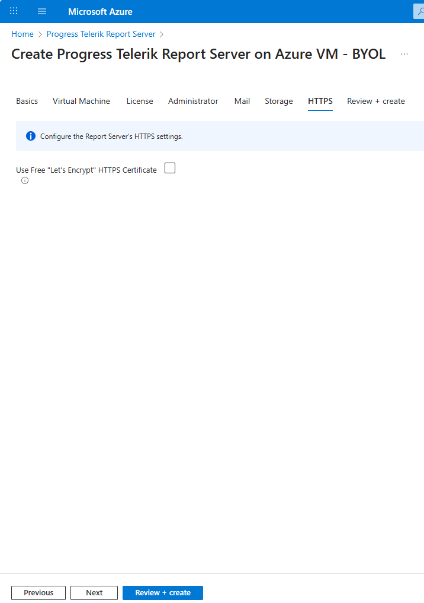
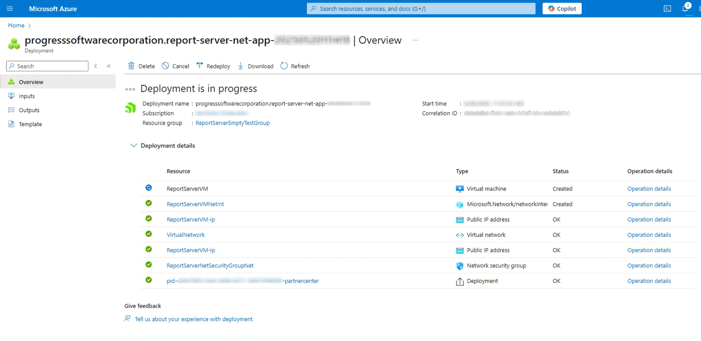

# Using Telerik Report Server .NET from the Azure Marketplace

You may deploy Telerik Report Server .NET directly from the Microsoft Azure Marketplace. It installs the public Report Server .NET Docker images with the specified settings on a new Azure Virtual Machine. Here are links to the necessary Docker images we provide publicly:

* https://hub.docker.com/r/progressofficial/telerik-reportserver-app
* https://hub.docker.com/r/progressofficial/telerik-reportserver-agent
* https://hub.docker.com/r/progressofficial/telerik-reportserver-setup

## Prerequisites

* A Microsoft Azure subscription
* A valid [Telerik Report Server License]()

## Configuration Steps

>note Please ensure you have fulfilled all the setting fields marked with an asterisk (*) in each section below.

1. [Log in to your Azure account](https://portal.azure.com/#home) and go to the Marketplace
1. Start the deployment process from your resource group:

	

1. Select the `Progress ReportServer .NET (preview)` product and create a new Subscription Plan for it:

	

1. Configure the __Basics__ by selecting the proper _Subscription_/_Resource Group_ and the preferred _Region_:

	

1. Configure the __Virtual Machine__ section. The screenshot below shows the recommended _Ubuntu OS Version_, _CPU Architecture_, and _VM size_:

	

	You may use an existing IP Address, or create a new one with the button at the bottom of the _Public IP Address for the VM_ setting.

	If you would like to use a Free Let's Encrypt HTTPS Certificate later in the _HTTPS_ section, choose an existing IP Address. Before starting to deploy the Report Server in Azure, you have to buy a domain name, create a DNS Zone, and a Public IP address. Make the _A_ record of the DNS zone to have the value of your public IP address. The DNS Zone and the Public IP address must be in a separate Resource group, because deploying the Report Server needs to happen in an empty resource group. Then, you can pick the Public IP address to which you have connected the Domain name.

	>important The __DNS Prefix for the public IP Address__ will be concatenated with the string below it to form the Report Server URL, where you will be able to access the Report Server Manager.

1. Add the __License__ token for your Telerik Report Server product - see how to set up the [Telerik Report Server License]():

	

1. Configure the __Administrator__ settings:

	

1. The __Mail__ settings are optional. You may configure the SMTP in the Report Server configuration after the deployment.

	

1. The __Storage__ section lets you provide a connection string to an external MSSQL Database. Otherwise, the default storage will be an MSSQL Express database deployed in a Docker container in the VM.

 	

1. In __HTTPS__, you may choose a Free Let's Encrypt HTTPS Certificate.

	If you want to use the Free Let's Encrypt HTTPS Certificate, before starting to deploy the Report Server in Azure, you have to buy a domain name, create a DNS Zone, and a Public IP address as explained in the _Virtual Machine_ section. Enter here your domain name created in the _Virtual Machine_ section. It will be the domain name you bought for yourselves, and you never used it in the setup process before this step.
 
	

	The HTTPS Certificate is expected to be renewed automatically before expiring through a _cron job_ set up during installation.

1. The last section __Review + create__ validates the above settings.

	

	After the validation passes, you need to click on the `Create` button to start the deployment of your Report Server .NET.

1. Wait for the deployment to finish. You will see a screen like below during the process that may take several minutes:

	

	When all the items under the _Resource_ are marked with green ticks, the deployment has finished successfully, and you will see the next screen:

	

1. Access your Report Server on the URL specified in the _Virtual Machine_ setting:

	

>note The user who created the Virtual Machine is fully responsible for managing it. The user can access it through [Secure Shell Protocol (SSH Protocol)](https://en.wikipedia.org/wiki/Secure_Shell) with the credentials provided in the _Virtual Machine_ section.

## See Also

* [Report Server for .NET Introduction]()
* [Telerik Report Server License]()
* [Telerik Report Server License Agreement](https://www.telerik.com/purchase/license-agreement/report-server)
