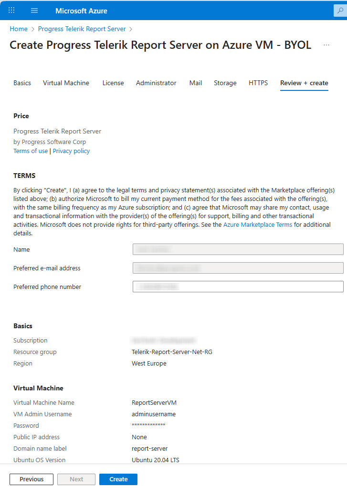

# Using Telerik Report Server .NET from the Azure Marketplace

You may deploy Telerik Report Server .NET directly from the Microsoft Azure Marketplace. It installs for you the public Report Server .NET Docker images with the specified settings on a new Azure Virtual Machine:

* https://hub.docker.com/r/progressofficial/telerik-reportserver-setup
* https://hub.docker.com/r/progressofficial/telerik-reportserver-agent
* https://hub.docker.com/r/progressofficial/telerik-reportserver-app

## Prerequisites

* A Microsoft Azure subscription
* A valid [Telerik Report Server License]()

>note The current state of the Report Server is in `Preview` and will soon be made the officially (and only) supported version of the Telerik Report Server product.

## Configuration Steps

1. Log in to your Azure account and go to the Marketplace
1. Select the `Progress ReportServer .NET (preview)` and create a new Subscription Plan for it:

	

1. Configure the __Basics__ by selecting the proper Subscription/Resource Group and the preferred Region:

	

1. Configure the __Virtual Machine__ with the recommended Ubuntu OS Version, CPU Architecture, and VM size:

	

	Note that you may use an existing IP Address, or create a new one with the button at the bottom of the 'Public IP Address for the VM' setting.

	The __DNS Prefix for the public IP Address__ will be concatenated with the string below it to form the Report Server URL, where you will be able to access the Report Server Manager.

1. Add the __License__ token for your Telerik Report Server product:

	

1. Configure the __Administrator__ settings:

	

1. The __Mail__ settings are optional. You may configure the SMTP in the Report Server configuration after the deployment.
1. The __Storage__ section lets you select the MSSQL Database storage. The default Storage type is File Storage.
1. In __HTTPS__, you may choose a Free HTTPS Certificate.
1. The last section __Review + create__ validates the above settings.

	>note Please ensure you have fulfilled all the setting fields marked with an asterisk (*).

	

	After the validation passes, you need to click on the `Create` button to start the deployment of your Report Server .NET.

1. Wait for the deployment to finish. You will see a screen like below during the process that may take several minutes:

	

	When all the items under the _Resource_ are marked with green ticks, the deployment has finished successfully.

## See Also

* [Telerik Report Server License Agreement](https://www.telerik.com/purchase/license-agreement/report-server)
