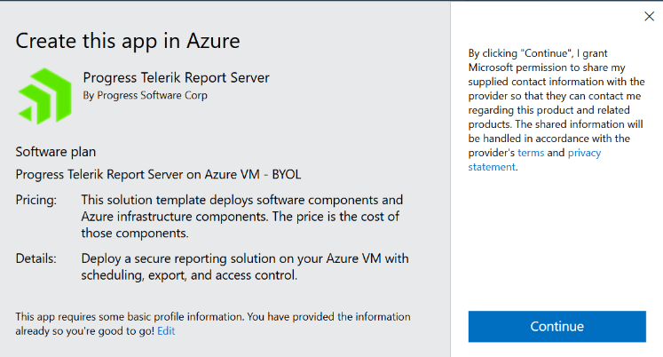
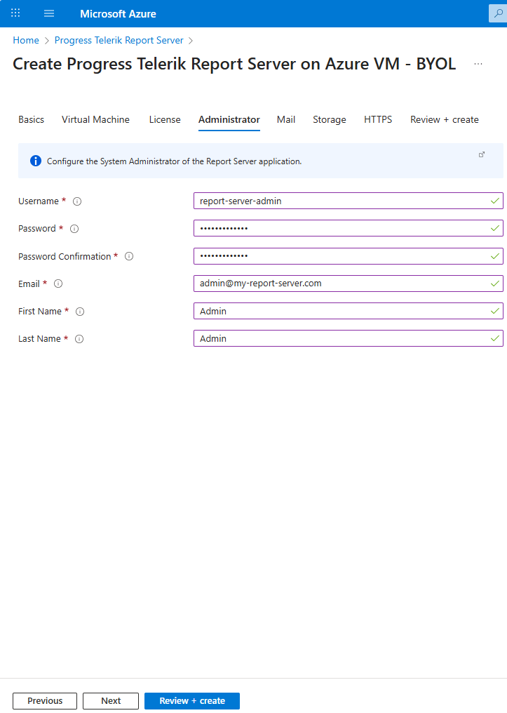
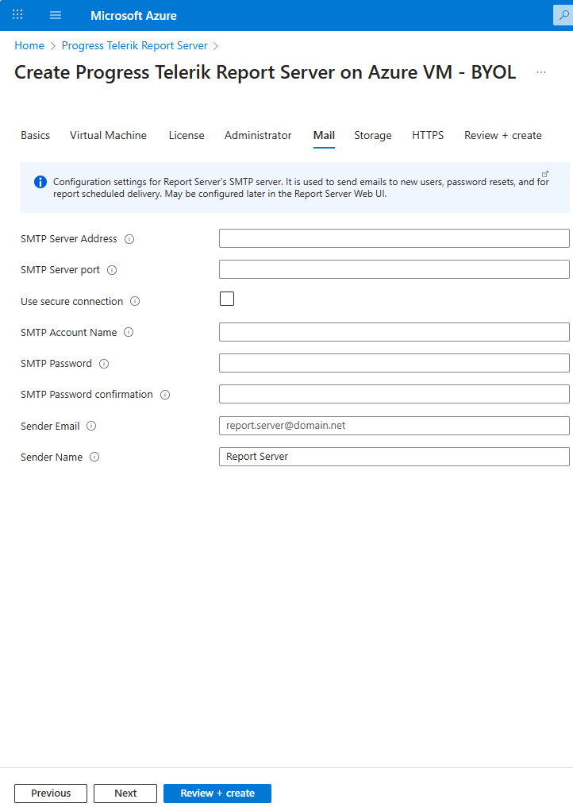
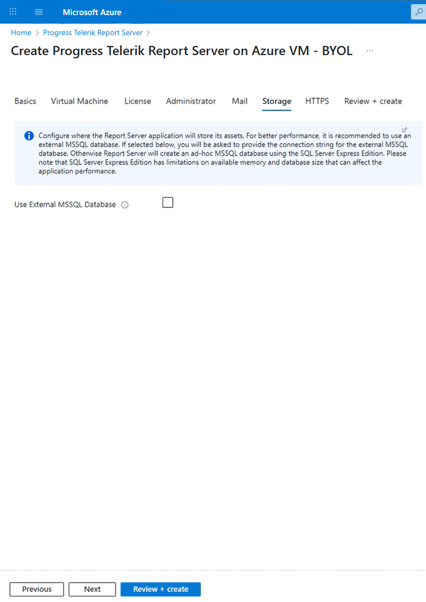
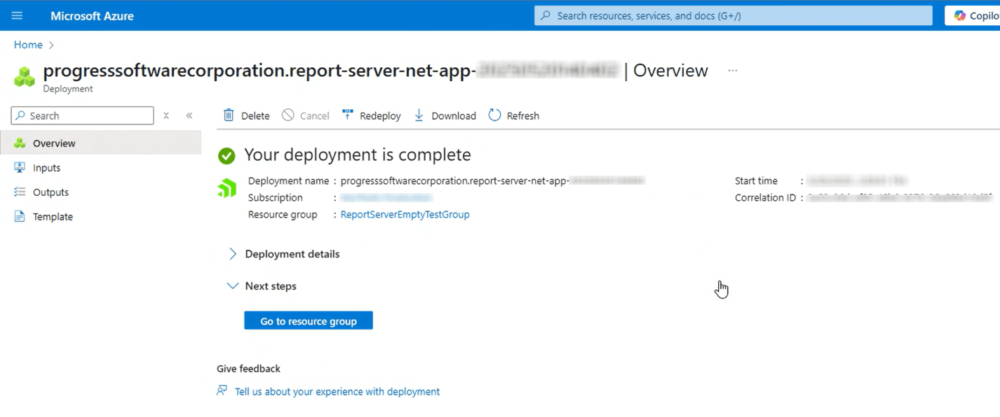

# Using Telerik Report Server .NET from the Azure Marketplace

You may deploy Telerik Report Server .NET directly from the Microsoft Azure Marketplace. It installs the public Report Server .NET Docker images with the specified settings on a new Azure Virtual Machine. Here are links to the necessary Docker images we provide publicly:

- https://hub.docker.com/r/progressofficial/telerik-reportserver-app
- https://hub.docker.com/r/progressofficial/telerik-reportserver-agent
- https://hub.docker.com/r/progressofficial/telerik-reportserver-setup

## Prerequisites

- A Microsoft Azure subscription
- A valid [Telerik Report Server License]()
- If you would like to use a Free Let's Encrypt HTTPS Certificate, before starting to deploy the Report Server in Azure, you have to buy a domain name, create a DNS Zone, and a Public IP address. Make the _A_ record of the DNS zone to have the value of your public IP address. The DNS Zone and the Public IP address must be in a separate Resource group, because deploying the Report Server needs to happen in an empty resource group.

## Configuration Steps

> note Please ensure you have fulfilled all the setting fields marked with an asterisk (\*) in each section below.

1. Access the [Progress Telerik Report Server](https://azuremarketplace.microsoft.com/en-us/marketplace/apps/progresssoftwarecorporation.progress-telerik-report-server) on the Azure Marketplace through the **Get It Now** button. You may need to log in to your Azure account.

   

1. Start the process by agreeing with the Microsoft conditions through the **Continue** button of the popped-up window:

   

1. Click **Create** to create a new Subscription Plan for the `Progress ReportServer .NET` product:

   

1. Configure the **Basics** by selecting the proper _Subscription_/_Resource Group_ and the preferred _Region_:

   

1. Configure the **Virtual Machine** section. The screenshot below shows the recommended _Ubuntu OS Version_, _CPU Architecture_, and _VM size_:

   

   You may use an existing IP Address, or create a new one with the button at the bottom of the _Public IP Address for the VM_ setting.

   If you would like to use a Free Let's Encrypt HTTPS Certificate later in the _HTTPS_ section, you can pick the Public IP address to which you have connected your Domain name as a Prerequisite.

   > important The **DNS Prefix for the public IP Address** will be concatenated with the string below it to form the Report Server URL, where you will be able to access the Report Server Manager.

1. Add the **License** token for your Telerik Report Server product - see how to set up the [Telerik Report Server License]():

   

1. Configure the **Administrator** settings:

   

1. The **Mail** settings are optional. You may configure the SMTP in the Report Server configuration after the deployment.

   

1. The **Storage** section lets you provide a connection string to an external MSSQL Database. Otherwise, the default storage will be an MSSQL Express database deployed in a Docker container in the VM.

   

1. In **HTTPS**, you may choose a Free Let's Encrypt HTTPS Certificate.

   If you want to use the Free Let's Encrypt HTTPS Certificate, before starting to deploy the Report Server in Azure, you have to buy a domain name, create a DNS Zone, and a Public IP address as explained in the _Virtual Machine_ section. Enter here your domain name created in the _Virtual Machine_ section. It will be the domain name you bought.

   

   The Free Let's Encrypt HTTPS Certificate is expected to be renewed automatically before expiring through a _cron job_ set up during installation.

1. The last section **Review + create** validates the above settings.

   

   After the validation passes, you need to click on the `Create` button to start the deployment of your Report Server for .NET.

1. Wait for the deployment to finish. You will see a screen like below during the process that may take several minutes:

   

   When all the items under the _Resource_ are marked with green ticks, the deployment has finished successfully, and you will see the next screen:

   

1. Access your Report Server on the URL specified in the _Virtual Machine_ setting:

   

> note The user who created the Virtual Machine is fully responsible for managing it.

The user can access the Virtual Machine through [Secure Shell Protocol (SSH Protocol)](https://en.wikipedia.org/wiki/Secure_Shell) with the credentials provided in the _Virtual Machine_ section. In this scenario, port 22 should be opened explicitly:

- Select the _Network Settings_ to open the configuration page of the Virtual Machine:

  

- Add the row that opens port 22 of the Virtual Machine:

  

## Upgrading the Report Server for .NET on Azure Marketplace

1. Add the SSH Networking rule to open the secure port 22 as explained at the end of the previous section. You may log into the Virtual Machine terminal only through an SSH connection.
1. Access the Azure Virtual Machine through the just-opened SSH port 22.
   There are four (4) services running on the machine. You may list them with the command `docker service ls`. The services we need to upgrade are `report-server_telerik-report-server` and `report-server_telerik-report-server-agent`. Execute the following commands for this purpose:
   ````bash
   docker service update --image progressofficial/telerik-reportserver-app:latest report-server_telerik-report-server
   docker service update --image progressofficial/telerik-reportserver-agent:latest report-server_telerik-report-server-agent

```


1. Run the command `docker image prune` to remove the old images, if any.
1. Close port 22 by removing the SSH rule we introduced in the first step to keep your environment safe.

> If you need to revert to an older Report Server for .NET version, replace the tag `latest` in the above commands with the corresponding version tag.

## See Also

* [Report Server for .NET Introduction]()
* [Telerik Report Server License]()
* [Telerik Report Server License Agreement](https://www.telerik.com/purchase/license-agreement/report-server)
```
