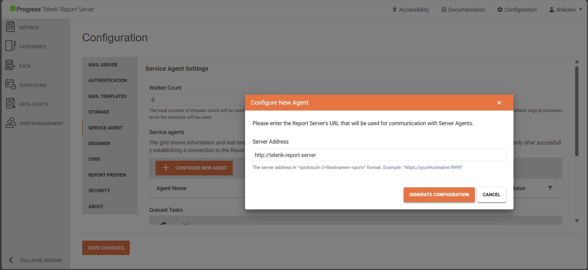
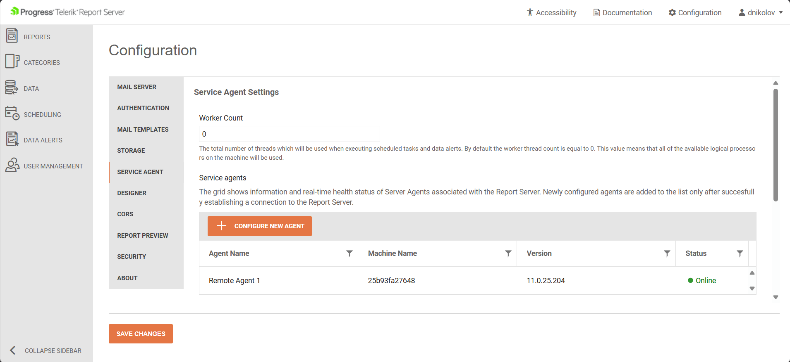

# Report Server for .NET: Installation on Docker Container

The Report Server for .NET (`RS.NET`) is ready for deployment on Docker Containers through ready-to-use Docker Images introduced in [2025 Q2 (11.1.25.521)](https://www.telerik.com/support/whats-new/report-server/release-history/progress-telerik-report-server-2025-q2-11-1-25-521):

* https://hub.docker.com/r/progressofficial/telerik-reportserver-app
* https://hub.docker.com/r/progressofficial/telerik-reportserver-agent

The above images would be downloaded automatically when using the `docker-compose.yml` files suggested in the workflow below, following the [Microsoft Docker Compose](https://docs.docker.com/compose/) concept.

The setup process described in this article consists of the following steps that should be executed in the proposed order:

1. First, we configure the Report Server Manager application for .NET. This lets you, as an administrator, configure the Report Server by adding the required Encryption.
1. As a second step, we redeploy the Report Server Manager for .NET with the known Encryption keys. This lets you add a Report Server Agent. Generally, you may add more than one Report Server Agent for each Report Server Manager.
1. Finally, with the known Report Server Agent identifiers, we may also deploy the latter.

## Compose the Docker Container

Below is an example of a `docker-compose.yml` that may be used for installing the Report Server Manager, Report Server Agent, and the MSSQL Server Storage for the complete Report Server for .NET suite. The same `docker-compose.yml` is used as a base in the steps below. Each step, though, requires uncommenting part of the code, updating part of it, or adding new pieces as explained in the corresponding step. Note that the tabulation must be kept as shown in the snippet:

````yml
services:

# template configuration of Report Server.
  telerik-report-server:
    environment:
      - Telemetry__IsDisabled=true
    env_file:
      - mssql_storage.env
    image: progressofficial/telerik-reportserver-app:latest
    restart: always
    ports:
      - "82:80"
    depends_on: 
      - storage

# template configuration of Report Server Agent.
# Uncomment the following lines when a new server agent is configured in the Service Agents panel in the Configuration view of the Report Server web application.
# Please update the Agent__AuthenticationToken and Agent__Id environment variables with the values from the newly created agent configuration.
  # telerik-report-server-agent:
  #   environment:
  #   - Agent__ServerAddress=http://telerik-report-server
  #   - Agent__AuthenticationToken=YOUR_AGENT_AUTHENTICATION_TOKEN_HERE
  #   - Agent__Id=YOUR_AGENT_ID_HERE
  #   image: progressofficial/telerik-reportserver-agent:latest
  #   restart: always
  #   command: dockerize -wait tcp://telerik-report-server:80 -timeout 1200s

  storage:
    image: "mcr.microsoft.com/mssql/server:2022-latest"
    restart: always
    environment:
      - MSSQL_SA_PASSWORD=P1@ceStr0ngP@ssw0rdH3r3
      - ACCEPT_EULA=Y
    volumes: 
      - mssql-storage:/var/opt/mssql

volumes:
  mssql-storage:
````

> We strongly recommend changing the password `P1@ceStr0ngP@ssw0rdH3r3` for the SA database user with your strong password in the above `docker-compose.yml`.

## Steps to install the RS.NET on the Docker Container

### Installing the Report Server Manager

+ (_optional, use it only if it was not used before_) Initialize a swarm to make the Docker Engine hosting the RS.NET a manager in the newly created single-node swarm by running the command `docker swarm init`.
+ Use the following `docker-compose.yml`:

````yml
services:

# template configuration of Report Server.
  telerik-report-server:
    environment:
      - Telemetry__IsDisabled=true
    env_file:
      - mssql_storage.env
    image: progressofficial/telerik-reportserver-app:latest
    restart: always
    ports:
      - "82:80"
    depends_on: 
      - storage

  storage:
    image: "mcr.microsoft.com/mssql/server:2022-latest"
    restart: always
    environment:
      - MSSQL_SA_PASSWORD=P1@ceStr0ngP@ssw0rdH3r3
      - ACCEPT_EULA=Y
    volumes: 
      - mssql-storage:/var/opt/mssql

volumes:
  mssql-storage:
````

+ Run the command `docker stack deploy -c docker-compose.yml report-server`.
+ Navigate to `localhost:82` in the browser to open the Report Server Manager for .NET.

### Creating a New Server Agent

>note The Report Server Manager for .NET has to be fully set up before following the steps from this section.

+ Use the following `docker-compose.yml`:

````yml
services:

# template configuration of Report Server.
  telerik-report-server:
    environment:
      - RS_NET_MainPrivateKey=PASTE_THE_MAIN_ENCRYPTION_KEY_HERE
      - RS_NET_BackupPrivateKey=PASTE_THE_BACKUP_ENCRYPTION_KEY_HERE
      - Telemetry__IsDisabled=true
    env_file:
      - mssql_storage.env
    image: progressofficial/telerik-reportserver-app:latest
    restart: always
    ports:
      - "82:80"
    depends_on: 
      - storage

  storage:
    image: "mcr.microsoft.com/mssql/server:2022-latest"
    restart: always
    environment:
      - MSSQL_SA_PASSWORD=P1@ceStr0ngP@ssw0rdH3r3
      - ACCEPT_EULA=Y
    volumes: 
      - mssql-storage:/var/opt/mssql

volumes:
  mssql-storage:
````

  Inside the `environment` element, there are entries for each encryption key. They should be downloaded from the [Encryption](#encryption) step during the Configuration after successfully [Installing the Report Server Manager](#installing-the-report-server-manager):

  * `RS_NET_MainPrivateKey` - Environment variable holding the main private key for the encryption. 
  * `RS_NET_BackupPrivateKey` - Environment variable holding the main backup key for the encryption.

+ Run the command `docker stack deploy -c docker-compose.yml report-server` to re-deploy with the updated `docker-compose.yml`.
+ Open the Report Server Manager (by default - http://localhost:82), and then open the **Configuration** page.
+ Click on the **SERVER AGENT** tab and start the creation of a new Server Agent by pressing the **CONFIGURE NEW AGENT** button.
+ In the pop-up window with title **Configure New Agent**, enter the Report Server base URL or http://telerik-report-server. This should automatically route to the Report Server Manager application.

	

+ Press the **GENERATE CONFIGURATION** pop-up and copy the tokens from the **ENVIRONMENT VARIABLES** tab:

	

+ Use the following `docker-compose.yml` file:

````yml
services:

# template configuration of Report Server.
  telerik-report-server:
    environment:
      - RS_NET_MainPrivateKey=PASTE_THE_MAIN_ENCRYPTION_KEY_HERE
      - RS_NET_BackupPrivateKey=PASTE_THE_BACKUP_ENCRYPTION_KEY_HERE
      - Telemetry__IsDisabled=true
    env_file:
      - mssql_storage.env
    image: progressofficial/telerik-reportserver-app:latest
    restart: always
    ports:
      - "82:80"
    depends_on: 
      - storage

# template configuration of Report Server Agent.
# Uncomment the following lines when a new server agent is configured in the Service Agents panel in the Configuration view of the Report Server web application.
# Please update the Agent__AuthenticationToken and Agent__Id environment variables with the values from the newly created agent configuration.
  telerik-report-server-agent:
    environment:
      - Agent__ServerAddress=http://telerik-report-server
      - Agent__AuthenticationToken=YOUR_AGENT_AUTHENTICATION_TOKEN_HERE
      - Agent__Id=YOUR_AGENT_ID_HERE
    image: progressofficial/telerik-reportserver-agent:latest
    restart: always
    command: dockerize -wait tcp://telerik-report-server:80 -timeout 1200s

  storage:
    image: "mcr.microsoft.com/mssql/server:2022-latest"
    restart: always
    environment:
      - MSSQL_SA_PASSWORD=P1@ceStr0ngP@ssw0rdH3r3
      - ACCEPT_EULA=Y
    volumes: 
      - mssql-storage:/var/opt/mssql

volumes:
  mssql-storage:
````

+ Update the _Agent__AuthenticationToken_ and _Agent__Id_ environment variables with the values from the newly created agent configuration.
+ Run the command `docker stack deploy -c docker-compose.yml report-server` to re-deploy with the updated `docker-compose.yml`.
+ Open the **Configuration** page with the Service Agents again, now there should be one agent visible in the Server Agents table in the middle of the page:

	

## See Also

* [Telerik Report Server Introduction]()
* [Report Server for .NET Introduction]()
