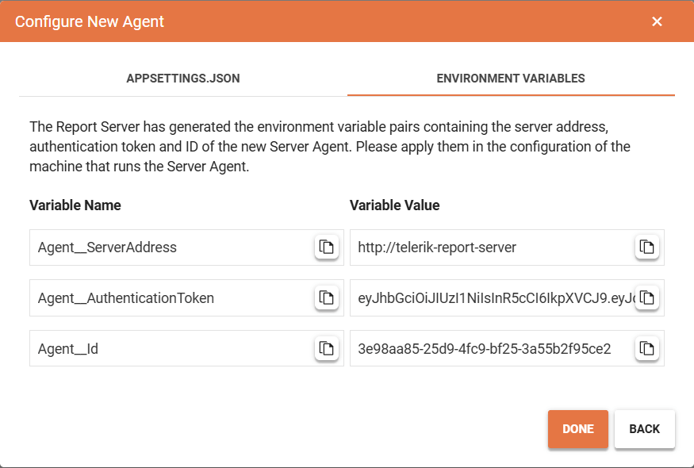

# Report Server for .NET: Installation on Docker Container

The Report Server for .NET (`RS.NET`) is ready for deployment on Docker Containers. The assets for non-Windows platforms are available as separate resources downloadable from [your Telerik account](https://www.telerik.com/account/downloads/product-download?product=REPSERVER).

This article is a step-by-step tutorial on deploying Telerik Report Server for .NET on a Linux Docker Container with a [Microsoft SQL Server (MsSqlServer) Storage](#microsoft-sql-server-mssqlserver) deployed on its own Docker Container based on the image `mcr.microsoft.com/mssql/server:2019-latest` exposed publicly on port `1433`.

## Installation Process

### Installing Report Server for .NET

1. Download the archive `Telerik_ReportServer_Net_NonWindows_{Report Server version}.zip` from [your Telerik account](https://www.telerik.com/account/downloads/product-download?product=REPSERVER).
1. Unzip the archive. The content gets deployed in two folders `ReportServer` and `ReportServiceAgent`.
1. Open the `Powershell` and navigate to the subfolder `ReportServer`.
1. Run the command `docker build -t telerik-report-server:local .` in _Powershell_ to build the Report Server Manager image. Mind the dot `.` at the end of the command.
1. Navigate to the subfolder `ReportServiceAgent`.
1. Run the command `docker build -t telerik-report-server-agent:local .` in _Powershell_ to build the Report Server ServiceAgent image. Mind the dot `.` at the end of the command.
1. Navigate to the subfolder `ReportServer\docker-configs`.
1. (_optional, recommended_) Change the password `P1@ceStr0ngP@ssw0rdH3r3` for the SA database user with your own strong password in the files `docker-compose.yml` and `mssql_storage.env`:

	* Open the file `docker-compose.yml` in a text editor like Notepad++ and change the password on line 31. The tabulation is essential and should be preserved:

	`      - SA_PASSWORD=P1@ceStr0ngP@ssw0rdH3r3`

	* Open the file `mssql_storage.env` in a text editor like Notepad++ and change the password with your own password you used above:

	`reportServer__storage__parameters__0__value=Data Source=storage;Initial Catalog=reportserver;Password=P1@ceStr0ngP@ssw0rdH3r3;User Id=sa;Encrypt=false`

1. Run the command `docker image pull mcr.microsoft.com/mssql/server:2019-latest`.
1. (_optional, use it only if it was not used before_) Initialize a swarm to make the Docker Engine hosting the RS.NET a manager in the newly created single-node swarm by running the command `docker swarm init`.
1. Run the command `docker stack deploy -c docker-compose.yml report-server`.
1. Navigate to `localhost:82` in the browser to open the Report Server Manager for .NET.

>important The first time you open the Report Server, you will to configure it as explained in the article [Application Startup]().

### Creating new Service Agent

>note The Report Server Manager for .NET has to be fully set up before following the steps from this section.

1. Navigate to the `\ReportServer\docker-configs` subfolder and open the `docker-compose.yml` file in a text editor of choice. Note that the text editor application may require administrator privileges to save the file after edit.
1. Inside the `environment` element, add an entry for each encryption key so:

	RS_NET_MainPrivateKey - Environment variable holding the main private key for the encryption.
	RS_NET_BackupPrivateKey - Environment variable holding the main backup key for the encryption.
	
	````yml
services:
  # template configuration of Report Server.
  telerik-report-server:
    environment:
      - Telemetry__IsDisabled=true
      - RS_NET_MainPrivateKey=PASTE_THE_MAIN_ENCRYPTION_KEY_HERE
      - RS_NET_BackupPrivateKey=PASTE_THE_BACKUP_ENCRYPTION_KEY_HERE
````


1. Run the command `docker stack deploy -c docker-compose.yml report-server` to re-deploy with the updated `docker-compose.yml`.
1. Open the Report Server Manager(by default - http://localhost:82), and then open the **Configuration** page.
1. Click on the **SERVICE AGENT** tab and start the creation of a new Service Agent by pressing the **CONFIGURE NEW AGENT** button.
1. In the pop-up window with title **Configure New Agent**, enter the Report Server base URL or http://telerik-report-server. This should automatically route to the Report Server Manager application.

	

1. Press the **GENERATE CONFIGURATION** pop-up and copy the tokens from the **ENVIRONMENT VARIABLES** tab:

	

1. Open the `\ReportServer\docker-configs\docker-compose.yml` file in a text editor again, and uncomment the section with the `telerik-report-server-agent` element. This section should be present by default in the file and it looks as follows:
	````yml
  telerik-report-server-agent:
    environment:
      - Agent__ServerAddress=http://telerik-report-server
      - Agent__AuthenticationToken=PASTE_THE_AGENT_AUTH_TOKEN_HERE
      - Agent__Id=PASTE_THE_AGENT_ID_HERE
    image: telerik-report-server-agent:local
    restart: always
    command: dockerize -wait tcp://telerik-report-server:80 -timeout 1200s
````


1. Run the command `docker stack deploy -c docker-compose.yml report-server` to re-deploy with the updated `docker-compose.yml`.
1. Open the **Configuration** page with the Service Agents again, now there should be one agent visible in the Server Agents table in the middle of the page:

	


## Additional Resources

You may download and watch the whole process from our `reporting-samples` GitHub repository: [SetupRS.NET-Docker.zip](https://github.com/telerik/reporting-samples/blob/master/VideosRS/SetupRS.NET-Docker.zip).

## Notes

The above approach for starting the RS.NET from the container will stop it *each* time you restart the machine. To avoid this, execute the following commands in _Powershell_ from the folder _.\ReportServer\docker-configs\_ to start/stop the Report Server instead of using the commands `docker-compose up` and `docker-compose down`:

1. Start the RS.NET with `.\start-docker-server.bat`
1. (_optional_) Stop the RS.NET with `.\stop-docker-server.bat`

## See Also

* [Telerik Report Server Introduction]()
* [Report Server for .NET Introduction]()
