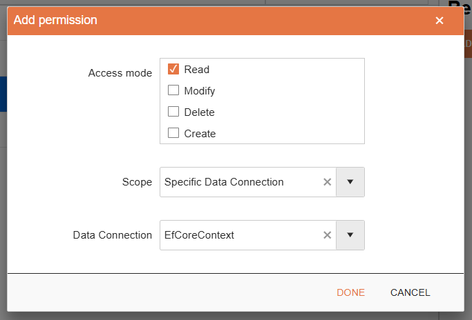

# EF Core Data Source Management

The Report Server for .NET can use custom .NET assemblies containing [Entity Framework Core](https://learn.microsoft.com/en-us/ef/core/) `DbContext` types to provide data for reports. Once registered, the EF Core data source is available during the design-time of reports via the [EntityCoreDataSource Component](https://www.telerik.com/products/reporting/documentation/designing-reports/connecting-to-data/data-source-components/entitycoredatasource-component/overview).

### How to Bind to an EF Core Data Source

1. Create an assembly containing your `DbContext` type. The `DbContext` must conform to the [DbContext Requirements](https://www.telerik.com/products/reporting/documentation/designing-reports/connecting-to-data/data-source-components/entitycoredatasource-component/overview#dbcontext-requirements).
1. Build the project using `dotnet publish` to produce the assembly along with all its dependencies.
1. Copy the assembly and its dependencies to the root folder of the Report Server web application. The default path is `C:\Program Files (x86)\Progress\Telerik Report Server .NET\Telerik.ReportServer.Web\`.
1. Declare the assembly in the `appsettings.json` file of the Report Server web application according to the instructions in the [Extending Reporting Engine with Custom Assemblies](https://www.telerik.com/products/reporting/documentation/doc-output/configure-the-report-engine/extensions-element#example) article. The configuration should look similar to:

	```json
	{
	   	"telerikReporting": {
	   		"assemblyReferences": [
	      		{
	      			"name": "MyEfCoreAssembly"
	      		}
	   		]
	   	}
	}
	```

	> After modifying `appsettings.json`, restart the Report Server application (for example, recycle the IIS application pool or restart the service) for the changes to take effect.

	> When the Report Server is upgraded to a newer version, the `appsettings.json` file may be overwritten and any changes applied to it will be lost. It is recommended to perform a file backup before upgrading.

1. Allow user access to the custom EF Core data source — after the assembly is present in the root folder and declared in the configuration file, a read-only data connection entry will be displayed for it in the [Data Connections View](slug:data-connections-management). This data connection entry can be used to control the user access to the assembly via [User Roles](slug:user-roles).
  
1. Create a [New Report](slug:new-report).
1. Create a new [EntityCoreDataSource Component](https://www.telerik.com/products/reporting/documentation/designing-reports/connecting-to-data/data-source-components/entitycoredatasource-component/overview) and follow the EntityCoreDataSource Wizard to select a `DbContext` type, a data-retrieval member, and configure any data source parameters:
	* [Web Report Designer EntityCoreDataSource Wizard](https://www.telerik.com/products/reporting/documentation/designing-reports/designing-reports/report-designer-tools/web-report-designer/tools/entitycoredatasource-wizard)
	* [Standalone Report Designer for .NET EntityCoreDataSource Wizard](https://www.telerik.com/products/reporting/documentation/designing-reports/report-designer-tools/desktop-designers/tools/data-source-wizards/entitycoredatasource-wizard)

	>The `DbContext` type will show in the wizard only when the currently logged-in user has Read permissions for the corresponding data connection.
