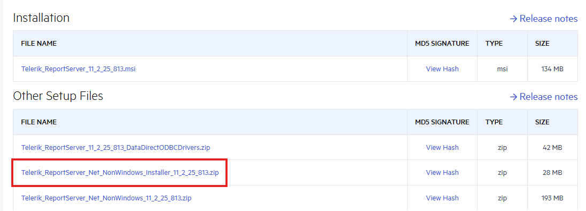

# Report Server for .NET: Installation on Linux

Starting with the [2025 Q3 release](https://www.telerik.com/support/whats-new/report-server/release-history/progress-telerik-report-server-2025-q3-11-2-25-813) of the Telerik Report Server, you can download a separate installer for Linux operating systems.

> note The CLI installer is configured for [Ubuntu](https://ubuntu.com/) and Ubuntu-based distributions.

## Installation Process

1. Navigate to the [Progress® Telerik® Report Server download page](https://www.telerik.com/account/downloads/product-download?product=REPSERVER), where you should find the zipped installer file.

   

1. If the `unzip` command isn't already installed on the system (use `which unzip` to check), run the following command to install it:

   ```bash
   sudo apt-get install unzip
   ```

1. After installing the unzip utility, use the following command to extract the installer into a new directory:

   ```bash
   unzip Telerik_ReportServer_Net_NonWindows_Installer_11_2_25_813.zip -d reportserver
   ```

1. Navigate to the newly created _reportserver_ directory and then use the `ls` command to ensure that the **Telerik.ReportServer.Installer** file is present:

   ```bash
   cd reportserver
   ls
   ```

1. Make the **Telerik.ReportServer.Installer** file an executable using the `chmod` command to give it the **+x** permission:

   ```bash
   sudo chmod +x ./Telerik.ReportServer.Installer
   ```

1. Run the executable file to begin the installation:

   ```bash
   sudo ./Telerik.ReportServer.Installer
   ```

1. If the previous steps were executed successfully, the installer will begin, and during the rest of the installation process, you will be asked to configure the Telerik Report Server for .NET via the CLI. This includes providing the operating system account that should be used by the installer, credentials for the admin user in the Report Server, and so on.

   

## Post-Installation

Once the installation is complete, navigate to the `/Account/Login` page of the Report Server for .NET in your browser to verify that the application is up and running.

Any configuration settings skipped during the CLI installation can be completed post-installation from the `/Configuration` page.

Internally, the installer uses the ready-to-use Docker Images introduced in [2025 Q2 (11.1.25.521)](https://www.telerik.com/support/whats-new/report-server/release-history/progress-telerik-report-server-2025-q2-11-1-25-521):

- https://hub.docker.com/r/progressofficial/telerik-reportserver-app
- https://hub.docker.com/r/progressofficial/telerik-reportserver-agent

The above images are downloaded automatically during the installation. If [Docker](https://www.docker.com/) is not present on the system, it will be automatically installed, as the installer uses **Docker** to host the application.

In the installation directory, you will find the `docker-compose.yml` file, which contains valuable information such as the **main and backup** [encryption keys](#encryption).

The installer will also automatically create a single [Report Server Agent](), the configuration for which can also be found in the `docker-compose.yml` file.

## Upgrading

We changed the installation approach for the Report Server for .NET on Linux in version [2026 Q1 (12.0.26.211)](https://www.telerik.com/support/whats-new/report-server/release-history/progress-telerik-report-server-2026-q1-(12-0-26-211)). Here are the upgrade steps before and after the change.

### Upgrade Steps for Report Server Instances Installed in Version 2026 Q1 (12.0.26.211) or Later

Execute the following commands for this purpose. Run them from the directory that contains your `docker-compose.yml` file, or specify the file explicitly with `-f /path/to/docker-compose.yml`:

   ```bash
   docker compose pull
   docker compose down
   docker compose up -d
   ```

### Upgrade Steps for Report Server Instances Installed Before Version 2026 Q1 (12.0.26.211)

There are four (4) services running on the machine. You may list them with the command `docker service ls`.

The services we need to upgrade are `report-server_telerik-report-server` and `report-server_telerik-report-server-agent`.

Execute the following commands for this purpose. Run them from the directory that contains your `docker-compose.yml` file, or specify the file explicitly with `-f /path/to/docker-compose.yml`:

   ```bash
   docker service update --image progressofficial/telerik-reportserver-app:latest report-server_telerik-report-server

   docker service update --image progressofficial/telerik-reportserver-agent:latest report-server_telerik-report-server-agent
   ```


> tip If you need to revert to an older Report Server for .NET version, replace the tag `latest` in the above commands with the corresponding version tag.


## See Also

- [Installation on Windows]()
- [Azure Marketplace Deployment]()
- [Installation on Docker Container]()
