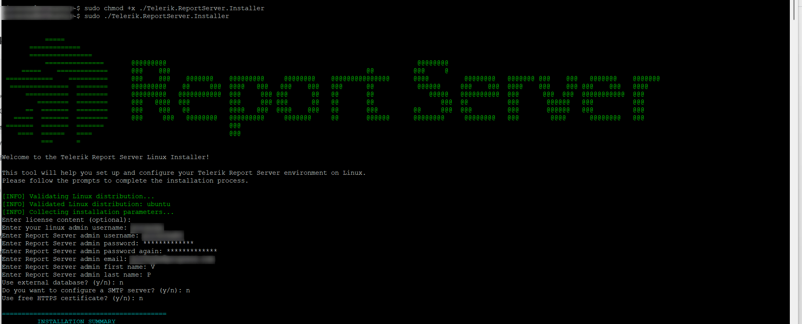

# Report Server for .NET: Installation on Linux

Starting with the [2025 Q3 release](https://www.telerik.com/support/whats-new/report-server/release-history/progress-telerik-report-server-2025-q3-11-2-25-812) of the Telerik Report Server, you can now download a separate installer for Linux operating systems.

## Installation Process

1. Navigate to the [Progress® Telerik® Report Server download page](https://www.telerik.com/account/downloads/product-download?product=REPSERVER), where you should find the zipped installer file.

	

1. If the `unzip` command isn't already installed on the system (use `which unzip` to check), run the following command to install it:

	````bash
sudo apt-get install unzip
````


1. After installing the unzip utility, use the following command to extract the installer in a new directory:

	````bash
unzip Telerik_ReportServer_Net_NonWindows_Installer_11_2_25_812.zip -d reportserver
````


1. Navigate to the newly created *reportserver* directory and then use the `ls` command to ensure that the **Telerik.ReportServer.Installer** file is present:

	````bash
cd reportserver
ls
````


1. Make the **Telerik.ReportServer.Installer** file an executable using the `chmod` command to give it the **+x** permission:

	````bash
sudo chmod +x ./Telerik.ReportServer.Installer
````


1. Run the executable file to begin the installation:

	````bash
sudo ./Telerik.ReportServer.Installer
````


1. If the previous steps were executed successfully, the installer will begin, and during the rest of the installation process, you will be asked to configure the Telerik Report Server for .NET via the CLI. This includes providing the operating system account that should be used by the installer, credentials for the admin user in the Report Server, and so on.

	


## Post-Installation

Once the installation is complete, navigate to the `/Account/Login` page of the Report Server for .NET in your browser to verify that the application is up and running.

Any configuration settings skipped during the CLI installation can be completed post-installation from the `/Configuration` page.

Internally, the installer uses the ready-to-use Docker Images introduced in [2025 Q2 (11.1.25.521)](https://www.telerik.com/support/whats-new/report-server/release-history/progress-telerik-report-server-2025-q2-11-1-25-521):

* https://hub.docker.com/r/progressofficial/telerik-reportserver-app
* https://hub.docker.com/r/progressofficial/telerik-reportserver-agent

The above images are downloaded automatically during the installation. If [Docker](https://www.docker.com/) is not present on the system, it will be automatically installed, as the installer uses **Docker** to host the application.
In the installation directory, you will be able to find the `docker-compose.yml` file, which will contain valuable information such as the **main and backup** [encryption keys](#encryption).

The installator will also automatically create a single [Report Server Agent](), the configuration for which can also be found in the `docker-compose.yml` file.

## See Also

* [Installation on Windows]()
* [Azure Marketplace Deployment]()
* [Installation on Docker Container]()
