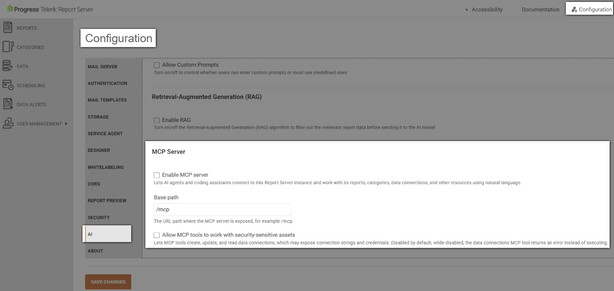
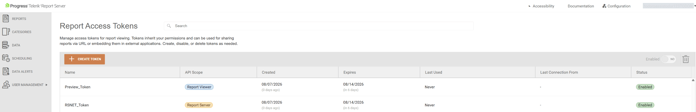

# Configuring the Report Server for .NET MCP Server

Starting with [2026 Q3 (12.2.26.812)](https://www.telerik.com/support/whats-new/report-server/release-history/progress-telerik-report-server-2026-q3-(12-2-26-812)) release version, the Telerik Report Server for .NET exposes a Model Context Protocol (MCP) server.

## Overview

The [Model Context Protocol (MCP)](https://modelcontextprotocol.io/) is an open standard that lets AI agents discover and call the tools that an application exposes, instead of requiring the AI agent's developer to write custom integration code for that application. An MCP-compliant server describes its available operations in a structured, machine-readable form so that any MCP-compatible AI client, for example, an AI coding assistant, can call them safely and predictably.

Before the MCP server, an AI agent, an IT administrator using an AI coding assistant, or an AI-powered business workflow that needed to interact with a Report Server for .NET instance had to either write custom HTTP client code against the Report Server REST API or navigate the Report Server Manager web UI manually. There was no structured, discoverable, AI-native interface for these scenarios.

The Report Server for .NET MCP Server resolves this by hosting an MCP-compliant server in-process inside the Report Server for .NET web application. The MCP server exposes the Report Server management REST API as a set of MCP tools that cover categories, reports, on-demand document generation, data connections, users, roles, permissions, scheduled tasks, data alerts, Object Data Sources, and SQL schema discovery. For the full list of tools, refer to [Available MCP Tools](#available-mcp-tools).

## Prerequisites

- An API Personal Access Token, described in [Authentication](#authentication), for the user account that the AI agent connects as.
- A Trial or Subscription license for the Report Server for .NET instance.

## Configuration

Configuring the MCP server involves enabling it on the Report Server for .NET instance and connecting an MCP client to it.

### Server-Side Configuration

The MCP server is disabled by default. Enable and configure it from the AI Configuration section of the Report Server Manager admin UI:

- **Enable MCP Server** — a switch that toggles the `EnableMcpServer` setting. The MCP endpoint responds with `404 Not Found` while this setting is disabled.
- **Base Path** — a configurable path, `/mcp` by default, that controls where the MCP endpoint is mapped. This value is persisted in the Report Server for .NET storage.
- **Allow MCP tools to work with security-sensitive assets** - Lets MCP tools create, update, and read data connections, which may expose connection strings and credentials. Disabled by default; while disabled, the data connections MCP tool returns an error instead of executing. You must enable MCP Server before allowing MCP tools to work with security-sensitive assets.



> You must restart the Report Server .NET Manager application after enabling the MCP Server or changing its configuration.

The MCP endpoint additionally requires a Trial or Subscription license for the Report Server for .NET instance. The endpoint responds with `404 Not Found` if the MCP server is disabled, or if the instance is not licensed for it.

#### Transports

The Report Server for .NET web application hosts a stateless Streamable HTTP transport for the MCP server, mapped at the configurable base path described above (`/mcp` by default).

### Authentication

The MCP server requires a Personal Access Token, separate from the tokens that the [Report Viewers use to preview reports]():

- **Report preview tokens** - the _Report Viewer_ Personal Access Tokens described in [Report Viewer Access Token](#report-viewer-access-token). These tokens only grant the Reading permissions of the user they belong to and are meant to be passed from a Report Viewer to authenticate report preview requests.
- **API access tokens** - the _Report Server_ Personal Access Tokens described in [Report Server Access Token](#report-server-access-token).Unlike report preview tokens, API access tokens are scoped for the MCP server (and, more broadly, the Report Server REST API) and can carry the full range of permissions of the user they belong to, including write operations such as creating reports, managing users, or configuring scheduled tasks. Generate an API access token for the user account that an AI agent connects as, then keep it as secret as you would a password.



Every request to the in-process HTTP transport must include a valid API access token in the `X-ReportServer-Token` header. The permissions enforced for each MCP tool call match the permissions of the user that the token belongs to.

### Client-Side Configuration

Configure an MCP client, for example, an AI coding assistant, to connect to the Report Server for .NET MCP server through its `.mcp.json` configuration file.

The following example configures the MCP client to connect directly to the in-process HTTP transport:

```JSON
{
	"mcpServers": {
		"Telerik.ReportServer.Core.MCP": {
			"type": "http",
			"url": "Paste your URL here",
			"tools": ["*"],
			"headers": {
				"X-ReportServer-Token": "Paste your token here"
			}
		}
	}
}
```

## Usage

Once the MCP client is configured, prompt the AI agent in natural language and let it call the exposed MCP tools on your behalf. The AI agent chooses which of the [Available MCP Tools](#available-mcp-tools) to call, in which order, based on the wording of your prompt.

The following example prompts walk through a typical report lifecycle:

1. "List all reports on the Report Server."
1. "Create a new report named `Sales Summary` in the `Sales` category."
1. "Create a scheduled task that runs the `Sales Summary` report every Monday at 8 AM."
1. "Render the `Sales Summary` report as a PDF and give me the file."
1. "Add a new revision to the `Sales Summary` report."
1. "Get all report definition files from my local `Reports` folder and upload them to the Report Server." (_bulk-operation_)

> Bulk operations, such as uploading multiple report definition files from a local folder in a single request, are not implemented as a dedicated MCP tool. The AI agent achieves step 6 by repeatedly calling `manage_report` for each file.

## Available MCP Tools

The MCP server exposes consolidated, multi-operation tools rather than a single tool per REST verb. The following table lists the currently implemented tools and the operations that each one covers.

**MCP Tools Exposed by the Report Server for .NET**

| Tool | Covers |
|---|---|
| `manage_category` | List, get, create, rename, and delete categories. |
| `manage_report` | List, get, create, update, lock and unlock, shelve, publish, and view revisions of reports. |
| `manage_document` | Generate documents on demand. Document generation is asynchronous: `Create` starts rendering, `GetStatus` is polled for progress, and `Get` downloads the base64-encoded content once rendering completes. This tool requires the Report Server REST API v3 surface. |
| `manage_data_connection` | List, get, create, update, and delete data connections and their providers. |
| `manage_user` | List, get, update, enable and disable local and federation users. |
| `manage_role` | List, get, create, update, and delete roles, and manage role membership. |
| `manage_permission` | List, add, and delete report and category permissions for users and roles. |
| `manage_scheduled_task` | List, get, create, update, execute, and delete scheduled tasks and their executions. |
| `manage_data_alert` | List, get, create, update, execute, and delete data alerts and their executions. |
| `manage_object_data_source` | List, get, create, update, and delete Object Data Sources. |

## Current Limitations

The following capabilities are not available in the current version of the MCP server:

- Bulk operations, for example, uploading a whole folder of report definitions in a single call.
- Anonymous or guest access through the MCP server.
- OAuth 2.0 or SAML single sign-on authentication for MCP clients. Only Personal Access Tokens and API access tokens are supported.
- The User operations `Create` and `Change Password` are not available through the MCP for security concerns.
- The SQL Schema API is not available through the MCP for security concerns.

## See Also

- [Report Server for .NET Introduction]()
- [Using Personal Tokens for Authentication]()
- [REST API V3](dotnet-docs/rest-api/v3/api-reference)