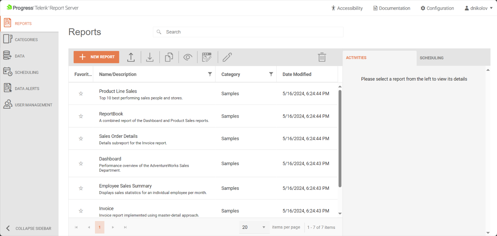

# Report Server for .NET Introduction

The Telerik Report Server for .NET was introduced in the [2024 Q2(10.1.24.514)](https://www.telerik.com/support/whats-new/report-server/release-history/progress-telerik-report-server-2024-q2-10-1-24-514) release and will, in the future, replace the [older Report Server]() application.

>note The current state of the Report Server is in `Preview` and will soon be made the officially(and only) supported version of the Telerik Report Server product.

## Report Server Manager

The Report Server Manager is the [ASP.NET Core Application](https://dotnet.microsoft.com/en-us/apps/aspnet) that lets the Report Server users log in and use its functionality through a user-friendly interface which is built with [Kendo UI 2024 Q1 (version 2024.1.130)](https://www.telerik.com/support/whats-new/kendo-ui/release-history/kendo-ui-2024-q1-(version-2024-1-130)). The Web UI provides a dedicated view for each functionality of the server.

## Requirements

### Server

- ASP.NET Core Module (ANCM) - The ASP.NET Core Module (ANCM) is installed with the .NET Core Runtime from the [.NET Core Hosting Bundle](https://learn.microsoft.com/en-us/aspnet/core/host-and-deploy/iis/hosting-bundle?view=aspnetcore-8.0).
- Internet Information Services (IIS 7+) - Required when for the automatic setup of the Report Server for .NET on Windows machines through the MSI file.

>note The Telerik Report Server for .NET can be hosted on Windows and Unix systems, such as Linux, however, the installator is currently available olny for Windows.

### Client 

- HTML5-compliant browser with support for `JavaScript 1.8.5` (ECMAScript5) and `CSS3`.

## Telerik Report Server for .NET Learning Resources

* [Telerik Report Server Homepage](https://www.telerik.com/report-server)
* [Telerik Report Server for .NET Windows Installation]()
* [Connecting to Data with Telerik Report Server]()
* [Telerik Report Server License Agreement](https://www.telerik.com/purchase/license-agreement/report-server)