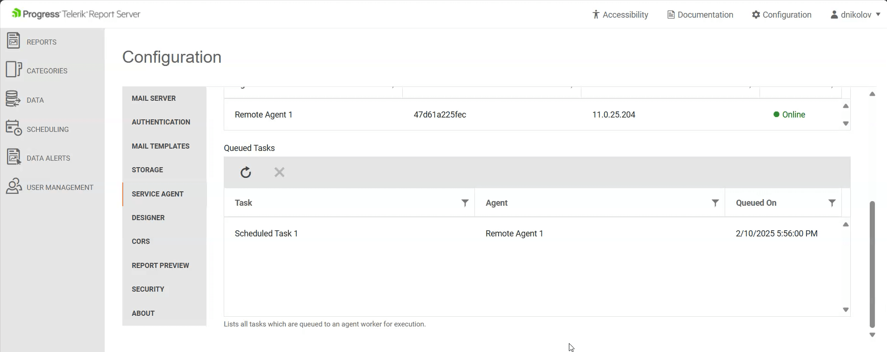

# Server Agent

The **Server Agent** is responsible for the execution of scheduled tasks and data alerts, as well as sending e-mail messages. 

It runs its tasks on multiple worker threads to optimize execution performance. The **Server Agent** communicates with the Report Server Manager through the [SignalR](https://en.wikipedia.org/wiki/SignalR) technology to allow fast and reliable two-way communication.


## Worker Count

This is the total number of threads that will be used when executing scheduled tasks and data alerts. By default, the worker thread count is equal to 0. This value means that the Worker Count will match the count of the *available* logical processors on the agent machine.

## Queued Tasks

A queued task represents a Scheduled task or Data alert that is currently being executed by any Server Agent. It allows canceling the execution of a selected task. 

The table displays the name of the Scheduled task or Data Alert, the target Server Agent, and when was the task scheduled for execution.



## Creating Server Agents on Windows

1. Open the Report Server Manager(by default - http://localhost:82), and then open the **Configuration** page.
1. Click on the **SERVER AGENT** tab and start the creation of a new Server Agent by pressing the **CONFIGURE NEW AGENT** button.
1. In the pop-up window with title **Configure New Agent**, enter the Report Server base URL or http://telerik-report-server. This should automatically route to the Report Server Manager application.

	
	
1. Press the **GENERATE CONFIGURATION** pop-up and copy the JSON-based configuration from the **APPSETTINGS.JSON** tab:

	
	
	The Report Server has generated a configuration containing the server address, authentication token, and ID of the new Server Agent.

1. Navigate to the `C:\Program Files (x86)\Progress\Telerik Report Server\Services\.NET\` folder and open the `appsettings.json` file in a text editor of choice.
1. Paste the JSON-based Server Agent configuration in the file:

	````JSON
"Agent": {
		"ServerAddress": "http://localhost:82",
		"AuthenticationToken": "eyJhbGciOiJIUzI1NiIsInR5cCI6IkpXVCJ9.eyJodHRwOi8vc2NoZW1hcy54bWxzb2FwLm9yZy93cy8yMDA1LzA1L2lkZW50aXR5L2NsYWltcy9uYW1laWRlbnRpZmllciI6IjI2YzMzZmIxZTAwOTRiYTE4NTk3MmNkYTJhZjE2MmNjIiwiaHR0cDovL3NjaGVtYXMueG1sc29hcC5vcmcvd3MvMjAwNS8wNS9pZGVudGl0eS9jbGFpbXMvbmFtZSI6IlN5c3RlbVVzZXIiLCJodHRwOi8vc2NoZW1hcy54bWxzb2FwLm9yZy93cy8yMDA1LzA1L2lkZW50aXR5L2NsYWltcy9lbWFpbGFkZHJlc3MiOiJTeXN0ZW1Vc2VyQHByb2dyZXNzLmNvbSIsIkFzcE5ldC5JZGVudGl0eS5TZWN1cml0eVN0YW1wIjoiMjM0NllFM1pXVU9HRFJYNzM1WDRWVFo1Rk1aTElHQUEiLCJodHRwOi8vc2NoZW1hcy5taWNyb3NvZnQuY29tL3dzLzIwMDgvMDYvaWRlbnRpdHkvY2xhaW1zL3JvbGUiOiJTeXN0ZW0gVXNlciIsImp3dF90b2tlbl9pZCI6IjI2OTkwNWVmLTg1NWUtNGYxZi04MzUyLWExMzIxMjhhN2IzYSIsImV4cCI6MTc3MDczOTE5NywiaXNzIjoiUmVwb3J0U2VydmVyIiwiYXVkIjoiU2VydmljZUFnZW50In0.XB6rembo2WOZ77ms1cRuk1sR1IYS8hhuSHODMxC4nIE",
		"Id": "f4093cf0-c259-4642-a8f2-cb314d00ee88"
	}
````


## Creating Server Agents in Linux Containers

>important The Report Server for .NET should be completely set and configured before adding Server Agents - [Installing ReportServer.NET on Docker Containe]().

1. Open the Report Server Manager(by default - http://localhost:82), and then open the **Configuration** page.
1. Click on the **SERVER AGENT** tab and start the creation of a new Server Agent by pressing the **CONFIGURE NEW AGENT** button.
1. In the pop-up window with title **Configure New Agent**, enter the Report Server base URL or http://telerik-report-server. This should automatically route to the Report Server Manager application.

	

1. Press the **GENERATE CONFIGURATION** pop-up and copy the tokens from the **ENVIRONMENT VARIABLES** tab:

	

1. Open the `\ReportServer\docker-configs\docker-compose.yml` file in a text editor again, and uncomment the section with the `telerik-report-server-agent` element. This section should be present by default in the file and it looks as follows:

	````yml
telerik-report-server-agent:
      environment:
        - Agent__ServerAddress=http://telerik-report-server
        - Agent__AuthenticationToken=PASTE_THE_AGENT_AUTH_TOKEN_HERE
        - Agent__Id=PASTE_THE_AGENT_ID_HERE
      image: telerik-report-server-agent:local
      restart: always
      command: dockerize -wait tcp://telerik-report-server:80 -timeout 1200s
````


1. Run the command `docker stack deploy -c docker-compose.yml report-server` to re-deploy with the updated `docker-compose.yml`.
1. Open the **Configuration** page with the Server Agents again, now there should be one agent visible in the Server Agents table in the middle of the page:

	 
