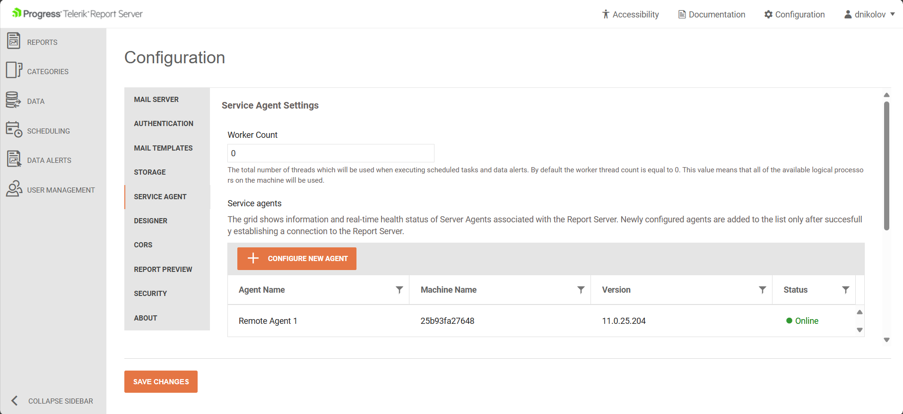

# Service Agent

The **Service Agent** is responsible for the execution of scheduled tasks and data alerts, as well as sending e-mail messages. 

It runs its tasks on multiple worker threads to optimize execution performance. The **Service Agent** communicates with the Report Server Manager through the [SignalR](https://en.wikipedia.org/wiki/SignalR) technology making it a fast and secure solution.



## Worker Count

This is the total number of threads which will be used when executing scheduled tasks and data alerts. By default, the worker thread count is equal to 0. This value means that *all of the available* logical processors on the machine will be used.

## Queued Tasks

The queued tasks grid shows all tasks which are currently queued for execution. It allows canceling a selected task execution. 

The grid displays the name of the machine and worker thread which started the execution and the start date and time.


## Creating Service Agents on Windows

1. Open the Report Server Manager(by default - http://localhost:82), and then open the **Configuration** page.
1. Click on the **SERVICE AGENT** tab and start the creation of a new Service Agent by pressing the **CONFIGURE NEW AGENT** button.
1. In the pop-up window with title **Configure New Agent**, enter the Report Server base URL or http://telerik-report-server. This should automatically route to the Report Server Manager application.

	
	
1. Press the **GENERATE CONFIGURATION** pop-up and copy the JSON-based configuration from the **APPSETTINGS.JSON** tab:

	
	
1. Navigate to the `C:\Program Files (x86)\Progress\Telerik Report Server\Services\.NET\` folder and open the `appsettings.json` file in a text editor of choice.
1. Paste the JSON-based Service Agent configuration in the file:

	````JSON

````


## Creating Service Agents in Linux Containers

>important The Report Server for .NET should be completely setup and configured before adding Service Agents - [Installing ReportServer.NET on Docker Containe]().

1. Open the Report Server Manager(by default - http://localhost:82), and then open the **Configuration** page.
1. Click on the **SERVICE AGENT** tab and start the creation of a new Service Agent by pressing the **CONFIGURE NEW AGENT** button.
1. In the pop-up window with title **Configure New Agent**, enter the Report Server base URL or http://telerik-report-server. This should automatically route to the Report Server Manager application.

	

1. Press the **GENERATE CONFIGURATION** pop-up and copy the tokens from the **ENVIRONMENT VARIABLES** tab:

	

1. Open the `\ReportServer\docker-configs\docker-compose.yml` file in a text editor again, and uncomment the section with the `telerik-report-server-agent` element. This section should be present by default in the file and it looks as follows:
	````yml
  telerik-report-server-agent:
    environment:
      - Agent__ServerAddress=http://telerik-report-server
      - Agent__AuthenticationToken=PASTE_THE_AGENT_AUTH_TOKEN_HERE
      - Agent__Id=PASTE_THE_AGENT_ID_HERE
    image: telerik-report-server-agent:local
    restart: always
    command: dockerize -wait tcp://telerik-report-server:80 -timeout 1200s
````


1. Run the command `docker stack deploy -c docker-compose.yml report-server` to re-deploy with the updated `docker-compose.yml`.
1. Open the **Configuration** page with the Service Agents again, now there should be one agent visible in the Server Agents table in the middle of the page:

	 
