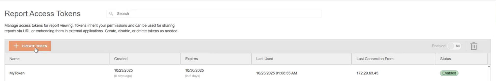
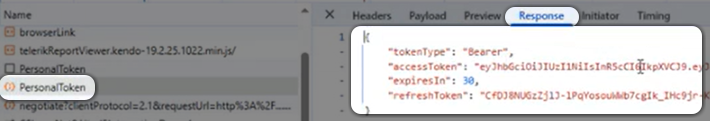

# Configuring the Report Server for .NET for Authentication with JWT Tokens

Starting with [2025 Q4(11.3.25.1112)](https://www.telerik.com/support/whats-new/report-server/release-history/progress-telerik-report-server-2025-q4-11-3-25-1112), Telerik Report Server for .NET enhances security by letting you register custom JWT Tokens for all the [Users](), including the [Guest User](). The tokens may be passed instead of user/password credentials from the Report Viewers for authentication against the Report Server .NET. The Report Viewers expose a dedicated callback function `getPersonalAccessToken` for this purpose, leaving the responsibility for fetching and returning the Token to the developer.

In this article, we will explain:
* how to add custom JWT Tokens, letting Report Server Users connect to the Report Server .NET remotely;
* how the server utilizes the Tokens;
* how an authenticated user may share reports with the outside world.

## Mechanism

All Report Server Users may add Tokens to their accounts:

> The Personal Access Tokens don't hold information about the user permissions. This information is obtained server-side after resolving who the Token belongs to.

Each Token may be used to authenticate remotely against the Report Server for .NET with the Reading permissions of the corresponding User.
> The Personal Access Tokens hold information that lets users authenticated with them to only read reports.

The 'Report Access Tokens' view of the Report Server Manager shows the main properties of the Token:
* The Token _Name_
* When was the Token _Created_
* When the Token _Expires_
* When was the Token _Last Used_
* Where was the _Last Connection From_ with the Token
* The Token _Status_ You may control it through a switch in the view

The view also lets you create a new Token through a button:

The Token has an expiration time selected by the User while creating it:

When the new Token is created, the UI lets you copy it from a dedicated form. You need to store it securely as it is not kept by the Report Server .NET in raw format and cannot be restored.

Each `personalAccessToken` is passed from the Viewer to the Report Server .NET only once per viewer's session. This ensures higher security in the communication between the viewer and the Report Server .NET.

The response from the server contains two temporary tokens: `accessToken` with a default lifespan of 30 minutes, and `refreshToken` with a default lifespan of 2 days. Both are kept in the browser cache for the viewer's session. This means that a refresh of the browser will reset the process, i.e., the `personalAccessToken` would be passed again to the server to receive the temporary couple of tokens.

The `accessToken` is used by the viewer to authenticate the requests. When it expires, the viewer utilizes the `refreshToken` to receive another temporary couple of tokens, and so on:

The existing Tokens may be disabled and deleted by the user. In this case, all the access and refresh token couples created by this personal token become immediately invalid.

If a User is deleted from the Report Server .NET, all its Tokens become immediately invalid.

## Guest User

The Report Viewers may use the Guest User to connect to the Report Server .NET only through a `personalAccessToken` already assigned to the Guest User. Only the admins of the Report Server .NET can create Tokens for the Guest User through the User Management view:

The token under the Guest User has the latter's Reading permissions and can be controlled (disabled, deleted) by the admins. The setup and control process is identical to the regular users' workflow.

When the Guest User is disabled, all its personal access tokens are immediately disabled as well.

Enabling the Guest User doesn't enable its Tokens automatically. The admin needs to do this manually for security reasons.

Granting more Reading permissions to the Guest User automatically transfers these permissions to its Tokens, even if they were created before granting these new permissions.

## Sharing Reports

> The Guest User must be enabled to share reports with external users.

Each report accessible for reading by the Guest User may be shared with the outside world by any Report Server .NET User:

The shared link contains an automatically generated JWT Token belonging to the Guest User and expires by default in 30 days. It can be copied only once from the Report Server .NET UI.
The autogenerated Token is added to the Guest Users' Personal Access Tokens, letting the admins control the URL expiration. The name of the new Token follows the rule `{Report name} shared by {User Name}'.

>warning The shared URL may be used by external users to access all reports accessible by the Guest User if they know their names.

## Limitations

* Each Token grants the Reading permissions of the User it belongs to.
* The Tokens are restricted to be used by Report Viewers for authentication against the Report Server for .NET.

## See Also

* [Report Server for .NET Overview]()
* [Report Server Users]()
* [Guest User]()
