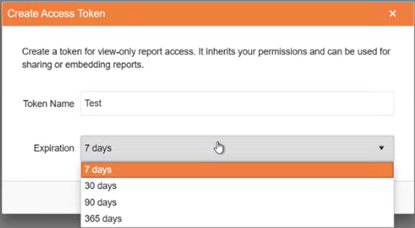

# Configuring the Report Server for .NET for Authentication with Personal Tokens

Starting with [2025 Q4(11.3.25.1111)](https://www.telerik.com/support/whats-new/report-server/release-history/progress-telerik-report-server-2025-q4-11-3-25-1111), Telerik Report Server for .NET enhances security by letting the [Users]() create Personal Tokens.

The Personal Tokens follow the JWT Token structure. Each user may have multiple Personal Tokens. The [Guest User]() may also keep Personal Tokens added by the admin users.

The Personal Tokens may be passed instead of user/password credentials from the Report Viewers for authentication against the Report Server for .NET. The Report Viewers expose a dedicated callback function `getPersonalAccessToken` for this purpose, leaving the responsibility for fetching and returning the Token to the developer.

See the list of viewers supporting the Token authentication in the [Characteristics and Limitations](#characteristics-and-limitations) section.

> The Report Viewers can still connect to the Report Server for .NET through the username/password, like in the Report Server for .NET Framework.

In the rest of the article, we will explain:

- how to create and add custom Personal Tokens, letting Users connect to the Report Server for .NET remotely;
- how the short-lived tokens, `accessToken` and `refreshToken` are used to keep the communication between the viewer and the Report Server for .NET;
- how to add and use Tokens from the Guest User account;
- how an authenticated user may share reports with the outside world.

## Mechanism

All Report Server Users may create and add Tokens to their accounts. The Tokens may be used to connect to the Report Server for .NET from a Report Viewer:

> Each Personal Token may be used to authenticate remotely against the Report Server for .NET with the Reading permissions of the corresponding User.

The 'Report Access Tokens' view of the Report Server Manager shows the main properties of the Personal Token:

- The Personal Token _Name_
- When was the Personal Token _Created_
- When the Personal Token _Expires_
- When was the Personal Token _Last Used_
- Where was the _Last Connection From_ with the Personal Token
- The Personal Token _Status_ You may control it through a switch in the view

The view also lets you create a new Personal Token through a button:

Each Personal Token has an expiration time selected by the User while creating it:

When the new Personal Token is created, the UI lets you copy it from a dedicated form. You need to store it securely as it is not kept by the Report Server for .NET in raw format and cannot be restored later.

Each Personal Token is passed from the Viewer to the Report Server for .NET only once per viewer's session, in the `PersonalToken` request. This ensures higher security in the communication between the viewer and the Report Server for .NET.

The response from the server to the `PersonalToken` request contains two short-lived tokens used during the continuous communication between the viewer and the Report Server for .NET:

- `accessToken` with a default lifespan of 1 hour;
- `refreshToken` with a default lifespan of 2 days.

The above tokens' default lifespans may be set up in the `appsettings.json` application configuration.

> The `appsettings.json` application configuration is overridden by the default one when upgrading Report Server for .NET. Any custom changes should be re-introduced following an upgrade.

Both short-lived tokens are kept in the memory during the viewer's session. This means that a refresh of the browser will reset the process, i.e., the `PersonalToken` would be passed again to the server to receive a new short-lived couple of tokens.

The life of the short-lived tokens is sustained automatically, through the `refreshToken` request:

The expiration of both short-lived tokens would also result in an automatic extra `PersonalToken` request to obtain a new short-lived tokens couple to continue the communication seamlessly.

The existing Personal Tokens may be disabled and deleted by the user. In this case, all the short-lived token couples created by this Personal Token become immediately invalid:

- When a User is disabled, all their personal access tokens are immediately disabled as well. Enabling the User doesn't enable their Personal Tokens automatically. The user has to do this manually.
- If a User is deleted from the Report Server for .NET, all their Personal Tokens become immediately invalid, along with the short-lived token couples created with it.

## Guest User

The Report Viewers may use the Guest User to connect to the Report Server for .NET only through a Personal Token already assigned to the Guest User. The users of the Report Server for .NET with administrative permissions can create Personal Tokens for the Guest User through the [User Management]() view:

The Personal Tokens under the Guest User have their Reading permissions and can be controlled (disabled, deleted) by the admins. The setup and control process is identical to the regular users' workflow.

When the Guest User is disabled, all their personal access tokens are immediately disabled as well.

Enabling the Guest User doesn't enable its Personal Tokens automatically. The admin needs to do this manually for security reasons.

Granting more Reading permissions to the Guest User automatically transfers these permissions to its Personal Tokens, even if they were created before granting these new permissions.

## Sharing Reports

> The Guest User must be enabled to share reports with external users through the Report Server for .NET Manager.

Each report accessible for reading by the Guest User may be shared with the outside world by any Report Server for .NET User:

The shared link contains an automatically generated Personal Token belonging to the Guest User and expires by default in 30 days. It can be copied only once from the Report Server for .NET Manager's User Interface.

The autogenerated Personal Token is added to the Guest Users' Personal Access Tokens, letting the admins control the URL expiration. The name of the new Personal Token follows the rule `{Report name} shared by {User Name}`. The same report may be shared by multiple users, which would generate the corresponding number of Personal Tokens under the Guest User account.

> warning The shared URL may be used by external users to access all reports accessible by the Guest User if they know their names.

> tip Following the approach for sharing reports through the Guest User, you may share your reports by replacing the autogenerated Personal Token with a valid Personal Token from your Personal Tokens collection. This would let anyone with the link access your reports. We do not recommend this as you expose your Personal Token. It may be useful when you want to have public reports readable by everyone. For this scenario, you may prefer a dedicated user account with restricted reading permissions.

## Characteristics and Limitations

- Each Personal Token grants the Reading permissions of the User it belongs to.
- The Personal Tokens are restricted to be used by Report Viewers for authentication against the Report Server for .NET.
- The Report Viewers that support the Personal Token authentication are:

  - [HTML5 Report Viewer](https://docs.telerik.com/reporting/embedding-reports/display-reports-in-applications/web-application/html5-report-viewer/overview)
  - [Native Blazor Report Viewer](https://docs.telerik.com/reporting/embedding-reports/display-reports-in-applications/web-application/native-blazor-report-viewer/overview)
  - [Blazor Report Viewer](https://docs.telerik.com/reporting/embedding-reports/display-reports-in-applications/web-application/blazor-report-viewer/overview)
  - [Native Angular Report Viewer](https://docs.telerik.com/reporting/embedding-reports/display-reports-in-applications/web-application/native-angular-report-viewer/overview)
  - [Angular Report Viewer](https://docs.telerik.com/reporting/embedding-reports/display-reports-in-applications/web-application/angular-report-viewer/angular-report-viewer-overview)
  - [React Report Viewer](https://docs.telerik.com/reporting/embedding-reports/display-reports-in-applications/web-application/react-report-viewer/react-report-viewer-overview)

- The Personal Access Tokens don't hold information about the user permissions. This information is obtained server-side after resolving who the Personal Token belongs to.
- The Personal Access Tokens hold information that lets users authenticated with them only read reports.
- If you reinstall RS.NET without removing the storage or migrate the storage from one RS.NET to another the existing Personal Tokens will stop working because they are signed with a different key. The Personal Tokens will still be visible in the UI as they exist in the storage. This behavior will be improved.

## See Also

- [Report Server for .NET Overview]()
- [Report Server Users]()
- [Guest User]()
