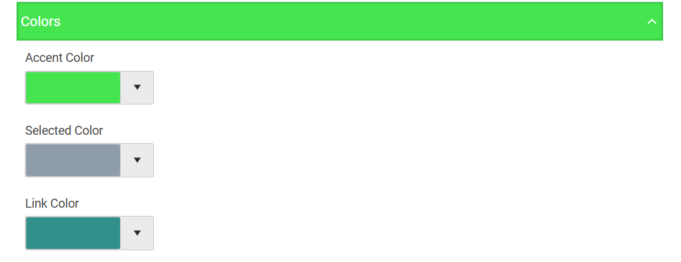
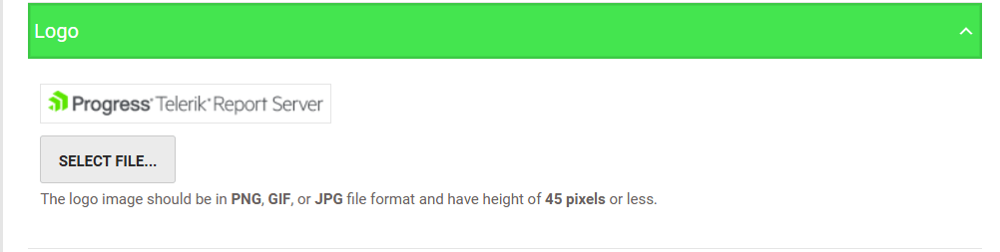
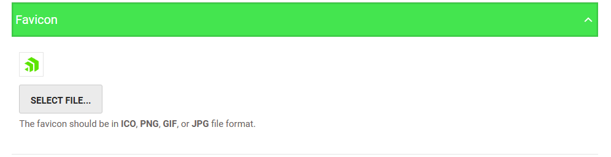
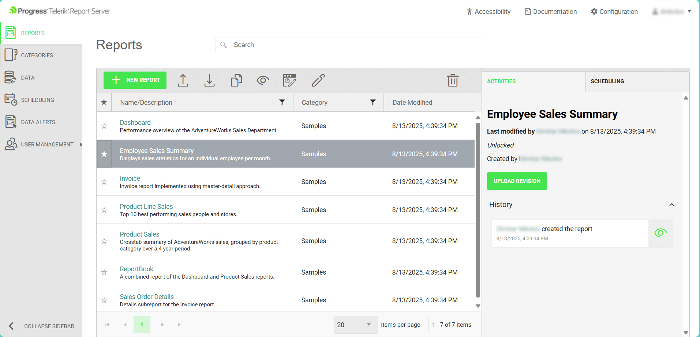
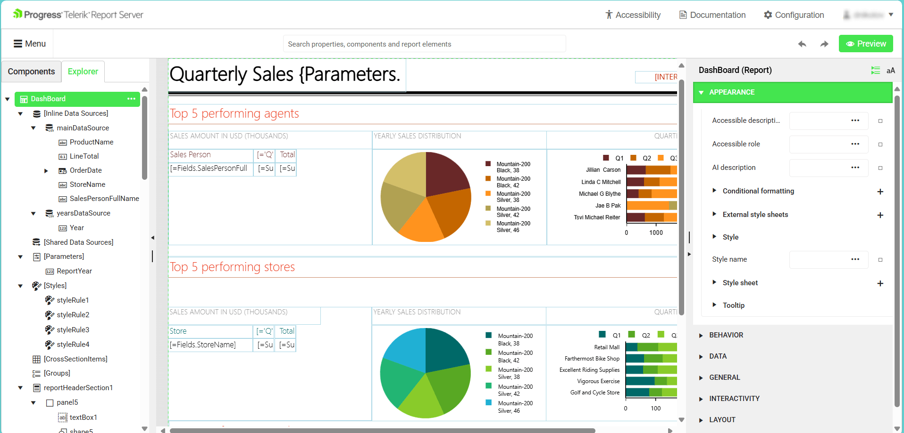
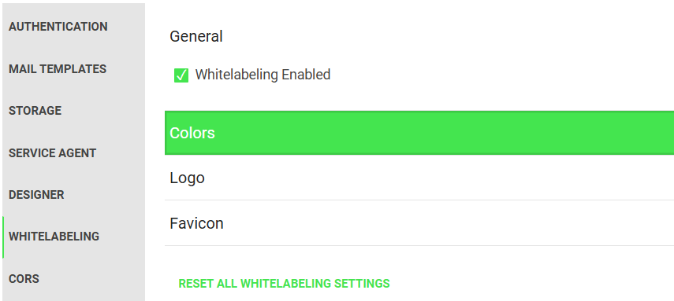

# Overview

Our product supports white-labeling, allowing customers to personalize the visual identity of their instance. This feature enables organizations to align the product's appearance with their brand guidelines.
Whitelabeling enables the **Report Server for .NET's** customers to remove branding elements in the Report Server Manager web application and its internal Web Report Designer.

By replacing the default colors, logo, and favicon with branding from the customer's enterprise, you can personalize the visual identity of each Report Server. This feature enables organizations to align the product's appearance with their brand guidelines.

### Customizable Elements

The following elements can be rebranded:

* Colors - Accent Color, Selected Color, and Link Color.

	

* Logo - The logo image should be in PNG, GIF, or JPG file format and have a height of 45 pixels or less.

	

* Favicon - The favicon should be in ICO, PNG, GIF, or JPG file format.

	

#### Report Server Manager

####  Web Report Designer

### Configuration

The whitelabeling feature can be found under **Configuration > Whitelabeling**. 
Administrator rights are required to access the Report Server Configuration page.

## See Also

* [Report Server for .NET Overview]()
* [Whitelabeling in the Report Server for .NET Framework]()
