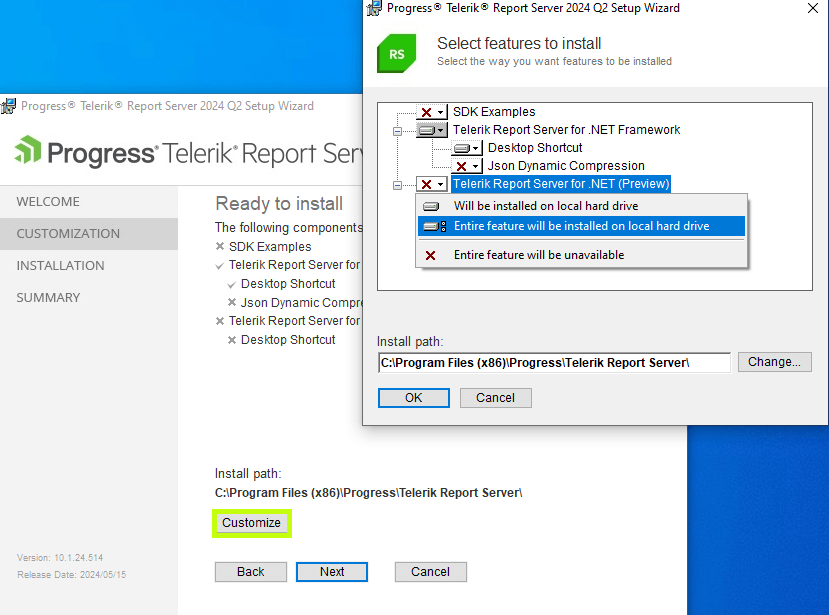

# Report Server for .NET: Installation on Windows

The Report Server for .NET (`RS.NET`) is currently distributed along with the installer for the .NET Framework 4.6.2. By default, the installer does not install RS.NET. Users must click `Customize` to install RS.NET.

## Installation Process

The RS.NET is an ASP.NET Core web application and its installation on the IIS requires the `ASP.NET Core Hosting Bundle` as explained in the Microsoft article [Host ASP.NET Core on Windows with IIS](https://learn.microsoft.com/en-us/aspnet/core/host-and-deploy/iis/?view=aspnetcore-8.0). The installation wizard will show a warning if the module is not installed. The user can continue the installation even when the module is not found.

>note Known issue: the detection returns false negative results on machines having `Windows 11`, `Windows Server 2016` and `Windows Server 2022`. This is fixed and will be included in our next release.

The installer will configure the ports for installing the RS.NET and RS.NET Service Agent, taking the available ports from 80 upwards:

## Installed Assets

The __RS.NET__ is installed in `{Installation Folder}\Telerik Report Server\Telerik.ReportServer.Web.NET`. The cross-platform distribution of RS.NET is in the `_non-windows` subfolder.

The __RS.NET Service Agent__ is installed in `{Installation Folder}\Telerik Report Server\Services\.NET`. The cross-platform distribution of RS.NET Service Agent is in the '_non-windows' subfolder.

## Configuration

### Automatic Configuration on Windows

The installation wizard will do the initial configuration of _RS.NET_ and _RS.NET Service Agent_ on Windows, making them ready-to-run.

If the automatic configuration fails, please, familiarize with the [initialization process](#initialization-process) and follow the [instructions for manual configuration](#manual-configuration-on-windows).

### Initialization process

1. When the Report Server is started for the first time, the user is supposed to pass the _Configure Storage_ and _Register Administrator_ pages. The settings from these pages are stored in a file named `ReportServerAdmin.json`.
1. Next, the RS.NET checks its `appsettings.json` configuration file for the key __InitialAgentUrl__. If the installation has passed successfully, the key must exist and must have a valid value like __http://localhost:84__. This is where the MSI installation file for Windows has registered the __RS.NET Service Agent__.
1. The RS.NET calls the above URL and passes the storage settings to its Service Agent. They are saved in the file `ServiceAgent.json` in the RS.NET Service Agent's directory. If such a file does not exist, the agent was not initialized or registered in the IIS.

### Manual Configuration on Windows

1. Delete the file `\Services\.NET\ServiceAgent.json` from RS.NET Service Agent's folder if it exists.
1. Test whether the RS.NET Service Agent responds by calling the RS.NET Service Agent endpoint `/api/system/isalive` from the browser. By default, this would be the URL `http://localhost:84/api/system/isalive`.

	If the agent is working, the result must be __HTTP ERROR 401 - Unauthorized__.

	If the agent is not working, the result should be __404 - Not Found__.

1. Open RS.NET's `appsettings.json` configuration file and add/edit the key `"InitialAgentUrl": "http://localhost:84"`. The value in the example assumes the RS.NET Service Agent is running on port _84_. Change the URL based on your settings.
1. Restart the RS.NET and RS.NET Service Agent.
1. Check the RS.NET's _Configuration_ -> _ServiceAgent_ page. The entry `"DefaultServiceAgent" : "http://localhost:84"` should now be present. The URL may differ, depending on your settings.
1. To use the RS.NET Service Agent, ensure the _Mail Server_ settings in _Configuration_ page are valid.
