# AI-Powered Features Settings

With the **2025 Q3** release, Report Server introduces its first AI-powered feature — a set of configurable AI Settings designed to enhance the reporting experience through intelligent automation. The AI configuration includes two panels — __AI Integration__ and __AI-Powered Report__ Document Insights.

During the report preview phase, the [AI-Powered Insights](https://docs.telerik.com/reporting/interactivity/ai-powered-insights)feature provides a rich set of capabilities, including generating responses, building prompts, interacting with AI-generated content, and executing predefined instructions. One of the configurable options in this panel is the ability to display a consent message to end users.

> Report Server does not provide a built-in REST API or include any embedded LLMs/SLMs. To use any AI-powered feature, you must have an active subscription to a third-party LLM provider. This subscription must give you access to a valid REST API endpoint and key, which must be configured in the AI Setup page.

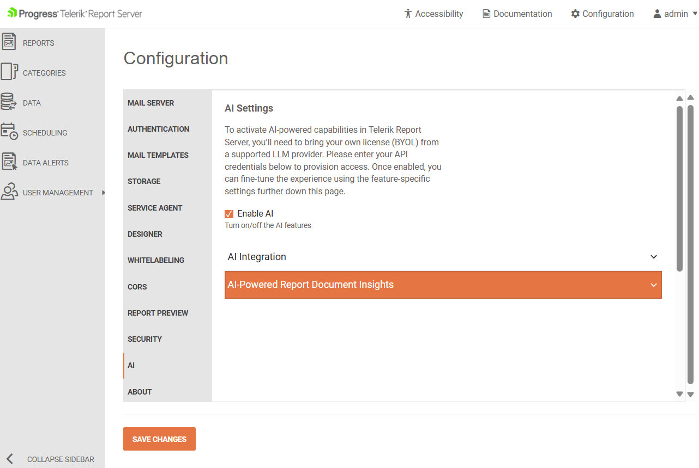

## Differences between Report Server for .NET and .NET Framework

In RS.NET, the third-party dependency required for Retrieval-Augmented Generation (RAG) is included by default. Users can disable it either through the appsettings.json configuration file or, if running in Docker, by passing the configuration externally.

In contrast, this dependency is not available in RS.462 or applications targeting .NET Framework, because it is not supported in .NET Standard. As a result, RAG functionality is not included in those environments.

## AI Integration

The AI configuration panel is always visible in the user interface, regardless of the current AI enablement status. When the `Enable AI` checkbox is unchecked (which is the default state), the panel enters read-only mode. In this mode:

* All dropdowns and checkboxes are disabled and cannot be modified
* Users can still view and copy existing configuration values.
* No changes to AI-related settings can be made until the `Enable AI` option is activated.

Depending on the state of the `Enable AI` setting:

* If `Enable AI` checkbox is unchecked, the AI configuration section will not be displayed in the Report Server
* If `Enable AI` checkbox is checked, you will be able to configure the AI by following these steps:

1. Choose one of the following providers:

  | Provider |
  | ------ |
  |`MicrosoftExtensionsAzureAIInference`|
  |`MicrosoftExtensionsAzureOpenAI`|
  |`MicrosoftExtensionsOllama`|
  |`MicrosoftExtensionsOpenAI`|

  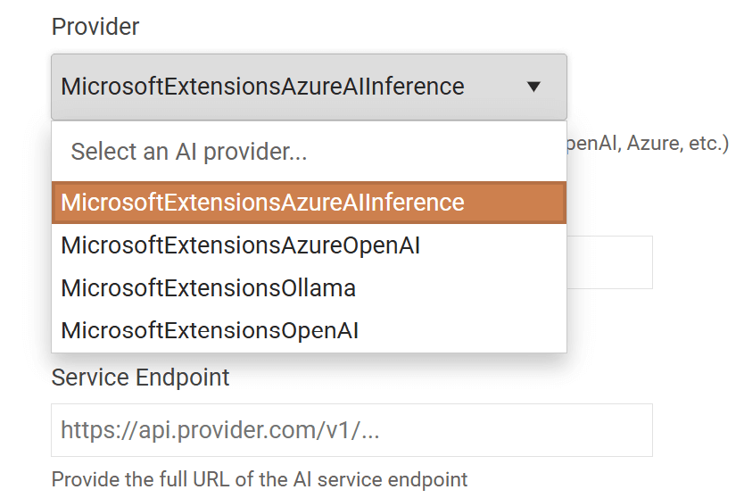

1. Select a `Model Name`, specify the `Server Endpoint` and the `API Key`

  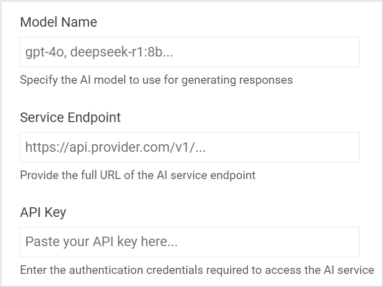

> While the **Provider** and **Model** are required for all AI providers, the remaining fields(**Endpoint** and **API Key**) depend on the specific provider's requirements.

If all required fields are filled in, you can test the integration using the `Test Integration` button. This will send a request to the selected provider with the specified information using a test prompt. If everything is configured correctly, you will receive a response saying `Integration successful`. If there is a problem, a pop-up will appear with detailed error information.

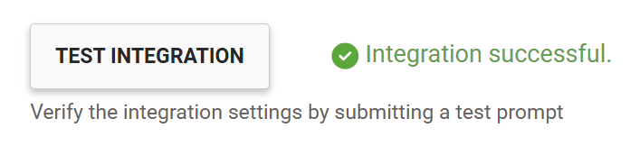

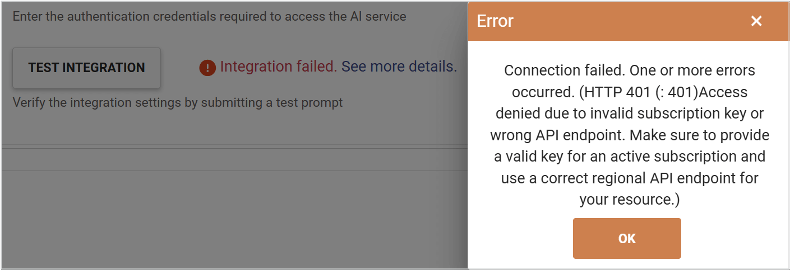

## AI-Powered Report Document Insights

From this panel, you can choose whether to display a consent message by setting the `Show consent message` checkbox to true. When this option is activated, a predefined message will be shown to users before they interact with AI-generated consent.

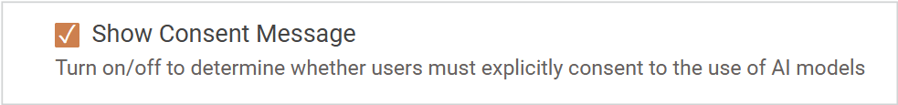

> If `Show consent message` checkbox is checked, and the consent message field is empty, you will not be able to save the changes.

### Prompts Settings

You can create as many **Predefined Prompts** as needed. You can also delete any prompts that are no longer required. However, if there is only one Predefined Prompt, it cannot be deleted. If you would like to enable 'custom prompts' for the end-users and *not* give them any predefined prompts, leave the prompts blank and save.

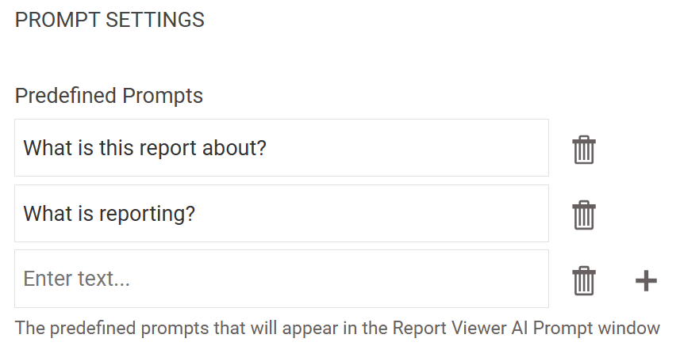

The `Allow custom prompts` checkbox enables or disables the ability for end users to send custom requests to the AI.

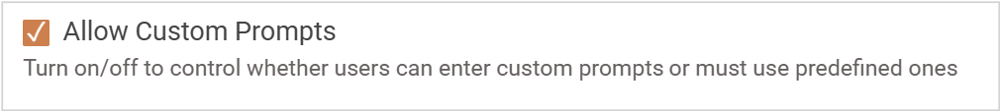

If all settings have been configured correctly and the changes have been saved, the following message will appear on the screen.

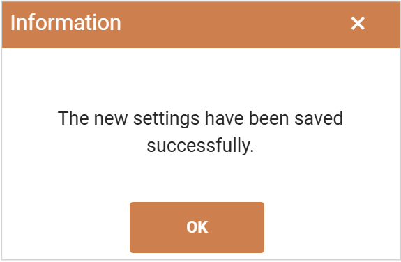

### Consent

Before any user can use this feature, upon opening the **AI Prompt Dialog**, they will be asked to give consent to the AI to process the provided text.

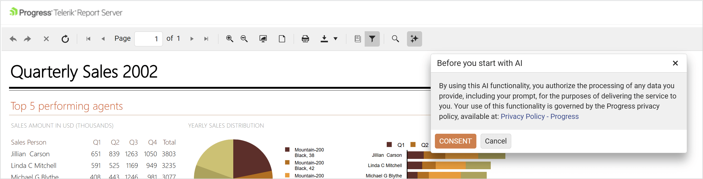

### Ask AI Prompt

After consent is given, the prompt for asking the AI questions will appear in the top-right corner of the report viewer. The UI will change depending on whether custom questions are allowed.

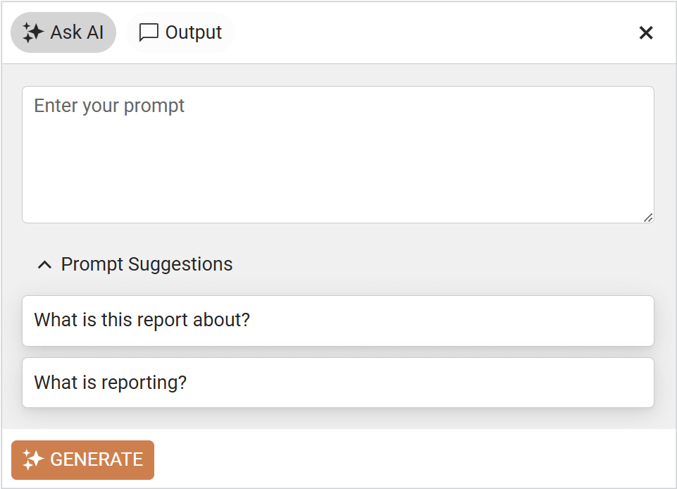

### Output

The **Output** of the AI processor will be displayed in the Output tab of the Ask AI Prompt after the result has been generated:

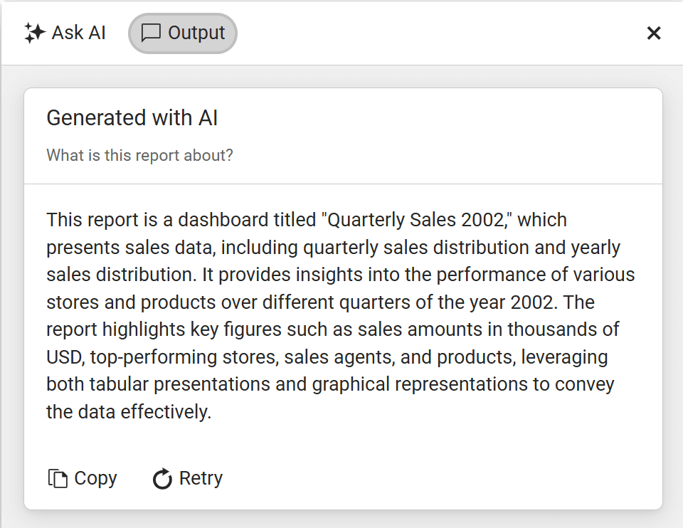
