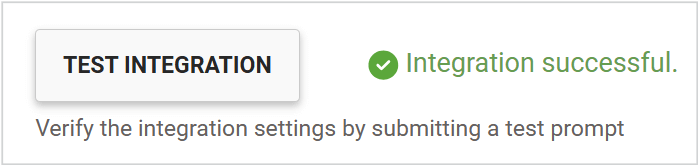
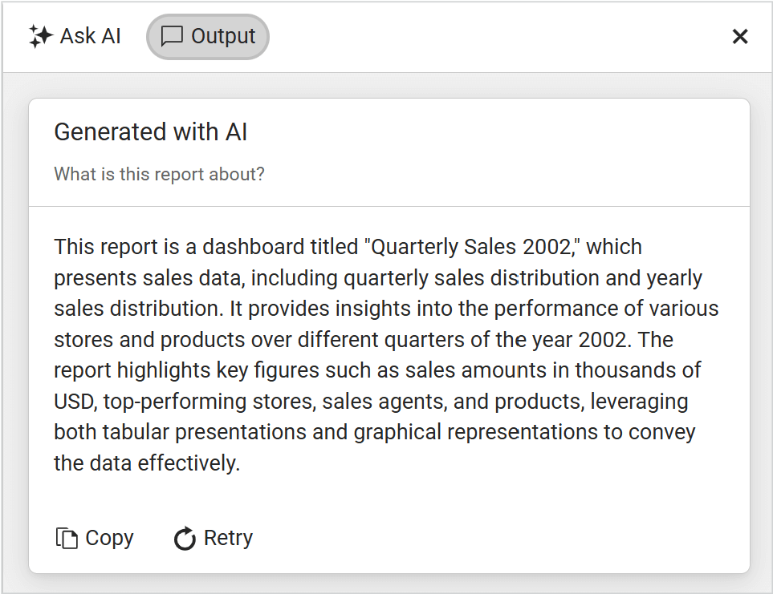

# AI-Powered Features Settings

With the [**2025 Q3**](https://www.telerik.com/support/whats-new/report-server/release-history/progress-telerik-report-server-2025-q2-11-1-25-716) release, Report Server introduces its first AI-powered feature — a set of configurable AI Settings designed to enhance the reporting experience through intelligent automation. The AI configuration includes two panels — __AI Integration__ and __AI-Powered Report Document Insights__.

During the report preview phase, the [AI-Powered Insights](https://docs.telerik.com/reporting/interactivity/ai-powered-insights) feature provides a rich set of capabilities, including generating responses, building prompts, interacting with AI-generated content, and executing predefined instructions. One of the configurable options in this panel is the ability to display a consent message to end users.

> Report Server does not provide a built-in REST API or include any embedded LLMs/SLMs. To use any AI-powered feature, you must have an active subscription to a third-party LLM provider. This subscription must give you access to a valid REST API endpoint and key, which must be configured in the AI Setup panel.

## AI Integration

The AI configuration panel is always visible in the user interface, regardless of the current AI enablement status. When the `Enable AI` checkbox is unchecked (which is the default state), the panel enters read-only mode. In this mode:

* All dropdowns and checkboxes are disabled and cannot be modified
* Users can still view and copy existing configuration values.
* No changes to AI-related settings can be made until the `Enable AI` option is activated.

Depending on the state of the `Enable AI` setting:

* If the `Enable AI` checkbox is unchecked, the AI Insights section will not be displayed in the Report Server
* If the `Enable AI` checkbox is checked, you will be able to configure the AI by following these steps:

1. Choose one of the supported providers:

| Provider |
| ------ |
|`MicrosoftExtensionsAzureAIInference`|
|`MicrosoftExtensionsAzureOpenAI`|
|`MicrosoftExtensionsOllama`|
|`MicrosoftExtensionsOpenAI`|

  

1. Select a `Model Name`, specify the `Server Endpoint` and the `API Key`

  

> While the **Provider** and **Model** are required for all AI providers, the remaining fields (**Endpoint** and **API Key**) depend on the specific provider's requirements.

If all required fields are filled in, you can test the integration using the `Test Integration` button. This will send a request to the selected provider with the specified information using a test prompt. If everything is configured correctly, you will receive a response saying `Integration successful`.

 If there is a problem, a pop-up will appear with detailed error information.

## AI-Powered Report Document Insights

The **Consent Message Setting** is part of the panel that allows you to configure the AI prompt displayed in the Report Viewer. It plays an important role in ensuring transparency and user awareness when interacting with AI features.

From this panel, you can choose whether to display a consent message by setting the `Show consent message` checkbox to true. When this option is activated, a predefined message will be shown to users before they interact with AI-generated content.

The `Consent Message` is a notification shown to users before they interact with AI features. When enabled, the message informs users that by using the AI functionality, they agree to the processing of any data they provide—such as their prompts—for the purpose of delivering the service. It also includes a link to the applicable privacy policy, helping users understand how their data will be handled. You can customize the content of the consent message to better align with your organization’s tone, legal requirements, or user expectations.

> If the `Show consent message` checkbox is checked, and the consent message field is empty, you will not be able to save the changes.

### Prompts Settings

The **Prompts Settings** panel allows you to configure how AI prompts are presented to end-users within the Report Viewer. This includes managing predefined prompts, enabling custom prompts, and controlling user interaction with AI-generated content.

You can create as many **Predefined Prompts** as needed. You can also delete any prompts that are no longer required.

The `Allow custom prompts` checkbox enables or disables the ability for end users to send custom requests to the AI.

If all settings have been configured correctly and the changes have been saved, the following message will appear on the screen.

### Consent

Before any user can use this feature, upon opening the **AI Prompt Dialog**, they will be asked to give consent to the AI to process the provided text.

### Ask AI Prompt

After consent is given, the prompt for asking the AI questions will appear in the top-right corner of the report viewer. The UI will change depending on whether custom questions are allowed.

### Output

The **Output** of the AI processor will be displayed in the Output tab of the Ask AI Prompt after the result has been generated:

## Differences between Report Server for .NET and Report Server for .NET Framework

In [Report Server for .NET](), *Retrieval-Augmented Generation* (RAG) is enabled by default to enhance response accuracy and relevance while minimizing token usage.

Currently, RAG can be disabled only via the `appsettings.json` configuration file. 

Support for controlling the RAG status directly from the UI is planned for upcoming versions of RS.NET. This feature is already logged for Q4.

> Retrieval-Augmented Generation (RAG) is not supported in Report Server for .NET Framework.
