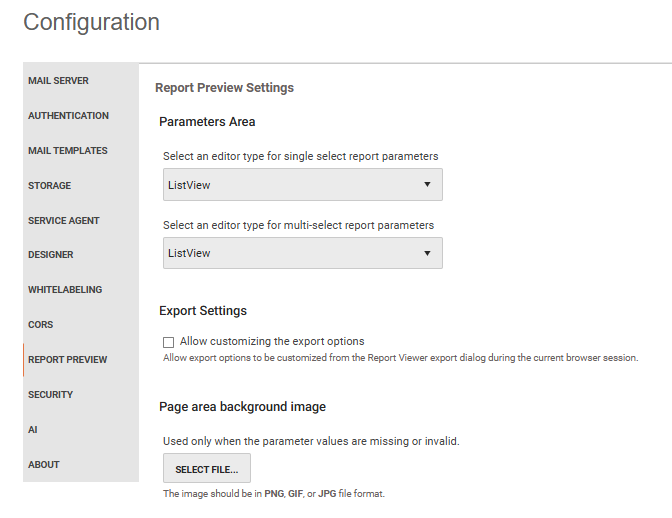

# Report Preview

Use the Report Preview settings to choose parameter editor types, enable export options, and upload a page-area background image.

<strong>Report Preview Settings</strong>

## Parameters Area Options

Choose **ListView** or **ComboBox** as the editor type for single-select and multi-select report parameters.

- **ListView** is the default and uses the [Kendo UI ListView](https://docs.telerik.com/kendo-ui/api/javascript/ui/listview) widget.
- **ComboBox** uses the [Kendo UI ComboBox](https://docs.telerik.com/kendo-ui/api/javascript/ui/combobox) for single-select parameters and the [Kendo UI MultiSelect](https://docs.telerik.com/kendo-ui/api/javascript/ui/multiselect) for multi-select parameters.

## Export Settings

The **Allow customizing the export options** setting is `disabled` by default.

To enable it, select the checkbox and then select **Save Changes**. Report Server then includes rendering-extension settings in the document information it sends to the Report Viewer.

Users can configure available settings in the [Export Options dialog](https://www.telerik.com/products/reporting/documentation/embedding-reports/display-reports-in-applications/web-application/web-report-viewers-export-options) before they export a report. Their export-option changes apply only during the current browser session and do not change server-side rendering defaults.

When this setting is cleared, Report Server does not send rendering-extension settings to the viewer. Users can still export reports directly, but they cannot customize device settings in the viewer.

## Page Area Options

Upload a PNG, GIF, or JPG image to use as a background in the Telerik Report Viewer page area. Report Server displays the image only when parameter values are missing or invalid.
