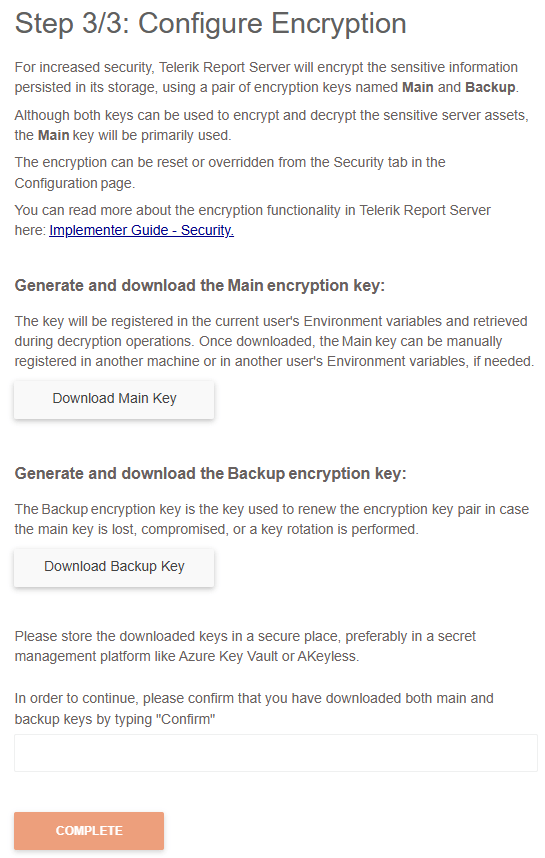
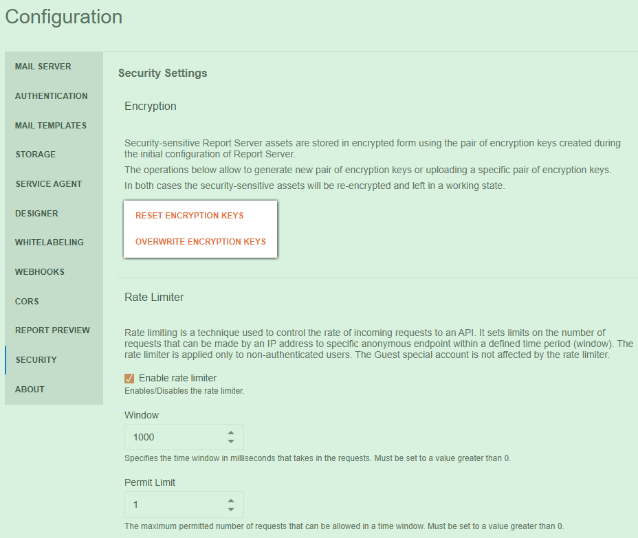

# Security

>caption The Security tab of the Report Server Configuration page:

## Encryption

Introduced with 2024 Q4 (10.3.24.1112).

The sensitive assets are stored in the [Report Server Storage]() in encrypted form. Now the encryption functionality is leveraged to use industry-standard encryption routines. The encryption algorithms use a pair of keys, __Main Key__ and __Backup Key__ created during the initial configuration of the Report Server:

To enable the enhanced encryption functionality, the administrator must download both _Main_ and _Backup_ private keys and type `Confirm` (case insensitive) in the input field just above the __Complete__ button to validate that the keys are safely stored. We strongly recommend storing the encryption private keys securely, for example, in a key vault.

When the button _Complete_ is pressed, the existing sensitive assets will be securely encrypted and the encryption keys will be stored as environment variables for the user, who is used to run the Report Server and Report Server ServiceAgent.

The administrator can generate a new pair of encryption keys through the `RESET ENCRYPTION KEYS` or upload a specific pair of encryption keys through the `OVERWRITE ENCRYPTION KEYS` buttons in the __Configuration__ page / __Security__ tab:

* __Reset Encryption Keys__ may be used when the keys need to be changed periodically for security purposes, or in case of an information leak. In this scenario, the Report Server will decrypt the sensitive assets using the existing pair of keys, generate new ones, and encrypt the assets again.
* __Overwrite Encryption Keys__ may be used when the Report Server or Report Server ServiceAgent is migrated to a new machine where the encryption keys are not present; or when provisioning multiple instances of the ServiceAgent to the same Report Server instance. This functionality registers the keys in the environment variables and encrypts the sensitive assets with them.

In both cases, the security-sensitive assets will be re-encrypted and left in a working state.

### When Installing a New Report Server Instance

Starting with version 2024 Q4 (10.3.24.1112), encryption is mandatory upon each new installation of the Report Server. __Step 3/3 (Configure Encryption)__ should be completed during the installation process.

### When Upgrading a Report Server Instance

When upgrading an existing Report Server instance to 2024 Q4 (10.3.24.1112) or newer, the admin user of the Report Server may choose to encrypt the Storage using the strengthened encryption algorithm (recommended).

If the enhanced encryption is not applied, the following notification will be shown every time a user with administrative rights is logged into the [Report Server Manager]():

## Rate Limiter

Introduced with [2024 Q3 (10.2.24.806)](https://www.telerik.com/support/whats-new/report-server/release-history/progress-telerik-report-server-2024-q3-10-2-24-806).

Rate limiting is a technique used to control the rate of incoming requests to an API. It sets limits on the number of requests that can be made by an IP address to a specific anonymous endpoint within a defined time period (window). The rate limiter is applied only to non-authenticated users. The Guest special account is not affected by the rate limiter.

When the client has exhausted the number of requests allowed, a 409 "Conflict" response with "The endpoint "{endpointName}" is currently not accessible." message is returned from the server.

### Enable rate limiter

Enables/Disables the rate limiter. By default, the value is set to `enabled`.

### Window

Specifies the time window in milliseconds that takes in the requests. It must be set to a value greater than 0. By default, the value is set to `1000 milliseconds`.

### Permit Limit

The maximum permitted number of requests that can be allowed in a time window. It must be set to a value greater than 0. By default, the value is set to `1`.
