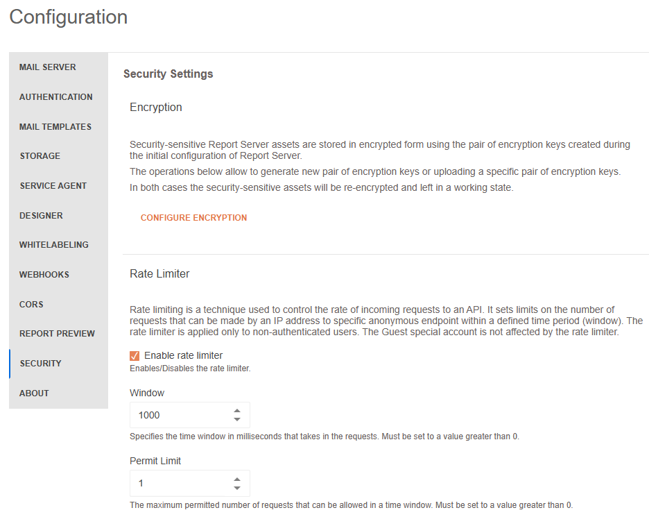

# Security

## Rate Limiter

Rate limiting is a technique used to control the rate of incoming requests to an API. It sets limits on the number of requests that can be made by an IP address to a specific anonymous endpoint within a defined time period (window). The rate limiter is applied only to non-authenticated users. The Guest special account is not affected by the rate limiter.

When the client has exhausted the number of requests allowed, a 409 "Conflict" response with "The endpoint "{endpointName}" is currently not accessible." message is returned from the server.

### Enable rate limiter

Enables/Disables the rate limiter. By default the value is set to enabled.

### Window

Specifies the time window in milliseconds that takes in the requests. It must be set to a value greater than 0. By default the value is set to 1000 milliseconds.

### Permit Limit

The maximum permitted number of requests that can be allowed in a time window. It must be set to a value greater than 0. By default the value is set to 1.