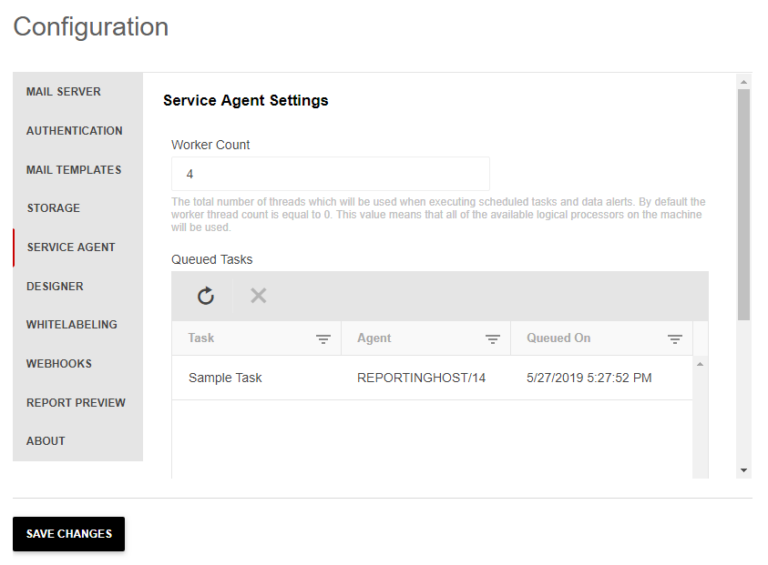

# Service Agent

The service agent is responsible for the execution of scheduled tasks and data alerts, and for sending e-mail messages. It runs its tasks on multiple worker threads to optimize execution performance. Also, the agent itself can run in a multi-instance environment.

## Worker Count

This is the total number of threads that will be used when executing scheduled tasks and data alerts. By default, the worker thread count is equal to 0. This value means that the Worker Count will match the count of the *available* logical processors on the agent machine.

## Queued Tasks

A queued task represents a Scheduled task or Data alert that is currently being executed by any Server Agent. It allows canceling the execution of a selected task. The table displays the name of the Scheduled task or Data Alert, the target Server Agent, and when was the task scheduled for execution.

## Multiple-instance Service Agent

The service agent can operate in a multi-instance environment out of the box. The only requirement is that all Report Server instances should be configured to point to the same [storage](). In such environments, each instance of the service agent will take as many tasks from the task queue at once as defined in the worker count setting.

>If the worker count setting is modified while multiple instances of the service agent are running it is required to restart all instances manually in order for the new setting to take effect.
