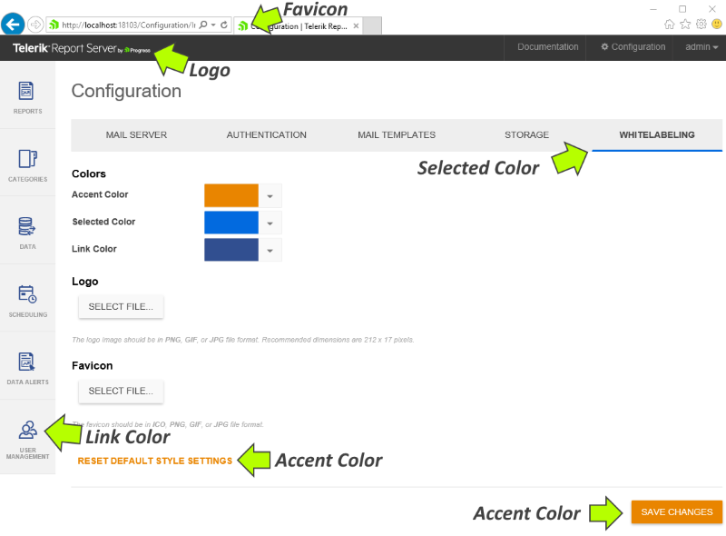
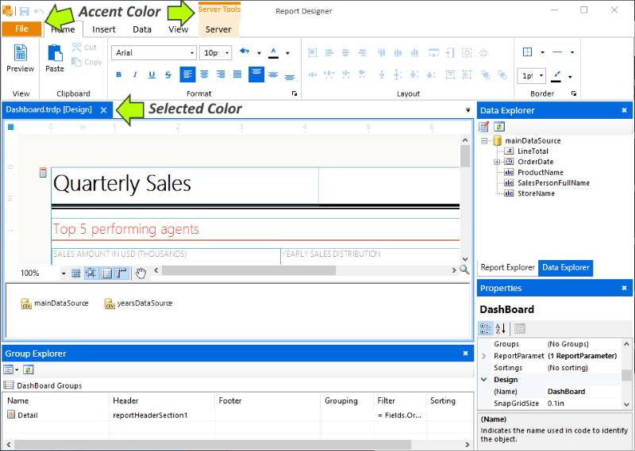

# Whitelabeling

>note Starting from 2025 Q3, the whitelabeling functionality is now also available for Report Server for .NET.

Whitelabeling enables Report Server customers to remove branding elements in the Report Server web application and [Standalone Report Designer]() application and replace them with branding from the customer enterprise.

The following elements can be rebranded:

* Colors - Accent Color, Selected Color, and Link Color.
* Logo - the logo image should be in PNG, GIF, or JPG file format. Recommended dimensions are 212 x 17 pixels.
* Favicon - the favicon should be in ICO, PNG, GIF, or JPG file format.

The whitelabeling feature can be found under _Configuration_ > _Whitelabeling_. Administrator rights are required to access the Report Server Configuration page.

## Report Server ##

## Standalone Report Designer ##

