# Azure AD Authentication

Active Directory have proved itself as a standard in directory and identity management services. In this article, we will explain how to use its cloud-based form to provide authentication for the Telerik Reporting Server users.

## Configuration Steps

### Prerequisites

-   Telerik Report Server installation with at least one administrator account.
-   An Azure account with Active Directory support.

In this article we’ll assume that Telerik Report Server is installed and accessible on **http://localhost:86**. For security reasons it’s better to access it via **https**, but this will require registering a domain certificate, which is not a subject of the current tutorial.

> In case you’re not familiar with the process of adding the Active Directory service to your Azure account, there is a useful video tutorial that will help: [Enabling Azure Active Directory Premium trial](https://channel9.msdn.com/Series/Azure-Active-Directory-Videos-Demos/Enabling-Azure-Active-Directory-Premium-trial).

### 1.  Setup the Azure AD Application

In your Azure portal, create an **Enterprise** application and marked it as a "**Non-gallery app**". It should look like this:

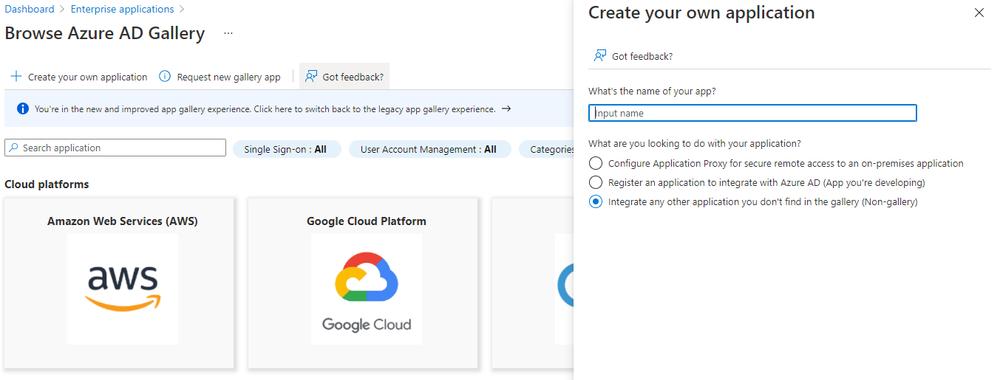


### 2.  Inspecting IDs:

After creating the app, inspect its IDs in the **Overview** page:

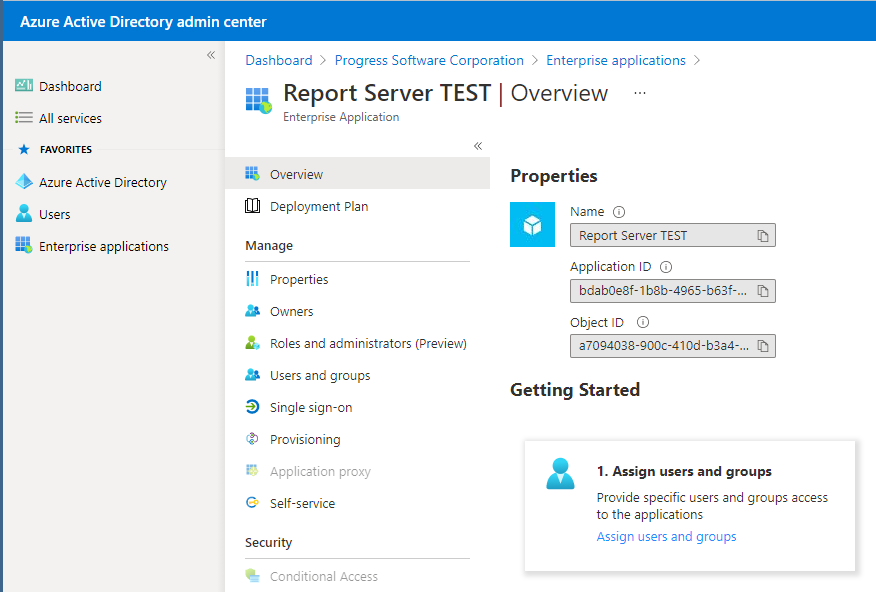


### 3.  Set up the Single Sign On settings:

In the "Single Sign On" page, choose SAML and configure the following properties:

- **Identifier (Entity ID)** - match the URL on which our Report Server was hosted. In this example, the server is hosted on the machine by using HTTPS binding and some self-signed certificate. The same URL must be used in the  **Authentication Settings** page in the Report Server configuration. 
Basically those two fields must match and it's not mandatory to use the actual server URL.

- **User Attributes & Claims** - use the default layout. You can include the **Unique User Identifier** (Name ID) claim first, because that's the first claim we use to look for matches in the Report Server's registered users.

SAML Signing Certificate - here you should have the App Federation Metadata Url generated by Azure. Copy its value and paste it in the Metadata Uri field in Report Server's Authentication Settings page.

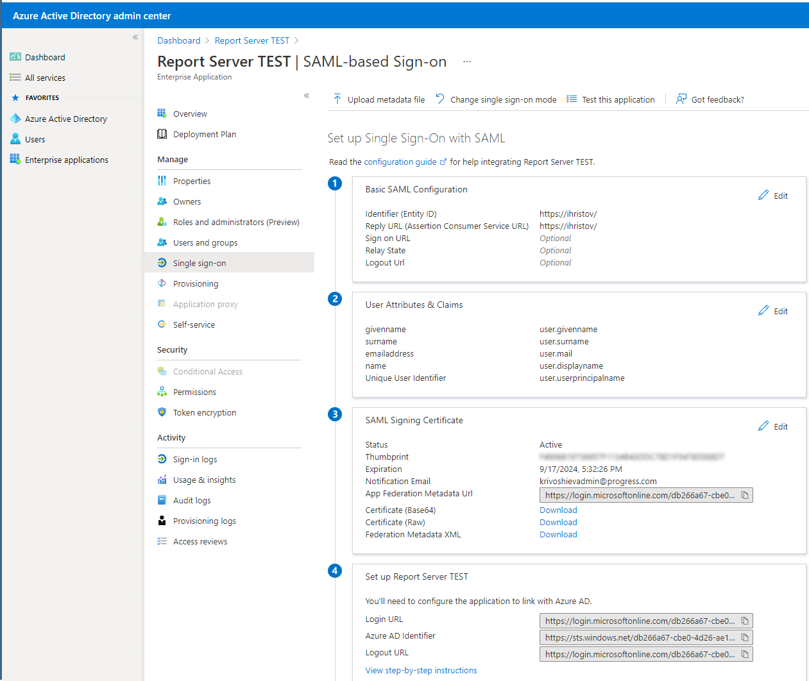


### 4.  Configuration of SAML authentication of Report Server against Azure AD users

When the SAML configuration is completed, go to the application's Properties page and set the "**User assignment required?**" and "**Visible to users?**" to **NO**. This is to avoid explicitly adding users in "**Users and groups**" page.

This concludes the configuration of SAML authentication of Report Server against Azure AD users. Naturally, the same users must be registered in the Report Server's assets storage as Federation users, using their NameId or e-mail (depending on your scenario). At this point you should be able to log in to Report Server using the web interface, clicking on the blue button "**Active Directory Credentials**" on the login screen.

Now let's register the Report Designer application and connect it to Telerik Report Server.


### 5.  Adding a new registration

In Azure Active Directory, navigate to **App registrations** and create a new registration. In the opened pane change only the **Redirect URI type** - by default it's set to **Web**, but you need to use a **Public client/native (mobile and desktop)** entry. For a value just use the URL of the report server - although the Standalone Report Designer doesn't redirect anywhere, having this URL might be required for validation purposes.

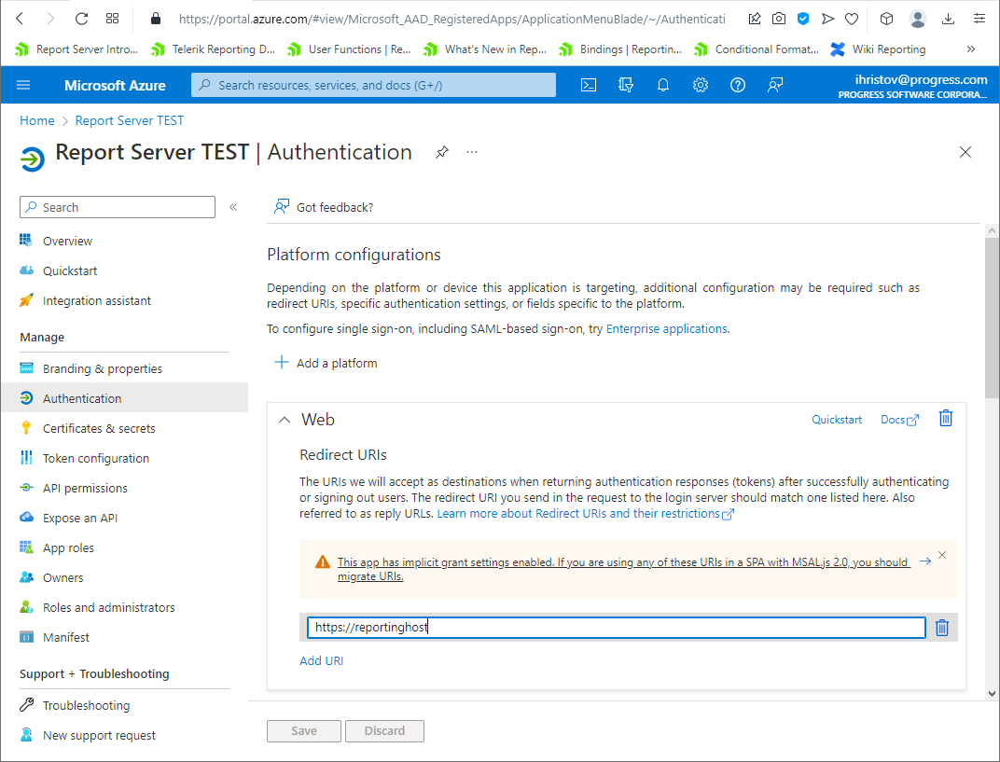


### 6.   Getting the Application (client) ID

After registration is complete, go to **Overview** tab and get the **Application (client) ID**. It must be pasted in the ClientID field the Report Server's Authentication Settings page.

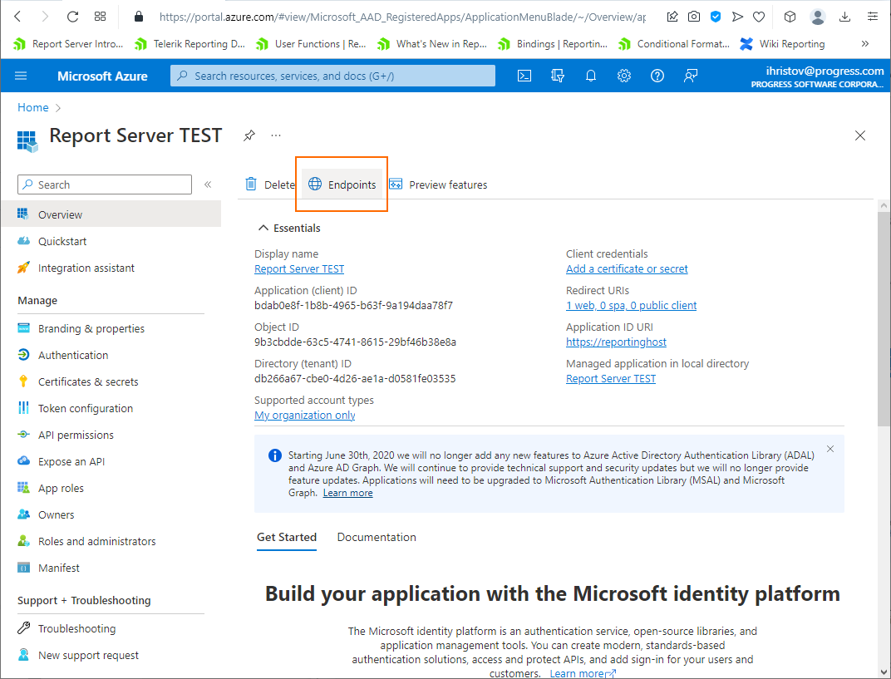


### 7.  Setting Endpoints

Go to **Endpoints** tab and copy the OAuth 2.0 authorization endpoint (v2). It should be the first one in the list, as shown on the screenshot below. Paste it into **Authority field** in the Report Server's Authentication Settings page.

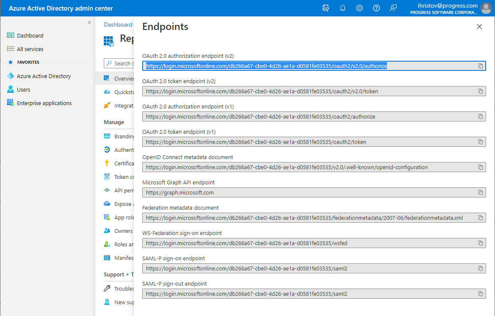


### 8.  Providing permission to the Report Designer application

The last steps is to provide permission to the Report Designer app to access Report Server app. Go to API permissions, add new permission and click on "**APIs my organization uses**" tab above - the Report Server API should be listed there. The only option is to use "user_impersonation" so just confirm the choice. There is also one option named "Admin consent required", which - as far as I understood - will prevent displaying a confirm dialog every time a new user wants to login to Report Server through Standalone Report Designer.

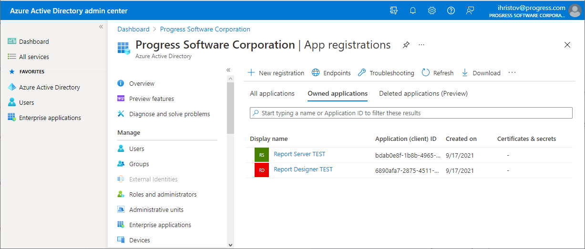


If you now click the **Log in with ADFS credentials** button, the Azure login page will appear and you can login with your credentials. When you successfully log in, you will see that the report server entry is added to the list of available servers and you can use it the same way you do with the local accounts.

## Report Server Users

Once the Report Server is configured to authenticate using your Azure Active Directory, it's time to add a new Active Directory user. It is extremely important that the Report Server user's `username` value must use the AAD user's `User Principal Name` value.

To help explain, let's first look at the steps to add a new user:

1. Select **User Management > Users** option
2. Click the **New User** button
3. In the popup, select Federation, enter the AAD username and email, then select Report Server rols you want that user to have
4. Click **Register**

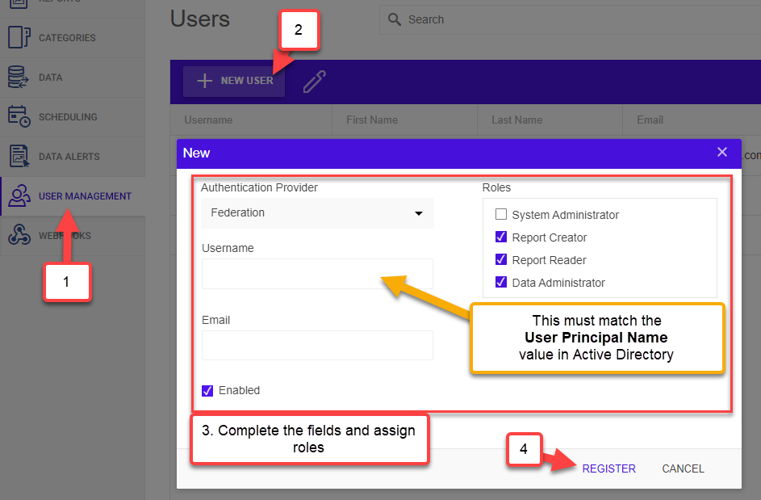


You can find the **User Principal Name** value in the Azure AD portal on that user's properties blade.

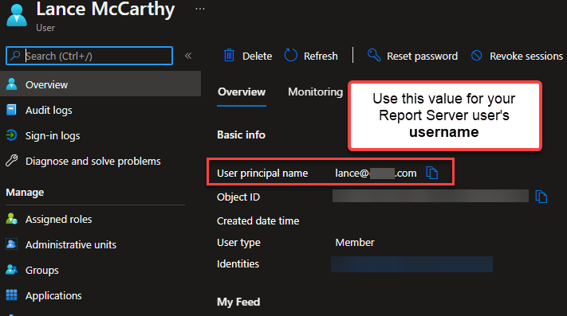


## Troubleshooting

### Runtime Error

There is one known issue which you may experience - Web.config error after authenticating with Active Directory. The workaround is adding the following **requestValidationMode="2.0"** setting in the `<httpRuntime />` property of the Telerik Report Server's web.config file. This will remove the "potentially dangerous" exception:

````XML
<httpRuntime maxRequestLength="2097152" requestValidationMode="2.0"/> 
````

More details about the workaround can be found at the following StackOverflow thread - [Potentially dangerous Request.Form in WSFederationAuthenticationModule.IsSignInResponse](https://stackoverflow.com/questions/5443563/potentially-dangerous-request-form-in-wsfederationauthenticationmodule-issigninr).

The Report Server's Web.config configuration file can be found in {reportServer_installDir}/Telerik.ReportServer.Web. For example, if you have installed the product with the default settings, you can find the file at the following path:

**C:\Program Files (x86)\Progress\Telerik Report Server\Telerik.ReportServer.Web**

### Signin Error

If you see an **Unauthorized access** error after an AAD user signs in:

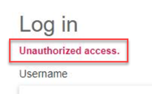


This typically occurs because the Report Server user's username doesn't match the `User Principal Name` in Active Directory. See [Report Server Users](#report-server-users) section above for setup guidance.

You will also want to confirm that the Azure AD Enterprise Application has given those users (or group) access permissions. This can be found on the Enterprise Application's **Users and Groups** blade:

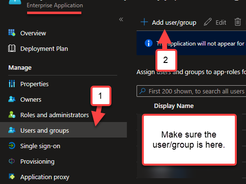


## Conclusion

In this tutorial we demonstrated how to connect to Telerik Report Server using accounts defined in Azure Active Directory. The same approach can be used to authenticate the users from Active Directory for Windows domain networks.
