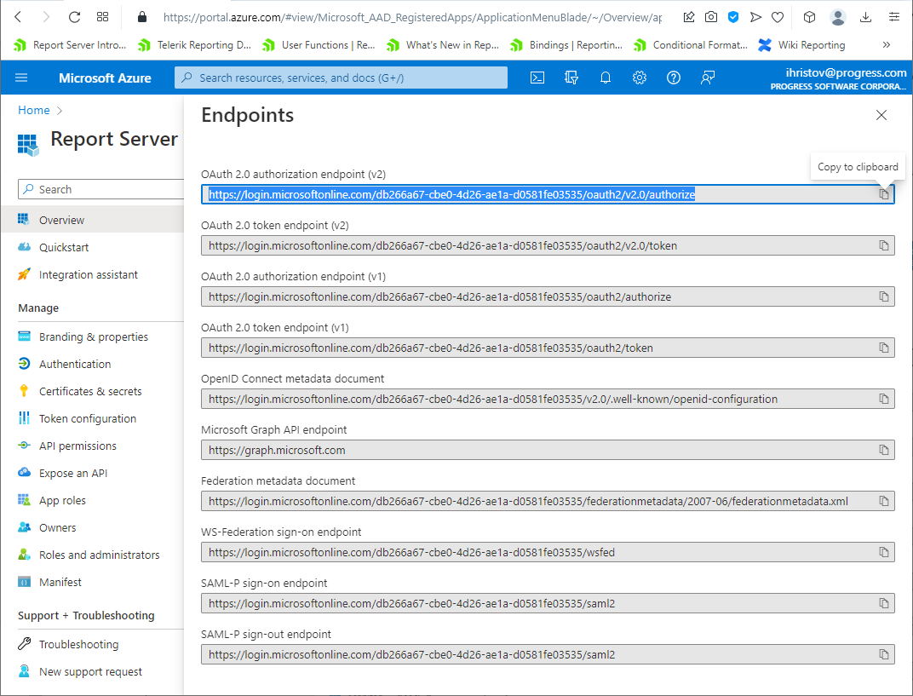

# Overview

Active Directory have proved itself as a standard in directory and identity management services. In this article, we will explain how to use its cloud-based form to provide authentication for Telerik Report Server users. Besides the enhanced authentication security, this approach also improves the user experience, because the users that are already registered in Azure AD will be able to login into Report Server Manager UI without entering their login credentials each time.

The article consists of two sections:
- The first one explains how to configure SSO for the Report Server Manager web application. 
- The second section explains how to configure SSO for the Standalone Report Designer which is connected to a Report Server instance.

## Configure Single Sign-On for Report Server Manager

In this section we'll explain the following:
- How to create your application in Azure.
- How to configure its Single Sign-On settings.
- How to configure the Report Server Manager web application to enable logging in it using Azure AD authentication.

### Prerequisites

-   Telerik Report Server installation with at least one administrator account and enabled **https** site binding in its Internet Information Services registration.
-   An Azure account with Active Directory support.

> In case you’re not familiar with the process of adding the Active Directory service to your Azure account, there is a useful video tutorial that will help: [Enabling Azure Active Directory Premium trial](https://channel9.msdn.com/Series/Azure-Active-Directory-Videos-Demos/Enabling-Azure-Active-Directory-Premium-trial).

### 1.  Setup the Azure AD Application

In your Azure portal, create an **Enterprise** application and mark it as a "**Non-gallery app**". It should look like this:


### 2.  Inspecting IDs:

After creating the app, inspect its IDs in the **Overview** page:


### 3.  Set up the Single Sign-On settings:

In the "Single Sign-On" page, choose SAML and configure the following properties:

- **Identifier (Entity ID)** - match the URL on which our Report Server was hosted. In this example, the server is hosted on the machine by using HTTPS binding and some self-signed certificate. The same URL must be used in the  **Authentication Settings** page in the Report Server configuration. 
Basically those two fields must match and it's not mandatory to use the actual server URL.

- **User Attributes & Claims** - use the default layout. You can include the **Unique User Identifier** (Name ID) claim first, because that's the first claim we use to look for matches in the Report Server's registered users.

SAML Signing Certificate - here you should have the App Federation Metadata Url generated by Azure. Copy its value and paste it in the Metadata Uri field in Report Server's Authentication Settings page.


### 4.  Configuration of SAML authentication of Report Server against Azure AD users

When the SAML configuration is completed, go to the application's Properties page and set the "**User assignment required?**" and "**Visible to users?**" to **NO**. This is to avoid explicitly adding users in "**Users and groups**" page. 
The users that need to authenticate using Azure AD, must be registered in the Report Server's assets storage as Federation users, using their NameId or e-mail (depending on your scenario). See the section **Registering Report Server Users** below.

### 5.  Configure Redirect URIs

Go to Authtentication tab and add the URI of the Telerik Report Server instance you will use. This is the URI that will be used to return the authentication response after successful sign-in. 


This concludes the configuration of the Azure application. We have obtained all the necessary information to register it in the Telerik Report Server web application.

### 6.  Configure Telerik Report Server instance

In Azure, navigate to the Overview tab and click on Endpoints toolbar button.


Copy the OAuth 2.0 authorization endpoint (v2). It should be the first one in the list, as shown on the screenshot below.



Open Telerik Report Server Manager web application and login with an user with administrative permissions. Navigate to Configuration and click on Authentication tab.
- Check the **Enabled** checkbox below Federation provider label.
- Paste the copied OAuth 2.0 authorization endpoint URL into **Authority** textbox.
- Switch again to the Endpoints tab in Azure and copy the **Federation metadata document** URI.
- Switch to Report Server's Configuration page and paste it into **Metadata URI** textbox. Append the following chunk to the URI: ````?appid={your-application-id}```` where ````{your-application-id}```` is the **Application (client) ID** of the Azure application. You can see it in the Essentials panel in the Overview tab. Finally, the contents of the **Metadata URI** textbox should look like this: 
````https://login.microsoftonline.com/{your-directory(tenant)-id}/federationmetadata/2007-06/federationmetadata.xml?appid={your-application-id}````
- Enter the URL of the Telerik Report Server application in the **Relying Party ID** textbox. Its value must be the same as the value of the Redirect URI configured in step 5.

The configuration of the Azure application and Telerik Report Server is now complete. To login into Report Server Manager web app, ensure that the Azure AD users are added as Telerik Report Server users, as described in section [Report Server Users](#report-server-users) below. After adding the Federation user accounts, you should be able to log in to Report Server using the web interface, clicking on the blue button "**Active Directory Credentials**" on the login screen.

In the next section we'll explain how to configure Standalone Report Designer application to authenticate against Telerik Report Server using Azure AD.

## Configure Single Sign-On for Standalone Report Designer

In this section we'll explain the following:
- How to add a new Azure app registration, which will be used to authenticate against Telerik Report Server instance from Standalone Report Designer application.
- How to set up the application's API permissions.
- How to configure the Report Server Manager web application to allow the Standalone Report Designer to connect to Telerik Report Server using Azure AD.

### 1.  Adding a new registration

In Azure Active Directory, navigate to **App registrations** and create a new registration. In the opened pane change only the **Redirect URI type** - by default it's set to **Web**, but you need to use a **Public client/native (mobile and desktop)** entry. For a value just use the URL of the report server - although the Standalone Report Designer doesn't redirect anywhere, having this URL might be required for validation purposes.


### 2.  Providing permission to the Report Designer application

In this step we'll provide permission to the Report Designer app to access Report Server app. Go to API permissions, add a new permission and click on "**APIs my organization uses**" tab above - the Report Server API should be listed there. The only option is to use "user_impersonation" so just confirm the choice. There is also one option named "Admin consent required", which will prevent displaying a confirm dialog every time a new user wants to login to Report Server through Standalone Report Designer.


### 3.   Configure the Report Server Manager's ClientId 

In Azure, go to **Overview** tab and get the **Application (client) ID**. 


Open the Configuration view of Telerik Report Server Manager, navigate to Authentication Settings page and paste it in the **ClientID** field.


The configuration of Standalone Report Designer is now complete. When you open it and try to connect to a Report Server instance, after typing the URL in the **Server URI** textbox, the button **Log in with ADFS credentials** will be enabled. When clicked, the Azure login page will appear and you can login with your credentials. When you successfully log in, you will see that the report server entry is added to the list of available servers and you can use it the same way you do with the local accounts.


## Report Server Users

Once the Report Server is configured to authenticate using your Azure Active Directory, it's time to add a new Active Directory user. It is extremely important that the Report Server user's `username` value must use the AAD user's `User Principal Name` value.

To help explain, let's first look at the steps to add a new user:

1. Select **User Management > Users** option
2. Click the **New User** button
3. In the popup, select Federation, enter the AAD username and email, then select Report Server rols you want that user to have
4. Click **Register**


You can find the **User Principal Name** value in the Azure AD portal on that user's properties blade.


## Troubleshooting

### Runtime Error

There is one known issue which you may experience - Web.config error after authenticating with Active Directory. The workaround is adding the following **requestValidationMode="2.0"** setting in the `<httpRuntime />` property of the Telerik Report Server's web.config file. This will remove the "potentially dangerous" exception:

````XML
<httpRuntime maxRequestLength="2097152" requestValidationMode="2.0"/> 
````

More details about the workaround can be found at the following StackOverflow thread - [Potentially dangerous Request.Form in WSFederationAuthenticationModule.IsSignInResponse](https://stackoverflow.com/questions/5443563/potentially-dangerous-request-form-in-wsfederationauthenticationmodule-issigninr).

The Report Server's Web.config configuration file can be found in {reportServer_installDir}/Telerik.ReportServer.Web. For example, if you have installed the product with the default settings, you can find the file at the following path:

**C:\Program Files (x86)\Progress\Telerik Report Server\Telerik.ReportServer.Web**

### Sign-in Error

If you see an **Unauthorized access** error after an AAD user signs in:


- Typically occurs because the Report Server user's username doesn't match the `User Principal Name` in Active Directory. See [Report Server Users](#report-server-users) section above for setup guidance.

- Confirm that the Azure AD Enterprise Application has given those users (or group) access permissions. This can be found on the Enterprise Application's **Users and Groups** blade:


- Ensure that the URLs registered in both Telerik Report Server Manager web application and apps, registered in Azure, are the same. Mind ending slashes and http/https schemes.

## Conclusion

In this tutorial we demonstrated how to connect to Telerik Report Server using accounts defined in Azure Active Directory. The same approach can be used to authenticate the users from Active Directory for Windows domain networks.
