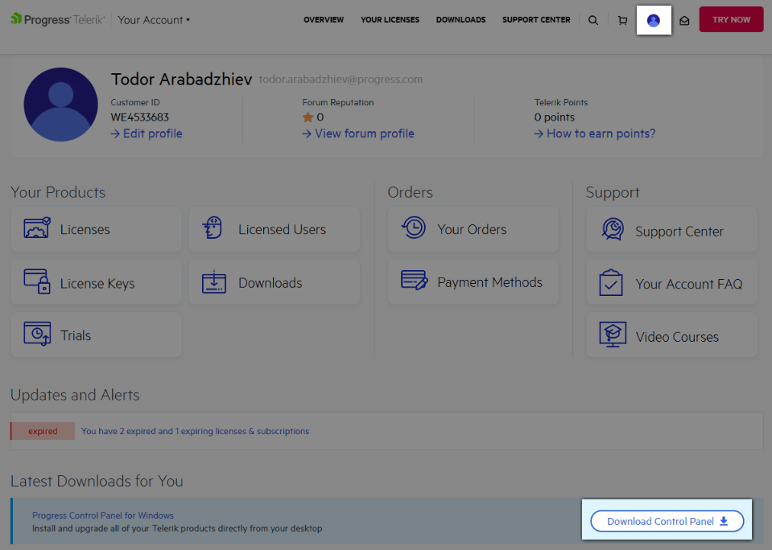
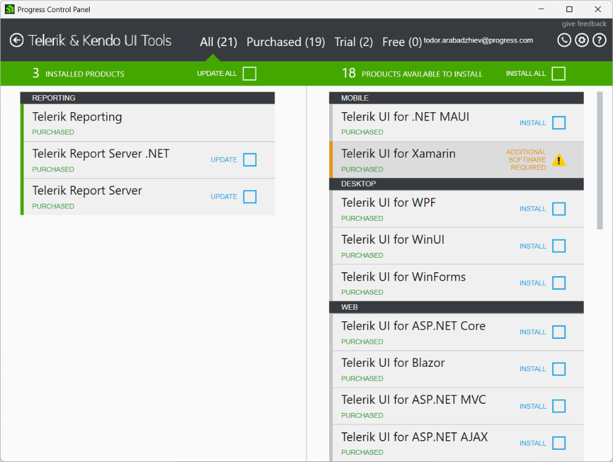
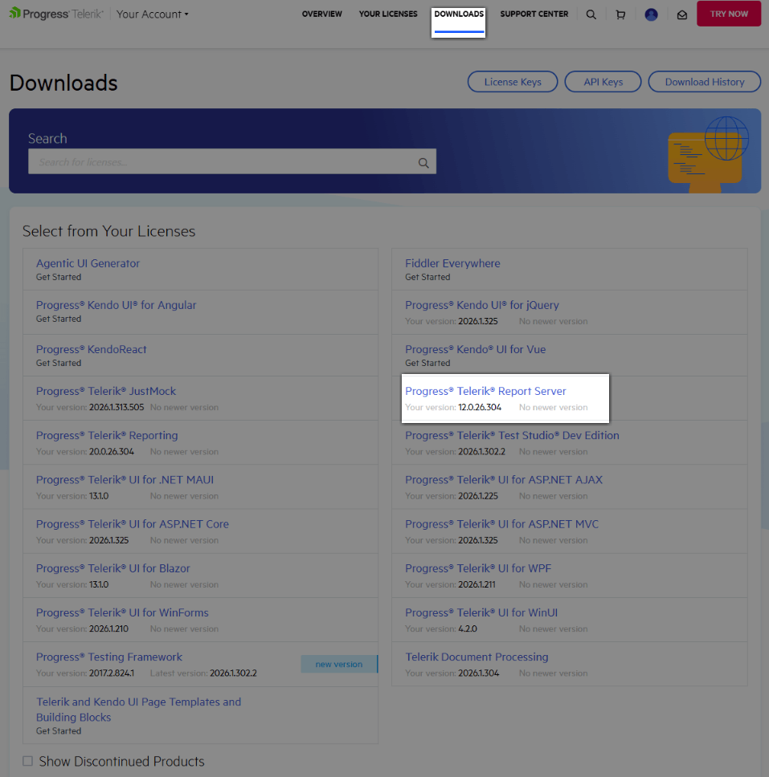
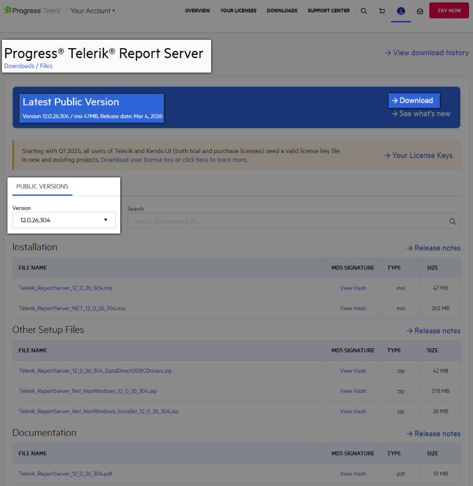
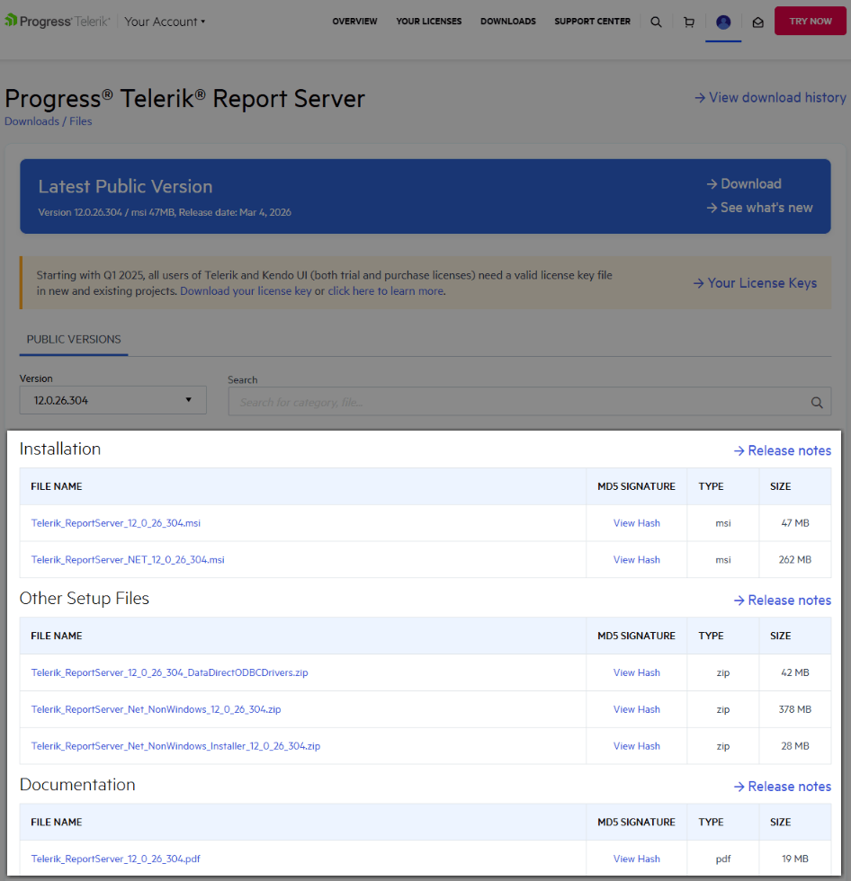

# Report Server Installation

> note This article covers the installation of Telerik Report Server for .NET Framework 4.6.2. Starting with **2025 Q4**, Report Server for .NET (RS.NET) has a dedicated MSI installer. For RS.NET installation instructions, check the [Report Server for .NET Installation on Windows](slug:dotnet-installation-on-windows) article.

The Report Server web application is installed by a Windows MSI installer, which deploys two applications: a website named `Telerik Report Server Manager`, automatically registered with its own application pool in the machine's IIS, and a non-UI application named `Telerik.ReportServer.ServiceAgent`, registered as a Windows Service. The Report Server Manager web application is accessible by default on HTTP port 83 and the Service Agent on HTTP port 82.

## ReportServerUser, LocalSystem Identity and Dedicated Users

### ReportServerUser

When deploying a new instance of Report Server, the default behavior of the MSI installer is to suggest applying the [principle of least privilege](https://learn.microsoft.com/en-us/entra/identity-platform/secure-least-privileged-access) and create a dedicated Windows user named **ReportServerUser** whose identity will be used by both applications. The user is granted the minimum necessary permissions to operate within the installation folder of Telerik Report Server.

The **ReportServerUser** is created with a strong random password, which is not saved, as this user is dedicated to running only the Telerik Report Server and its agent.

### LocalSystem Identity

The MSI installer allows opting out of the safe workflow and installing the applications under the **LocalSystem** identity, which uses elevated permissions.

The safety recommendations dictate that this option should be selected only if the Report Server is deployed and used in a safe environment. If needed, the Report Server applications can be configured to use an [identity with limited permissions](slug:how-to-change-report-server-iis-user).

### Using Dedicated Users After Installation

After installing the Telerik Report Server product, one may want to assign a custom dedicated user to be used by the Report Server and the Service Agent.

This is supported as well, and you can find a step-by-step tutorial on how to do it in the [How to Run Report Server and Service Agent with Limited Permissions](slug:how-to-change-report-server-iis-user) article.

Any custom Windows user must have the following permissions/policies for the Report Server and its Service Agent to function properly with all of the functionalities being supported:

- [Modify access](https://learn.microsoft.com/en-us/windows-server/administration/windows-commands/icacls) for the Report Server installation directory(`C:\Program Files (x86)\Progress\Telerik Report Server`), and all subdirectories
- [Modify access](https://learn.microsoft.com/en-us/windows-server/administration/windows-commands/icacls) for the `%ProgramData%\Telerik\Reporting` directory - This is the place where the cache of the [Map](https://docs.telerik.com/reporting/report-items/map/overview) report item is stored.
- [Log on as a service](https://learn.microsoft.com/en-us/previous-versions/windows/it-pro/windows-10/security/threat-protection/security-policy-settings/log-on-as-a-service) must be **enabled** for the user, or one of the user groups where it is included.

## Multiple Report Server Installations

Generally, it is possible to deploy multiple Report Server instances on the same IIS if they have different website names, ports, and application folders. However, the Scheduler Windows Service (the Service Agent) cannot be duplicated and will always point to the Storage of the last installed Report Server instance.

Installing multiple instances of Report Server will also affect the retrieval of the encryption keys stored in the user's environment variables. For those reasons, only one fully functional Telerik Report Server can be installed on a single machine.

## Downloading and Installing

You can download the licensed product version from the [Telerik Control Panel](https://docs.telerik.com/controlpanel/introduction), which you can get from [Your Account](http://www.telerik.com/account):



The Control Panel is a small Windows utility that will notify you when a new version of the Telerik product(s) you have purchased is available. Once you download the product, run the installer to install it on your machine.

## Installation Options

- The installation can be customized to include SDK examples in the installation folder and enable JSON dynamic compression for the Report Server website in IIS. These options can be selected from the _Customization_ installer page when clicking the **Customize** button.

	The SDK examples show how to implement a [custom login provider](slug:custom-login-provider) and how to use the [Telerik.ReportServer.HttpClient](slug:report-server-api-client) library to programmatically access Report Server assets and control the Report Server engine.
	The JSON dynamic compression is a feature that can lower the report loading times in Web Report Designer. See the [IIS Configuration](slug:iis-configuration) article for more details or if you plan to do it manually later.

- The installer provides an option to choose whether the website and the Windows Service will be installed in 32-bit or 64-bit mode.

	The option is available only on a 64-bit OS.
	It sets the option _Enable 32-Bit Applications_ in the website's application pool and registers the corresponding version of the **ServiceAgent** in the Windows Services list.
	This configuration option is useful when the Report Server and its Scheduling service need to work with a specific version of external entities, like ODBC drivers, without an architecture mismatch between the driver and the application.

- Use PowerShell command [Start-Process](https://learn.microsoft.com/en-us/powershell/module/microsoft.powershell.management/start-process?view=powershell-7.3) to install the Report Server silently:

	```powershell
	Start-Process -FilePath "msiexec" -Wait -ArgumentList "/I D:\Installs\Telerik_ReportServer_12_0_26_304_Dev.msi /passive"
	```

	The above script will install Telerik Report Server version `12.0.26.304` from the file `D:\Installs\Telerik_ReportServer_12_0_26_304_Dev.msi`. You need to change the file path to point to the position and version of the MSI installer on your machine.

## New Versions

### Download Automatically through Progress Control Panel

The best way is to download the new version through your Progress Control Panel:



It automatically detects the latest version and lets you install it for the products you have access to.

## Other Product Files and Latest Public Version

1. From [Your Account page](http://www.telerik.com/account/), go to `Downloads` and select the product:

	

1. Download the `Latest Public Version` from the corresponding `Download` button, or select another version from the dropdown with the listed available Public Versions below:

	

1. From there, select the product files you want to download:

	

## See Also

- [Upgrade Report Server](slug:upgrade)
- [Run Report Server with Low-Privileged User](slug:how-to-change-report-server-iis-user)
