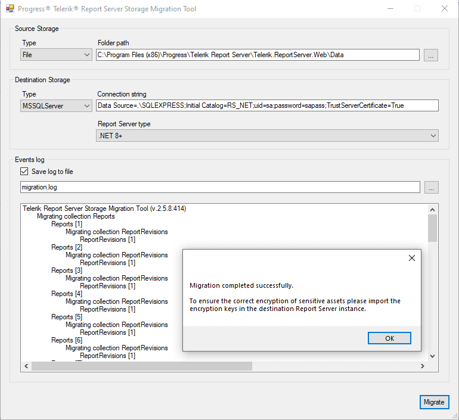

# Storage Migration Tool

The **Telerik Report Server Storage Migration Tool** is a standalone module shipped with the Telerik Report Server installation. It was introduced in [R2 2017 (3.1.17.503)](https://www.telerik.com/support/whats-new/report-server/release-history/telerik-report-server-r2-2017-(version-3-1-17-503)). Its purpose is to provide an easy out-of-the-box solution for migrating the Report Server storage. It can be used from a command line or a graphical (Windows Forms) user interface. The executables are placed in `Tools\` subfolder of the installation directory. The tool supports as source and destination the following built-in storages:

- MS SQL Server storage
- Redis storage
- File storage

> The Storage Migration tool will copy the assets from the source storage to the specified destination. If the destination storage does not exist, it will be created. If the destination storage exists, then the source assets will be copied to the destination, **without clearing the destination storage first**, which can produce duplicated entries in the destination storage.

### Command-Line Interface

The executable **migrate.exe** operates in two modes - *simple* and *configurable* migration. The simple mode copies all the entries from the source storage to the destination storage. The configurable mode allows selecting which assets will be migrated along with their related entities (see the *Storage assets upgrade mechanism* section below). The migration mode is determined by the arguments provided to the executable. For the simple migration mode, the executable must be started with two arguments, describing respectively the **source** and **destination** storage types, followed by connection information for each storage type. Example commands that perform a copy of file storage located on `C:\Report Server\Data` to a Redis database hosted on `localhost:6981` or to an MS SQL Server instance would look like this:

<code>migrate.exe type=file,connection="C:\Report Server\Data" type=redis,connection=localhost:6981,defaultDatabase=1</code>

<code>migrate.exe type=file,connection="C:\Report Server\Data" type=mssqlServer,connection="Server=myServerAddress;Database=myDataBase;User Id=myUsername;Password=myPassword;"</code>

Available values for **type** parameter (case-insensitive):

-	**file** - indicates that File storage will be used.

-	**redis** - indicates that a Redis storage will be used.

-	**mssqlServer** - indicates that an MS SQL Server storage will be used.

### File Storage Connection Parameters

When using **file** as a storage type, the **connection** parameter must contain the path to the Telerik Report Server storage directory. By default, it is named **Data** and is placed under **Telerik.ReportServer.Web** folder. When the path consists of directory names containing spaces, the argument must be enclosed in quotes. When used for the destination parameter, make sure the current user has proper permissions for creating files in the specified folder.

### Redis Storage Connection Parameters

The migration tool uses *StackExchange.Redis.StrongName v.1.0.479* library as a client that accepts the value of the connection argument to create a connection to the database. Make sure the Redis storage instance is active and is accepting connections before commencing a migration. Examples of initializing the connection options can be found [here](https://github.com/StackExchange/StackExchange.Redis/blob/c6d8aec280722d83ed78b11e7b70d6d43b16ec98/Docs/Configuration.md).

### MS SQL Storage Connection Parameters

Similar to the **redis** option, when **mssqlServer** type is used, the value of the connection parameter is passed as a connection string to the MSSQL client. Make sure the MSSQL server is active and accepts connections before commencing a migration. Examples of constructing the connection string can be found [here](https://www.connectionstrings.com/sql-server/). Note that if you do not specify a table name, the data will be stored using the *master* schema.

### Graphical User Interface

The migration tool can also be used via **Telerik.ReportServer.Migration.UI.exe**. It is a Windows desktop application that provides a convenient graphical migration experience and an option to log the migration process output. The form requires setting type and connection information for **source** and **destination** storages - the same way it is done with the CLI tool. An events log text box will display the results of the migration process, and its content can be copied to the clipboard via a context menu. If needed, the same log can be saved to a file for further examination - in this case, make sure your user has the necessary privileges for writing a file into the log directory.

## Automating the Migration Process
Some scenarios require deploying a pre-configured Report Server instance to the clients. The Report Server installation distributes two PowerShell scripts, named **rs-export.ps1** and **rs-import.ps1**, that help automate this process. Although the scripts can be used out of the box, their purpose is to demonstrate an example workflow, and they should be modified according to the current use case.

The **rs-export.ps1** script starts a Report Server installation in silent mode and, when finished, opens the server's management console and waits for the server configuration to complete. When the administrator finishes configuring the report server (users, reports, whitelabeling, etc.), the script continues with exporting the server's assets storage into a .zip file and then exits.

The **rs-import.ps1** script starts a Report Server installation and unpacks the .zip file produced by the first script as its storage. In case changing the ReportServer storage type is required, the script determines (via a parameter) the connection to the target storage and migrates the contents of the .zip file to MSSQL or REDIS if needed. The script also modifies the .config file in the Report Server directory so it will match the target storage type. Finally, the scripts start the Report Server Manager and exit.

Both scripts accept startup parameters, defining the installation directory and path to the produced .zip file, so they would work even without modification for most common migration scenarios.

## Storage assets upgrade mechanism
The migration tool can perform a selective migration using a rule set defined in an external JSON file. This is useful in continuous deployment scenarios, where the target database must be regularly updated without affecting its current assets. This migration mode is determined by an additional *config* parameter of the **migrate.exe** utility and looks like this:

`migrate.exe type=file,connection="C:\Report Server Source\Data" type=file,connection="C:\Report Server Deployed\Data" config=config.json`

The above command will migrate the report server file storage located at `C:\Report Server Source\Data` to the file storage located at `C:\Report Server Deployed\Data`, applying the rules defined in the `config.json` file. If the destination storage does not exist, it will be created.

### Configuration file
The configuration file that determines the rules for the migration is in JSON format and looks like the one below:
```json
{
  "user": {
    "name": "newUser",
    "password": "newPassword",
    "email": "newMail@somemail.org",
    "firstName": "First",
    "lastName": "Second"
  },
  "mailConfiguration": {
   "smtpHost": "myNewHost.smtp.org",
   "port": "33",
   "useSecureConnection": "true",
   "accountName": "newUser",
   "password": "111111",
   "senderEmail": "newSenderEmail",
   "senderName": "newSenderName"
  },
  "assets": [ "reports", "data connections", "scheduled tasks", "data alerts", "users" ]
}
```

### Configuration file rules
The configuration file describes which assets will be migrated, applying the rules for each asset or collection as shown below: 

  * **User** – the JSON file must contain a single user. If the username exists in the target storage, its data will not be updated; just its ID will be retrieved and will be used when migrating the reports asset. If the user is new to the target storage, it will be inserted as an administrator. If the user exists on the target storage and has NO administrator rights, the migration process will abort with an explanatory message.
  
  * **Mail Server** – this entry is optional. If provided, it will insert or update the mail server settings on the target storage. 
  
  * **Assets** - defines the assets that will be migrated as follows:
  
    + **Reports** – when migrating the stock set of reports, the new reports (the ones that do not exist in the target, compared by the combination of category and report name) will be inserted, and the existing ones will be updated. When the report is new, only its last revision from the source storage will be inserted in the target storage. When the report already exists, the last revision from the source storage will be inserted as the last revision in the target storage. If a report has specific permission that does not exist on the target storage, the permission will be migrated as well. The permissions assignment depends on whether the user exists in the destination storage and the **"users"** flag is used in the assets' configuration, as explained below:
      - If the permission is assigned to a user that exists in the destination storage, it will be migrated and assigned to that user. 
      - If the permission is assigned to a user that does not exist in destination storage and the **users** flag is included in the assets' configuration, the user will be migrated and the permission will be migrated and assigned to this new user.
      - If the permission is assigned to a user that does not exist in destination storage and the **users** flag is **not** included in the assets' configuration, then the permission will be migrated and assigned to the migration user.
  
    + **Data connections** – the data connections that do not exist in the target storage will be inserted. Existing data connections will not be updated, because this could break the currently working reports. The permissions are migrated the same way as with the **Report Permissions** collection.
  
    + **Scheduled Tasks** and **Data Alerts** – their migration follow the same rules as with the **Data connections**. If a task or alert is related to a report that does not exist on the target storage, that relation will be preserved, changing the report ID when the report is migrated. The permissions are migrated the same way as with the **Report Permissions** collection.

    + **Users** – The users that do not exist in the target storage will be inserted along with their roles. Existing users' data will not be updated. The permissions are migrated the same way as with the **Report Permissions** collection.

The application outputs a detailed log in the console so the migration process can be easily tracked. In case an error occurs, the stack trace will be logged as well. The migration process cannot be rolled back, so it is recommended to create a backup of the storage before migrating. This can be done manually, using batch files, or through scripts, as explained above.

## Storage Migration Tool for Report Server for .NET

The assets storage of Report Server for .NET utilizes a different serialization mechanism. That's why the storage assets are not interchangeable between both flavors of Report Server applications. In 2025 Q1, we introduced a preview version of **Telerik Report Server .NET Storage Migration Tool**. The executables are placed in the `Tools\` subfolder of the installation directory. It is built on top of the classic Migration Tool with a few differences listed below. 

  * The *Destination Storage* configuration now accepts a new argument: **serverType** with the following options:
  
    + **netFramework** -  the migrated assets will be compatible with the classic Report Server for .NET Framework.
    + **net** -  the migrated assets will be compatible with the new Report Server for .NET.
    + **notSet** -  the migrated assets will use the same serialization mechanism used in the *source storage*.

The **serverType** option can be selected when using either the CLI tool or the WinForms application. The server type of the source storage will be automatically detected.



> The migration process copies the assets "as-is" without applying decryption or encryption to them. This means that the destination storage will have its sensitive assets stored with the same encryption keys that were used in the source storage. It is important to set the same encryption keys in the Report Server application that will use the destination storage assets. The Migration Tool will display a reminder message upon successfully completing the migration process.

### Known Limitations

  The Report Server for .NET Migration Tool is in the *development phase* and does not support all the functionalities provided by the classic Migration tool. Here's a short list of what's not supported yet:

  - Redis database as destination storage. You can migrate storage assets from a **Redis** database to **File or MSSQLServer** storage.
  - Migration rules - currently, the supported migration mode allows the transfer of the whole storage.
  - Changing storage type - currently, the migration from File to MSSQL storage or vice versa is not supported.
  - Backwards migration - migrating from Report Server for .NET storage to Report Server for .NET Framework storage is not supported.
