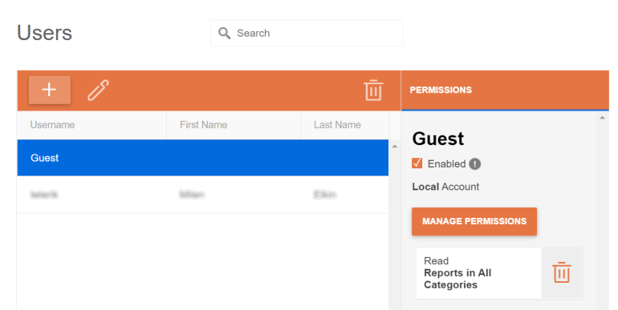

# Guest User Overview

The Guest user is a built-in user account created upon the initial setup of the Telerik Report Server. The Guest's purpose is to be used for report document preview and sharing, either using a sharing link to a report, a report viewer control embedded in a client application, or the reports API.

## Guest User Administration

By default, the Guest user is disabled. To enable it, navigate to the _User Management -> Users_ view, select the Guest user from the list of users, and tick the _Enabled_ checkbox.

By default, the Guest user has `Read` permission on all reports in all report categories. If some reports or report categories should not be generally accessible, delete the default permission and substitute it with more specific `Read` permissions.

## Usage

Use the Guest user to generate report documents in different scenarios. The Guest user needs `Read` permissions on the target report for this to work.

###	Share a report that resides on the Report Server with a URL

Report Server's API provides a method that serves a report by specified category, report name, and report revision. 
The format is _`serverUrl`/report/share/`category`/`reportName`/`revision`_. 
Omit the _`revision`_ parameter to display the last revision of the specified report.
The Report Server processes such a request using the Guest account.
If the Guest account is disabled, the server will return a response with error code 403- Forbidden.

###	Display a server report in an embedded Report Viewer control

Use the Guest account to display reports to the users of a client application.
To do this, embed a suitable report viewer control according to the UI technology without setting up user credentials in the viewer's configuration.
This will effectively authenticate the viewer's requests to the server as a Guest user. 
More information and how-to recipes on displaying server reports in client applications are available in the help article 
[Integration With Report Viewers]().

## Limitations of the Guest user

* Cannot be edited - since it doesn't have any user-related fields except `username`, the _Edit_ button is disabled when the Guest user is selected.
* Cannot be used to log in to Telerik Report Server manager or API.
* Cannot have any permission other than `Read`. It cannot modify, create or delete reports.
* Permission scope is limited to Reports - based on the previous limitations, the Guest user's Read permission can only have a report-related scope.
* Cannot have any Roles - the Guest can only read reports and since a role can have virtually any permission, adding the Guest user to a role is not permitted.
* Cannot be used to perform operations with Report Server resources using its API as they require passing an access token. The only allowed method is GET _`serverUrl`/report/share/`category`/`reportName`/`revision`_.

## Security concerns related to the Guest user

When you authenticate with the Guest user, you grant access to the reports allowed to be read by it to anyone who may use your application/report viewer. The users don't need credentials for your Report Server in this scenario. This makes the Report Server potentially vulnerable to:

* [__Distributed denial-of-service (DDoS) attack__](https://www.microsoft.com/en-us/security/business/security-101/what-is-a-ddos-attack) 
	The [rate limiter]() is disabled for the Guest user. This lets the bad agents use the report viewer to exhaust the Report Server resources by requesting lots of reports through the Guest user in short time.

* __Information disclosure__ 
	By letting users access reports from the Report Server without authentication, you grant them access to all the information in these reports.
