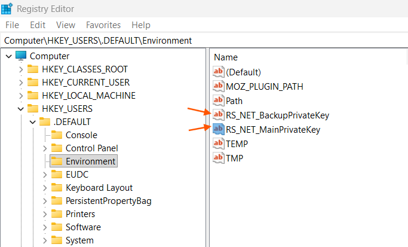

## Environment

<table>
	<tbody>
		<tr>
			<td>Product</td>
			<td>Progress® Telerik® Report Server for .NET</td>
		</tr>
		<tr>
			<td>Product Version</td>
			<td>11.0.25.211 and later</td>
		</tr>
	</tbody>
</table>

## Description

After upgrading or reinstalling the [Report Server for .NET](slug:report-server-net-overview) with a different Windows user account, navigating to the **Data Connections** page results in a `Failed to decrypt` error. The administrator is not redirected to the **Override Encryption Keys** page, even after performing an IIS reset.

The issue occurs when stale encryption key environment variables (`RS_NET_MainPrivateKey` and `RS_NET_BackupPrivateKey`) remain in the default user registry hive (`HKEY_USERS\.DEFAULT\Environment`) from a previous installation.

## Error Message

```error
Failed to decrypt
```

## Cause

When the [Report Server for .NET](slug:report-server-net-overview) is first installed under one Windows user account (for example, `LocalSystem`) and later reinstalled or upgraded under a different user account (for example, a dedicated `ReportServerUser`), the encryption key environment variables from the original installation persist in the registry under `Computer\HKEY_USERS\.DEFAULT\Environment`.

The Report Server application inherits environment variables from the parent process. Because the stale keys from the previous installation exist at the `.DEFAULT` registry level, the application detects them instead of recognizing that the current user is missing valid keys. As a result, the Report Server attempts to decrypt data connections with the outdated keys and fails. The expected redirect to the **Override Encryption Keys** page does not occur because the application does not identify the keys as missing.

The Report Server application runs with limited permissions and cannot delete the stale environment variables from the `.DEFAULT` registry hive on its own. An application pool recycle does not resolve the issue because the stale variables continue to be inherited.

## Solution

To work around this issue, manually delete the stale encryption key environment variables from the default user registry hive:

1. Open **Registry Editor** (`regedit`) on the server machine with administrator privileges.
1. Navigate to the following registry path:

   `Computer\HKEY_USERS\.DEFAULT\Environment`

   

1. Locate and delete the following environment variables:
   - `RS_NET_MainPrivateKey`
   - `RS_NET_BackupPrivateKey`
1. Run an IIS reset by opening an elevated command prompt and executing:

   ```bash
   iisreset
   ```

1. Open the Report Server in a browser and log in. The application navigates you to the **Override Encryption Keys** page.
1. Follow the on-screen instructions to reset the encryption keys.

> important After resetting the encryption keys, all previously encrypted data connections must be re-entered because the old encrypted values cannot be decrypted with the new keys.

## Notes

This issue is specific to IIS-hosted (Windows) installations of the Report Server for .NET. It does not affect the **Report Server for .NET Framework** edition.

A permanent fix that ensures the installer cleans up stale encryption keys from previous installations is planned for a future release.
