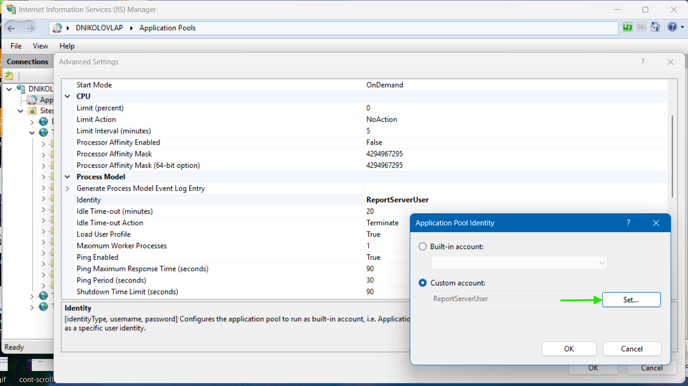
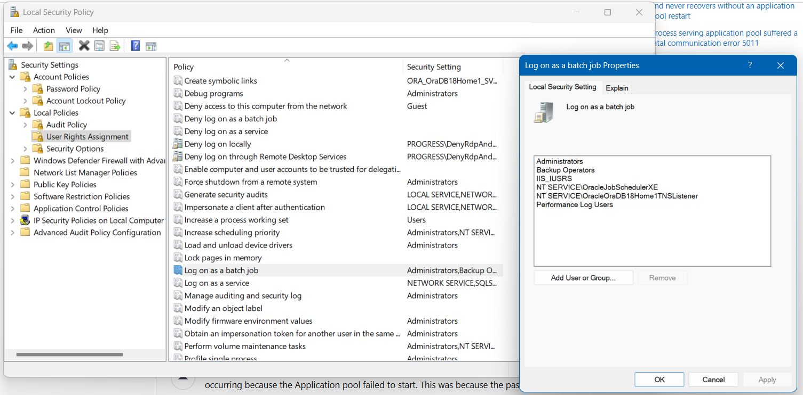
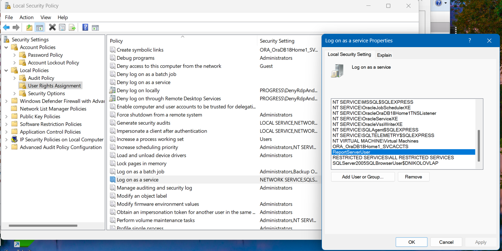

## Environment

<table>
   <tbody>
      <tr>
         <td>Product</td>
         <td>Report Server</td>
      </tr>
   </tbody>
</table>

## Description

I cannot start the Report Server application pool in IIS. Attempting to log in results in a 503 error stating "The Service is unavailable." The Windows log shows that the identity of the application pool is invalid, possibly due to an incorrect username/password or missing batch logon rights. Restarting the application pool leads to immediate failure.

## Solution

To resolve the issue, follow these steps:

1. Verify whether the password for the `ReportServerUser` account has been changed since installation. If yes:
   * Open IIS Manager.
   * Navigate to Application Pools.
   * Go to Advanced Settings -> Process Model -> Identity.
   * Set the password to the new one
  
   

1. Ensure that the `ReportServerUser` account has __'Log on as a batch job'__ and __'Log on as a service'__ required user rights:
   * Open Local Security Policy.
   * Navigate to Computer Configuration -> Windows Settings -> Local Policies -> User Rights Assignment.

   

   

1. If the issue persists even after you have confirmed that the username and password are correct, troubleshoot further by generating logs:
   * Refer to [Troubleshoot Report Server Manager]().
   * Follow the instructions to collect the necessary logs.

> Before making any changes, ensure you create a backup to prevent data loss. For detailed instructions, refer to [Storage Backup - Telerik Report Server]()

## See Also

* [Welcome to Telerik® Report Server!]()
* [Weak Password Requirement]()
* [Login]()

