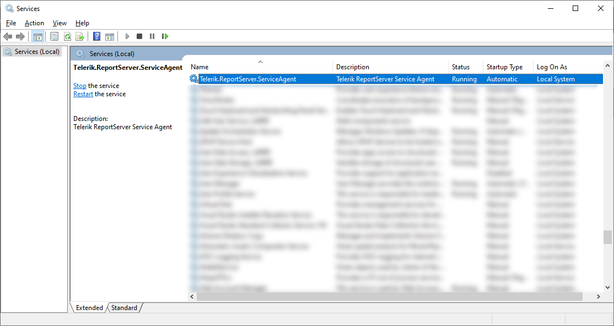

[---
title: How to Create a Non-Privileged IIS User for Report Server and Service Agent
description: "This tutorial shows how to use a low-privileged user to host the Report Server on IIS."
type: how-to
page_title: How to Run Report Server and Service Agent with Limited Permissions
slug: how-to-change-report-server-iis-user
tags: report server, iis, user permissions, iis permissions
res_type: kb
---

## Environment

|  |  |
|---------|-----------------|
| Product | Progress® Telerik® Report Server |
| Version | 10.1.24.514+ |

## Description

This tutorial will show you how to change the Report Server's IIS application pool and service agent to use an identity with limited permissions.

## Solution

1. Create a new Windows user with limited permissions, for example, `RSUser`.

	

	For more help, see [Microsoft Docs - Manage User Accounts in Windows](https://support.microsoft.com/en-us/windows/manage-user-accounts-in-windows-104dc19f-6430-4b49-6a2b-e4dbd1dcdf32).

2. Go to Telerik Report Server's installation directory (`C:\Program Files (x86)\Progress\Telerik Report Server`) and give `RSUser` full access permissions to the `Telerik.ReportServer.Web` and `Services` sub-folders.

	

	- Ensure the user does not have read or write permissions to any other folders.
	- You can use any username you prefer, the `RSUser` recommended here applies the semantic naming practices.
	- For more help, see [Microsoft Q&A - How do I set up user account and manage permissions](https://learn.microsoft.com/en-us/answers/questions/1389054/how-do-i-set-up-user-accounts-and-manage-permissio).

3. Open Internet Information Services (IIS) Manager by selecting `Windows Key` + `R` to open the Run window, and then enter `inetmgr`.
4. In the left column, expand the machine's node and select **Application Pools**. Right-click on the `TelerikReportServer` application pool and select **Advanced Settings** from the context menu.

	

5. Select the **Identity** item and click the ellipsis button.

	

6. Select **Custom account**, click **Set…**, and enter the name of the newly created user (for example, `RSUser`) and its password:

	

7. Right-click the `TelerikReportServer` application pool and select **Recycle...** from the context menu.
8. Open the Report Server Manager application in the web browser to confirm it is working with the new user identity.
9. Open Windows's Services app by selecting `Windows Key` + `R` to open the Run window, and then enter `services.msc`.
10. Scroll to the `Telerik.ReportServer.ServiceAgent` service instance:

	

11. Double-click to show the service's **Properties** panel. Select the **Log On** tab.
12. Click **This account** and enter the new user name (for example, `.\RSUser`) and its password:

	

13. Right-click `Telerik.ReportServer.ServiceAgent` and select **Restart** to restart the service with the new user.
14. Ensure it is working by running a **scheduled task** or a **data alert** from the Report Server Manager web UI, or on the URL `http://{MachineNameHere}:82/ReportServer/ServiceAgent?wsdl`:

	If the Report Server Manager cannot connect to the Telerik.ReportServer.ServiceAgent, most probably the WCF service doesn't have a reservation for the corresponding port (the default one is `82`). Ensure reserving the port by running the proper [Netsh command](https://learn.microsoft.com/en-us/windows-server/networking/technologies/netsh/netsh-contexts) as an Administrator in the _command prompt_ or _terminal_. Here is a sample command that reserves port `82` for `ReportServer/ServiceAgent/` running under user `RSUser`:

	`netsh http add urlacl url=http://+:82/ReportServer/ServiceAgent/ user=RSUser`

	If the default port `82` is already reserved by another process, you may change the port and reserve the new port as above, or release port `82` with the `delete urlacl` command and then reserve it with the above command. Here is a sample code releasing port `82` from the Telerik.ReportServer.ServiceAgent:

	`netsh http delete urlacl url=http://+:82/ReportServer/ServiceAgent/`

> Additional Actions: Consider adding the local user to databases used by Report Server data connections that utilize Windows Credentials login permissions.
