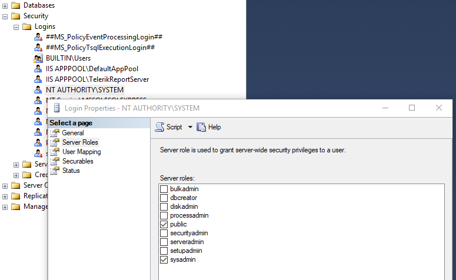
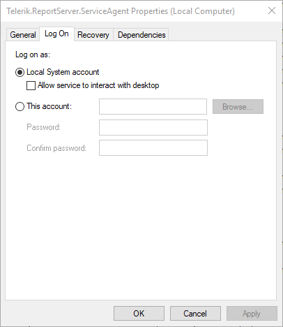

## Environment

<table>
	<tr>
		<td>Product</td>
		<td>Progress® Telerik® Report Server</td>
	</tr>
</table>

## Description

When upgrading an existing instance of the Report Server which uses [Microsoft SQL Server storage]() to a newer version, the installation fails at the "Starting services" step
and then rolls back the upgrade.

The Report Server installation installs and runs an instance of the _Telerik.ReportServer.ServiceAgent_ service which is a local Windows service.

By default, the _Telerik.ReportServer.ServiceAgent_ runs under the **Local System** account (**NT AUTHORITY\SYSTEM**). When this account does not have login permissions for Microsoft SQL Server the _Telerik.ReportServer.ServiceAgent_ cannot start because it cannot connect to the database configured in the Report Server [storage settings]().

This is the reason for the installation failure at the "Starting services" step.

## Solution

The following solutions are available:

- Grant the required permissions to the **NT AUTHORITY\SYSTEM** account, so it can access the database configured in the Report Server [storage settings]().

  

- Change the account under which the _Telerik.ReportServer.ServiceAgent_ service is running to an account which has permissions for the storage database.

  
