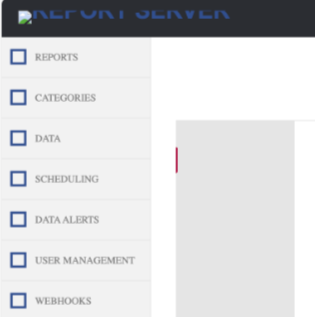
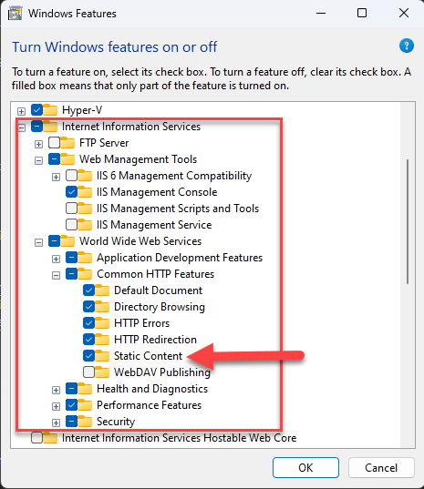

## Environment

<table>
	<tbody>
		<tr>
			<td>Product</td>
			<td>Progress® Telerik® Report Server</td>
		</tr>
		<tr>
			<td>Product Version</td>
			<td>11.1.25.521</td>
		</tr>
	</tbody>
</table>

## Description

Report Server unexpectedly stops showing icons, throw script errors, or has lost whitelabeling features.

Other symptoms may include script errors in the browser console, such as:

- `Uncaught Type Error: Cannot read properties of undefind (reading 'getLocalizatoinString')`
- `Failed to decode downloaded font: host/Contentfonts/TelerikReportServerFont.ttf`

You may also see 404 errors for script and asset links in the Networking tab.

## Possible Cause

If the server's IIS setting were reset, either through Windows Update or other OS operations, which stops allowing access to static content inside the application folder. Some of those assets are image files and javascript resources, which results in client-side issues as described above.

## Solution

Reenable IIS and reselect all relevant features, especially `Internet Information Services` > `World Wide Web Features` > `Common HTTP Features` > `Static Content`. Use the following screenshot for guidance:

> After fixing IIS settings, if your whitelabeling customizations are still missing, disable the whitelabeling, then reenable it (and reapply customizations).

## See Also

* [IIS Configuration]()
* [Whitelabeling]()