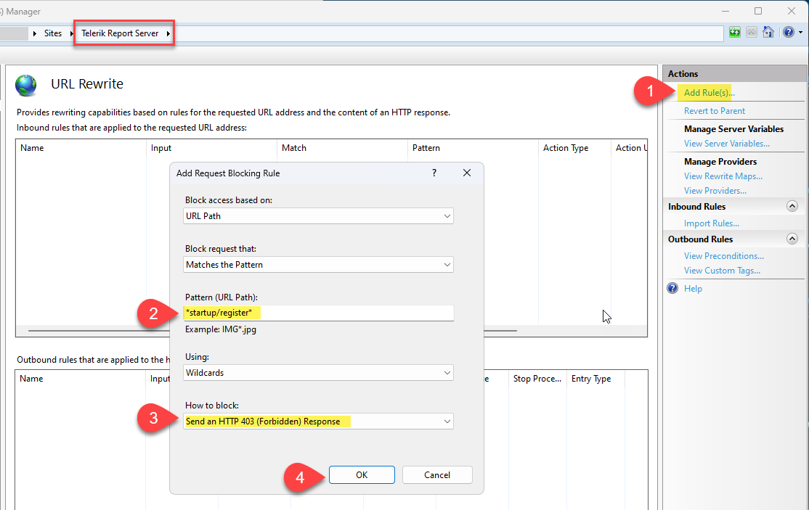

## Description

Critical Alert – May 2024 - [CVE-2024-4358](https://www.cve.org/CVERecord?id=CVE-2024-4358)

- Telerik Report Server 2024 Q1 (10.0.24.305) and earlier.

## Issue

CWE-290 Authentication Bypass by Spoofing

### What Are the Impacts

In Progress Telerik Report Server, version 2024 Q1 (10.0.24.305) or earlier, an unauthenticated attacker can gain access to Telerik Report Server restricted functionality via an authentication bypass vulnerability.

Although we have not received any reports that this vulnerability has been exploited, it is important to review your Report Server’s users list for any new Local users you have not added at `{host}/Users/Index`.

## Solution

Updating to Report Server 2024 Q2 (10.1.24.514) or later is the only way to remove this vulnerability. The Progress Telerik team strongly recommends performing an upgrade to the latest version listed in the table below.

| Current Version | Guidance |
|-----------------|----------|
| 2024 Q1 (10.0.24.305) | Update to 2024 Q2 (10.1.24.514) ([update instructions]()) |

## Temporary Mitigation

If upgrading your Report Server instance(s) is not an immediate option, we strongly recommend that you promptly implement a **URL Rewrite** mitigation technique to remove the attack surface in IIS:

  1. The URL Rewrite IIS module is required for this mitigation. If you do not already have it installed, you may download it from [here](https://www.iis.net/downloads/microsoft/url-rewrite) (relaunch IIS Manager after installtion).
  1. Open IIS Manager and select the Telerik Report Server site.
  1. Select the URL Rewrite module (see screenshot below for this view).
      1. Click “Add Rules”
      1. Choose a ‘Request Blocking’ rule.
      1. For “Block Access Based On”, select “URL Path”
      1. For “Pattern”, enter the value: *startup/register*
      1. Click OK to save and activate the rule.

> Do not add a URL Rewrite rule until after Report Server has been fully installed and configured, as this rule blocks traffic to the initial setup functionality.

## Notes

- All customers who have a Telerik Report Server license can access the downloads here [Product Downloads | Your Account](https://www.telerik.com/account/downloads/product-download?product=REPSERVER).
- If you have any questions or concerns related to this issue, open a new Technical Support case in [Your Account | Support Center](https://www.telerik.com/account/support-center/contact-us/). Technical Support is available to Telerik customers with an active support plan.

## External References

[CVE-2024-4358](https://www.cve.org/CVERecord?id=CVE-2024-4358) (CRITICAL)

**CVSS:** 9.8

In Progress Telerik Report Server, version 2024 Q1 (10.0.24.305) or earlier, on IIS, an unauthenticated attacker can gain access to Telerik Report Server restricted functionality via an authentication bypass vulnerability.

Credit: "Sina Kheirkhah of Summoning Team working with Trend Micro Zero Day Initiative"
