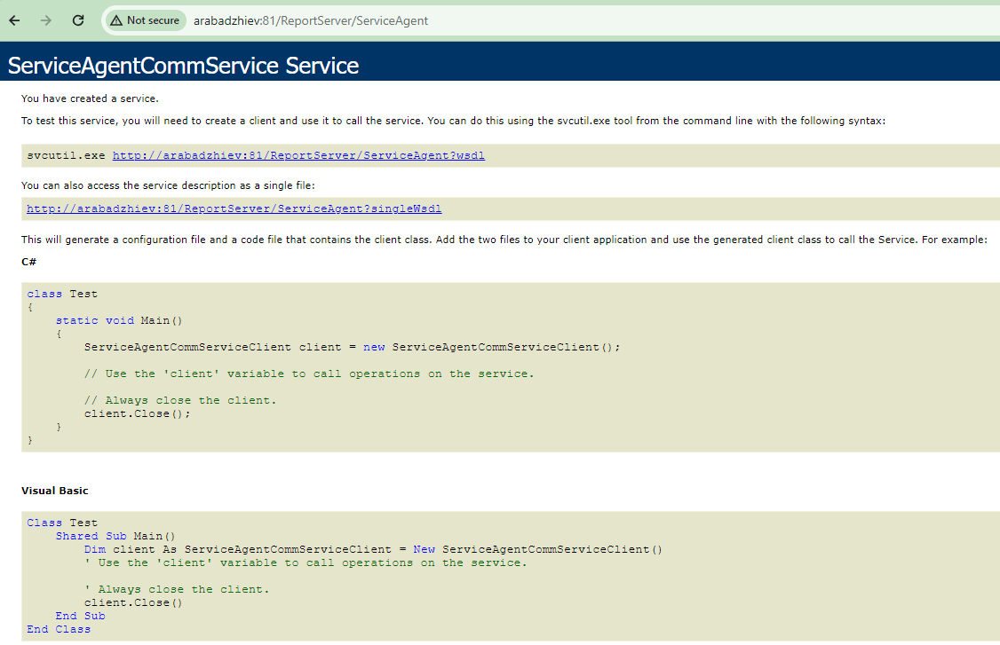

## Environment

<table>
	<tr>
		<td>Product</td>
		<td>Progress® Telerik® Report Server</td>
	</tr>
</table>

## Description

The `Telerik.ReportServer.ServiceAgent` is a Windows Service that should be constantly running on the machine where the Report Server is installed. It uses [WCF](https://learn.microsoft.com/en-us/dotnet/framework/wcf/whats-wcf) to communicate with the Report Server Manager and the corresponding settings are stored in two configuration files: `Telerik.ReportServer.ServiceAgent.exe.config` and Report Server's configuration file `Web.config`.

The Report Server maintains the connection with the Service Agent and polls it when a certain event occurs: a _Scheduled Task_ or a _Data Alert_ is added or modified, or the Report Server settings are changed.

## Error Message

* When a _Scheduled Task_ or a _Data Alert_ is being added or modified:

	`An error occurred while updating the task: Telerik Report Server Service Agent is not running. Please check the Windows service.`

* When the Report Server configuration cannot be saved:

	`An error occurred while saving the settings: The changes were not applied!`

## Cause\Possible Cause(s)

1. The service is not running.
1. The Report Server application cannot communicate with the Service Agent at the configured port.

## Solution

Telerik Report Server $R2 2018 (4.1.18.516)$ exhibits this issue. It has been fixed in [R2 2018 SP1 (4.1.18.620)](https://www.telerik.com/support/whats-new/report-server/release-history/progress-telerik-report-server-r2-2018-sp1-4-1-18-620). If you are using a different version than 4.1.18.516 and still experience the issue, please follow the steps below.

To make sure that the service is running and that the Report Server application can find the service using the configured address check the following:

1. Open [Windows Task Manager](https://techcommunity.microsoft.com/t5/windows-11/how-to-run-task-manager-on-windows-11-6-ways/m-p/2701239) and look for the `Telerik.ReportServer.ServiceAgent` service - it should be running.
1. Open the `Telerik.ReportServer.ServiceAgent.exe.config` file located at `[installation folder]\Progress\Telerik Report Server\Services` and look for the address of the service in the `baseAddress` element. Paste this address in the browser to check if the service is functioning.

	The URL in the `baseAddress` should look like `http://MachineNameHere:81/ReportServer/ServiceAgent`

	The expected content of the opened web page is like the below image:

	

1. Open the Report Server's `Web.config` file located at `[installation folder]\Progress\Telerik Report Server\Telerik.ReportServer.Web` and check if the `address` of the client/service matches the `baseAddress` provided in `Telerik.ReportServer.ServiceAgent.exe.config`. Note that the name of the protocol, i.e. `http:\\` is a must in the URL.
1. Enable tracing in the `Telerik.ReportServer.ServiceAgent.exe.config` file, start the service manually, and check the generated log file for errors.

	````XML
<configuration>
		...
		<system.diagnostics>
			<trace autoflush="true" indentsize="4">
				<listeners>
					<add name="myListener" type="System.Diagnostics.TextWriterTraceListener" initializeData="serviceAgent.log" />
					<remove name="Default" />
				</listeners>
			</trace>
		</system.diagnostics>
	</configuration>
````


1. Enable tracing in the Telerik.ReportServer's `Web.config` file, restart the web application and check the generated log file for errors.

	````XML
<configuration>
		...
		<system.diagnostics>
			<trace autoflush="true" indentsize="4">
				<listeners>
					<add name="myListener" type="System.Diagnostics.TextWriterTraceListener" initializeData="reportServer.log" />
					<remove name="Default" />
				</listeners>
			</trace>
		</system.diagnostics>
	</configuration>
````


1. The communication layer between the Service Agent and Report Server uses WCF service and by default relies on port 80 for initial client registration. Ensure that the port is currently not used by another application or service. Use the [`netstat` command](https://learn.microsoft.com/en-us/windows-server/administration/windows-commands/netstat) to list the active connections and check if port 80 is available. A common issue is to have a web server (e.g. _Apache Tomcat_) already using this port. In this case either move the application that occupies port 80 to another port or change the configuration of the `wsDualHttpBinding` entry in Report Server's `Web.config` file, adding [**clientBaseAddress** attribute](https://docs.microsoft.com/en-us/dotnet/api/system.servicemodel.wsdualhttpbinding.clientbaseaddress?view=netframework-4.8) to the **binding** entry:

	````XML
<system.serviceModel>
		<bindings>
			<wsDualHttpBinding>
				<binding clientBaseAddress="https://your-reportserver-url:56436" name="WSDualHttpBinding_IServiceAgentCommService" sendTimeout="00:00:10"/>
			</wsDualHttpBinding>
		</bindings>
		...
	</system.serviceModel>	
````

