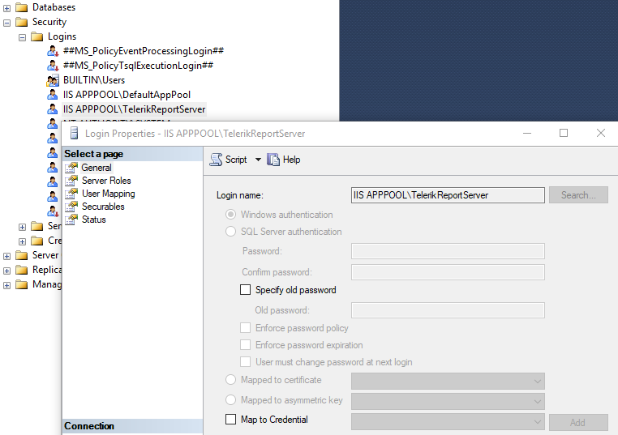
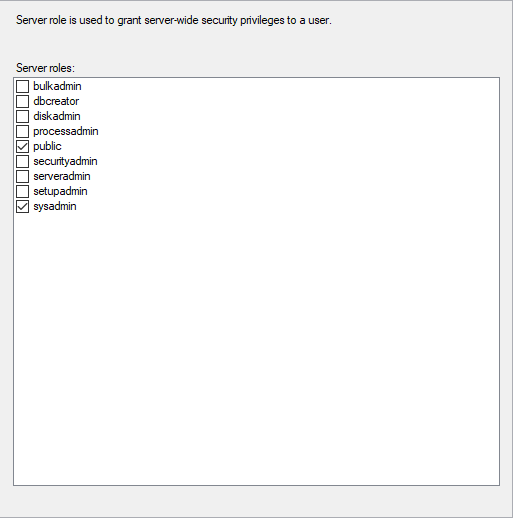
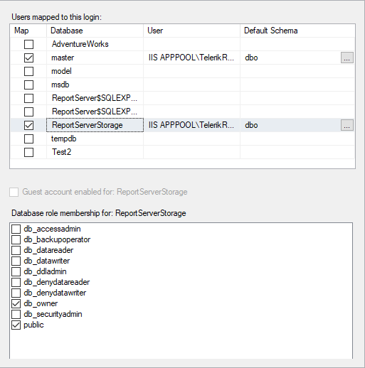
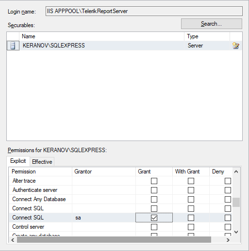

## Environment

<table>
	<tr>
		<td>Product</td>
		<td>Progress® Telerik® Report Server</td>
	</tr>
</table>

## Description

Report Server or Standalone Report Designer cannot connect to Microsoft SQL Server storage when using integrated security.
The error message states _Login failed for user 'DOMAIN\COMPUTER$'_ (Microsoft SQL Server, Error: 18456).

## Solution

The **DOMAIN\COMPUTER$** part of the error message is a tad misleading. Even if we assign the **sysadmin** role to the current domain user, the issue will not go away.

We need to find out which is the real user trying to access the database and is denied login. In the case of the default Report Server installation, this will be the **IIS APPPOOL\TelerikReportServer**.

When working with a development server (Visual Studio) this will be the **IIS APPPOOL\DefaultAppPool** user. Once we find which is the user, we can add it to the SQL Server logins:

1. Set the login name in the **General** page.

   

2. In the **Server Roles** page assign the desired roles.

   

3. Add **User Mappings** and database role membership.

   

4. In **Securables** add the SQL Server instance and grant it the _Connect SQL_ permission.

   
