# Authenticating Using Azure Active Directory

Active Directory have proved itself as a standard in directory and identity management services. In this article we will explain how to use its cloud-based form to provide authentication for the Telerik Reporting Server users.

**Prerequisites:**

-   Telerik Report Server installation with at least one administrator account;

-   An Azure account with Active Directory support;

In this article we’ll assume that Telerik Report Server is installed and accessible on **http://localhost:86**. For security reasons it’s better to access it via **https**, but this will require registering a domain certificate, which is not a subject of the current tutorial.

Note: In case you’re not familiar with the process of adding the Active Directory service to your Azure account, there is a useful video tutorial that will help: [Enabling Azure Active Directory Premium trial](https://channel9.msdn.com/Series/Azure-Active-Directory-Videos-Demos/Enabling-Azure-Active-Directory-Premium-trial).

**1.  Setup the Azure AD Application**

We can use either the default directory or creating a new entry in the active directory list – depending on the users and rights you’ve already defined, you might want to use some existing directory. For simplicity, we’ll create a new entry called *ActiveDir* so your directories list should look like this:

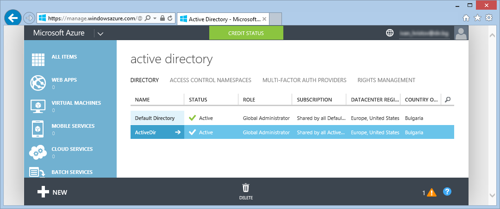

In this directory we have to register two applications. The first one is the Telerik Report Server, which will act as a Web API server and respond to the requests made from the second application we’re about to register – the Standalone Report Designer.

-   Enter the directory you’ve created and add a new application using the buttons at the bottom. Select “Add an application my organization is developing” from the panel that should appear:

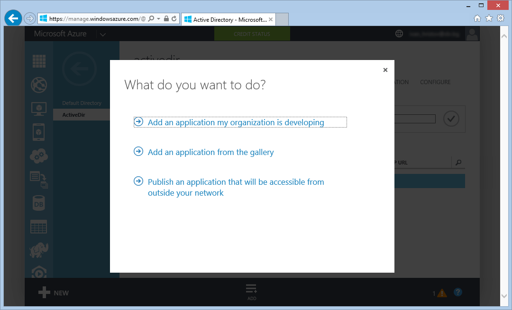

-   On the next page enter “**TelerikReportServer**” the name of the application and select “Web application and/or Web API” from the radio buttons list below:

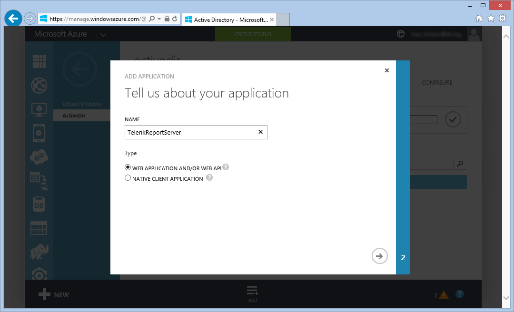

-   On the third page enter the **Sign-on URL** and the **App ID URI** – both could be set to the actual URL of Telerik Report Server:

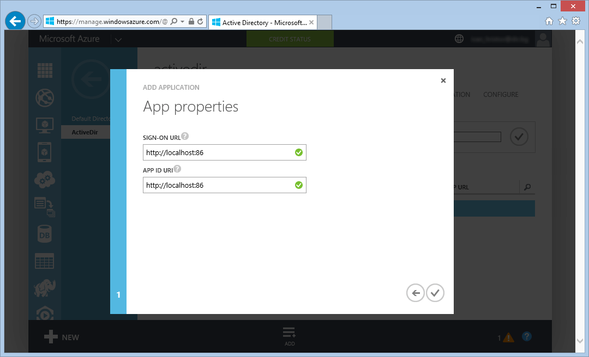

When you click the checkmark button, the application will be added to your directory and you can preview its details using the CONFIGURE menu entry on the top.

**2.  Setup the Azure AD users**

The active directory you have created should have one user, sourced from your Microsoft Account. You can use this user to connect to Telerik Report Server, or you can create another one just for the directory. Creating a user for Azure AD is fairly straightforward process. Note that the user name (in this case *TestUser@ActiveDirTrialDemo.onmicrosoft.com*) you provide for the new user will be the one used for its registration in Telerik Report Server, which we will describe later in this article. When you are done adding the new user in Azure AD, the USERS tab should look like this:

> 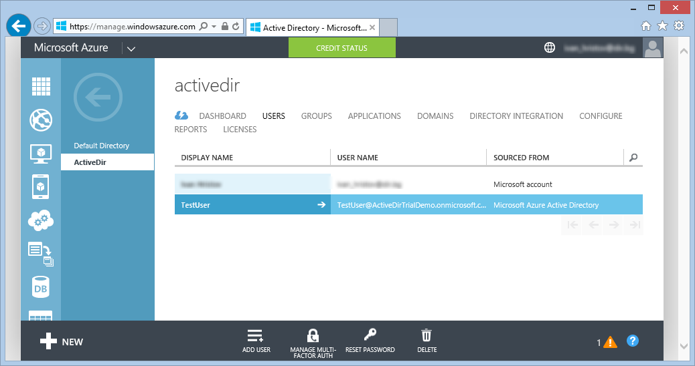

There are a few more things to do in Azure AD, but so far we have created a directory entry, an application and a user, which allows us to test if we can login to Telerik Report Server using Azure AD authentication.

**3.  Setup an External Authentication Provider in Telerik Report Server**

-   First, we need to set the *federation metadata URI* in the Report Server configuration settings. When still on the same Azure AD application page, click on the VIEW ENDPOINTS button at the bottom and a popup should appear:

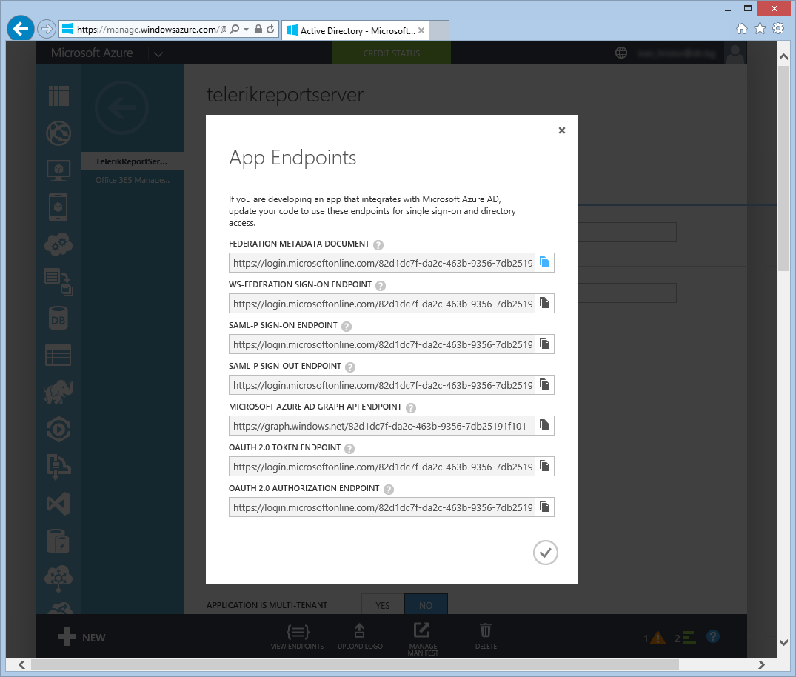

-   Copy the text in the first textbox named FEDERATION METADATA DOCUMENT. 
-   Start Telerik Report Server web application (in our scenario by browsing to <http://localhost:86>) and login using the local administrator account, which is created upon first start. 
-   When logged in, click on the **Configuration** button in the top right corner and the configuration page should appear. 
-   Under **External authentication providers settings** section, check **Enabled** checkbox, paste the federation metadata URI into the **Metadata Uri** textbox and write <http://localhost:86> into **Relying Party ID** textbox. These settings are enough to check if we can login into Telerik Report Server, but to satisfy the validation of the remaining fields, paste the URI from **Metadata Uri** into **Authority** field and enter some number into **ClientID** field. We'll explain the meaning of these fields later in this article. Now the settings page should look like this:

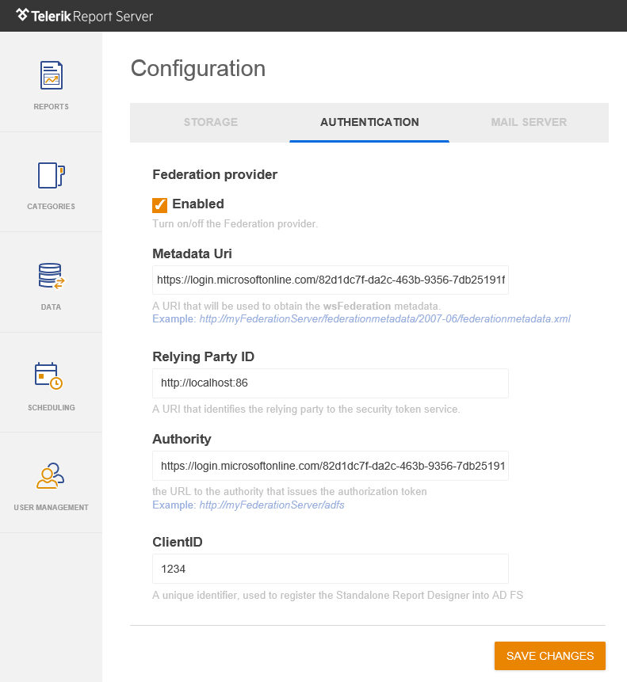

After clicking on **Save Changes** button, a notification about restarting the application will appear. This is necessary for the changes to be applied so confirm it and a second window will inform you that the changes have been saved.

**4.  Add Federation Users in Telerik Report Server**

-   While still logged in, click on USER MANAGEMENT on the side toolbar and then click on NEW USER button above. In the popup window select **Federation** as authentication provider and set the username and email according to the entries you just did in Azure AD. Note that the username should contain the domain (i.e. to be exactly the same with the one you setup in Active Directory). To make things simpler, there is no need to enter the user's first and last name - they will be obtained from the claims, provided by Azure AD upon first login with this user.
-   Assign some roles to the user you are creating.

> 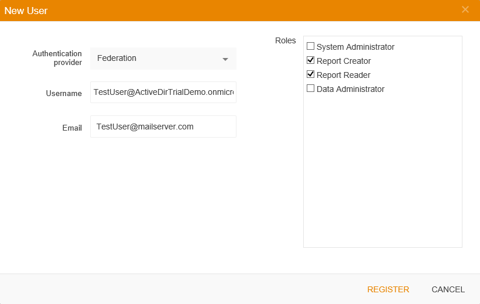

Now you can log out or just close the browser and open it again. The **Login** page now should have an additional button named **Federation**, which will open the external authentication provider login window, as shown below:

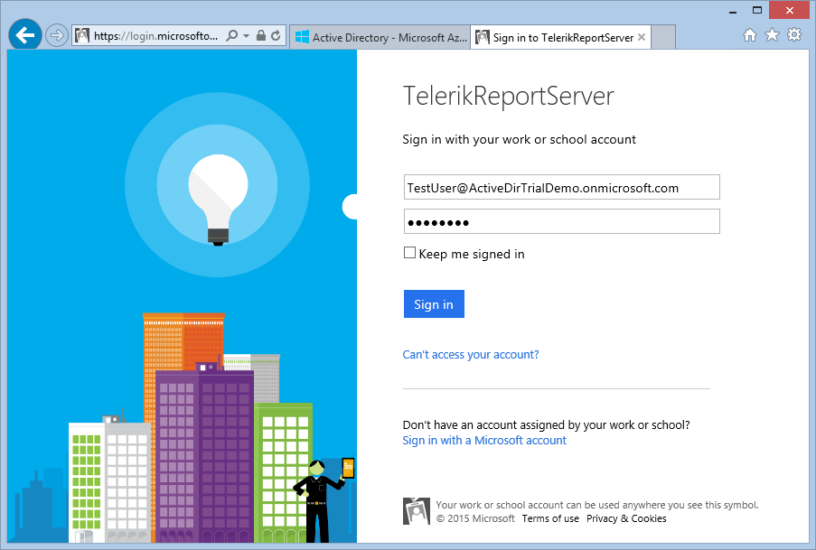

Once you sign in with the username and password that you have obtained from Azure AD, you will be logged in to Telerik Report Server (note the user name in the top right corner):

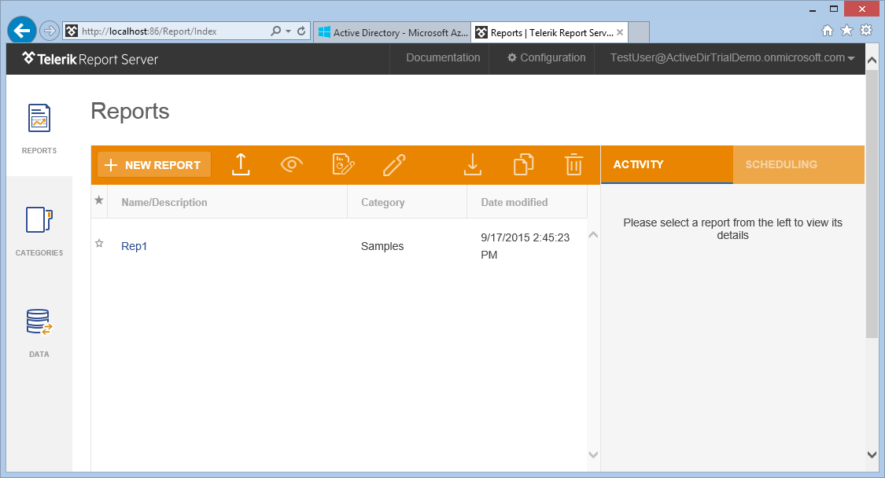

So far we have demonstrated how to authenticate against the Telerik Report Server using credentials provided by the Azure AD federation service. Although it’s useful, it will be better if we are able to log in from the Standalone Report Designer, which will be a client for the WebAPI, provided by the Telerik Report Server. This requires registering the client as another application in Azure AD and adding two more settings in Telerik Report Server.

**5.  Registering the Standalone Report Designer in Azure AD**

-   Log in to Azure AD and go to the directory created earlier.
-   Open the APPLICATIONS page and click on the **Add** button below.
-   Select the option “Add an application my organization is developing” on the first page.
-   Add a name (i.e. *Report Designer*) and click on the “Native Client Application” on the second page.
-   On the third page enter the URI of the Telerik Report Server as a Redirect URI (in our example it’s [*http://localhost:86*](http://localhost:86))
-   When you click the check mark, your application will be created. Go to CONFIGURE page and locate the *Permissions to other applications section*.
-   Click on **Add application** button and a popup should appear. 
-   Select All Apps from the drop-down list above and click the check mark on the right. The list will be updated and our **TelerikReportServer** application should appear in it. 
-   Click on the plus sign right next to the name and confirm closing the popup:

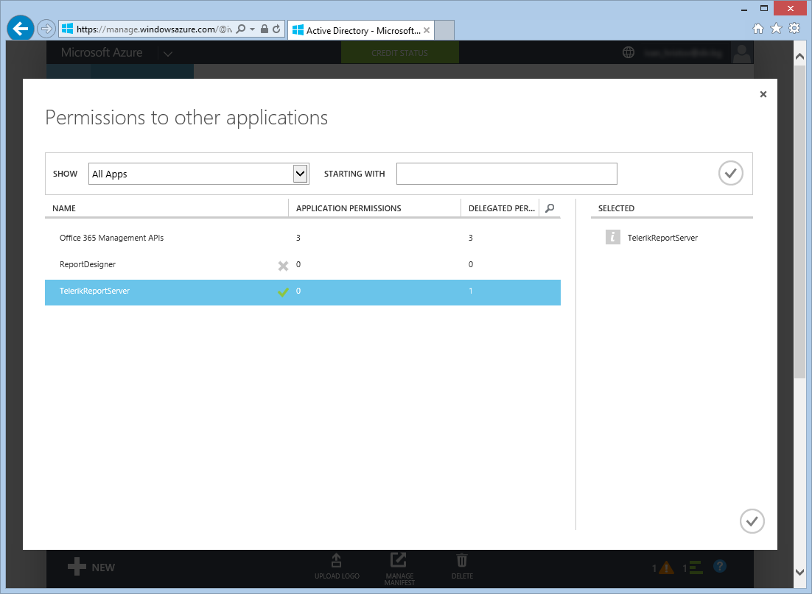

-   Back on the ReportDesigner page expand the **Delegated Permissions** drop-down list and check the option *Access TelerikReportServer*, as shown below. 
-   Save the changes. Now our application ReportDesigner is allowed to access the TelerikReportServer application.

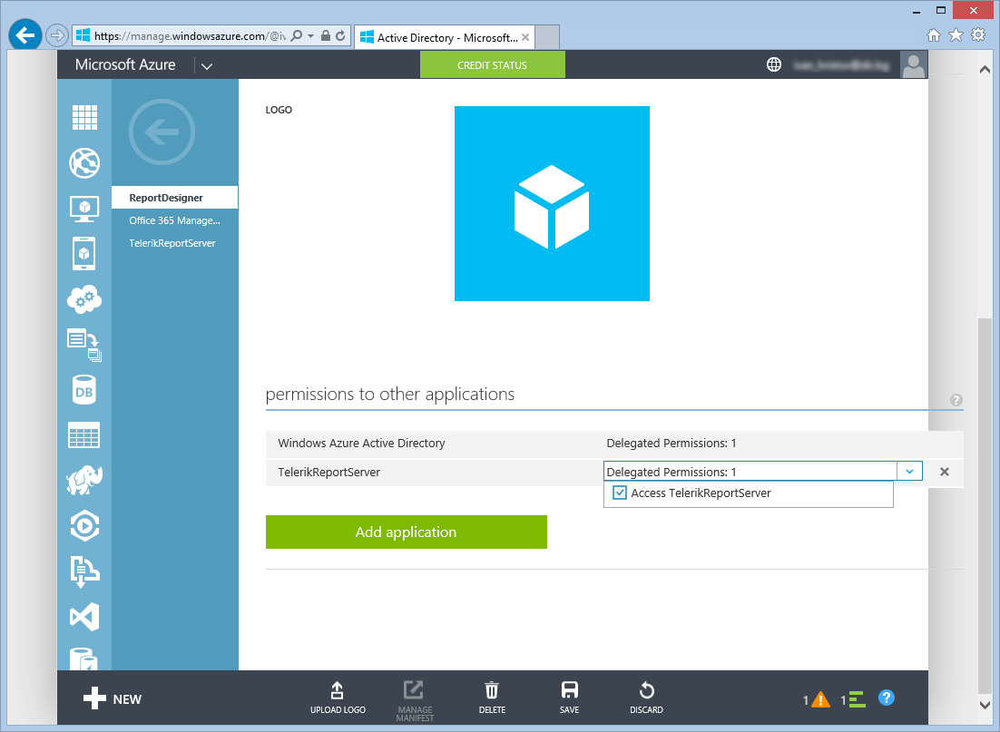

-   In the Properties section locate the CLIENT ID textbox and copy its content. This ID should be provided from the Standalone Report Designer when it tries to authenticate itself before accessing the Telerik Report Server API. However, Azure generates this ID and doesn’t allow it to be changed, so we need to set it in our Telerik Report Server where it will be transferred to the client application.

**6.  Setup Standalone Report Designer to use Azure AD authentication**

All the settings that are used to allow the Standalone Report Designer to connect to Telerik Report Server using a federated authentication, are located in Server’s Configuration page.

-   Browse to <http://localhost:86> and login using any account with administrator rights.
-   Open the **Configuration** page and locate the **External authentication providers settings** section. Paste the copied Client ID into the ClientID textbox.
-   In **Authority** textbox put the URL to the authority that will issue the authorization token to the client. This URL can be obtained from the federation metadata XML document or directly from the Active Directory settings and usually follows the pattern http://federationserver.com/adfs. For Azure AD you can get the same URL you used to obtain the federation metadata and remove the part after the directory identifier: <https://login.microsoftonline.com/82d1dc7f-da2c-463b-9356-7db25191f101/>.

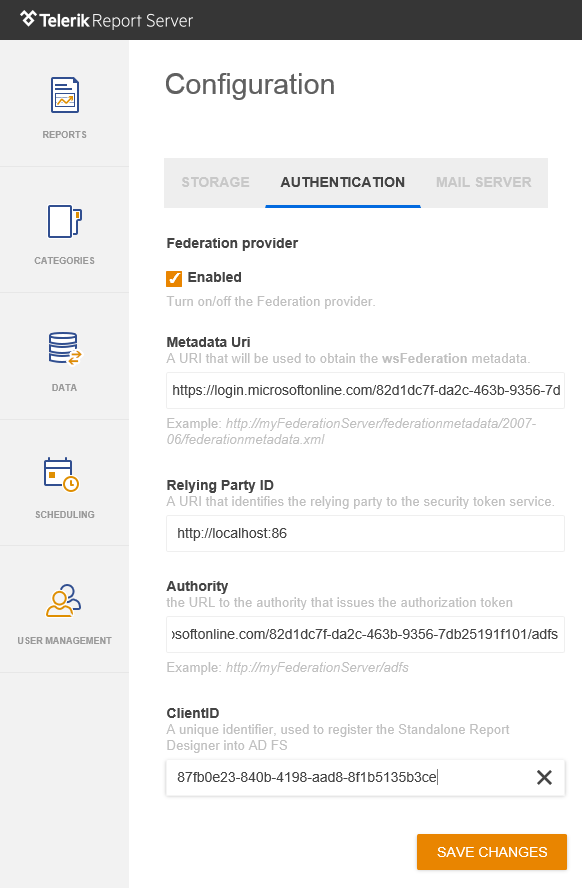

After saving the settings you can start the Standalone Designer and login with your Azure AD credentials.

-   From **File** menu click **Open** and then select **Report Servers** option. 
-   If the Telerik Report Server is not added in the list of available servers, click on **Add Server** icon. Set the Server URI to <http://localhost:86> and as soon as you move to the next field, you will see that the **Federation** button becomes enabled.

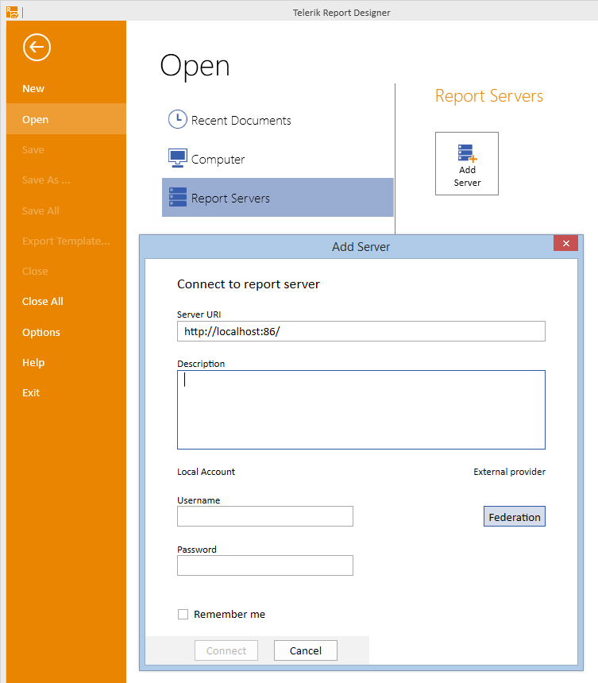

If you now click the **Federation** button, the Azure login page will appear and you can login with your credentials. When you successfully log in, you will see that the report server entry is added to the list of available servers and you can use it the same way you do with the local accounts.

**Conclusion:**

In this tutorial we demonstrated how to connect to Telerik Report Server using accounts defined in Azure Active Directory. The same approach can be used to authenticate the users from Active Directory for Windows domain networks.
