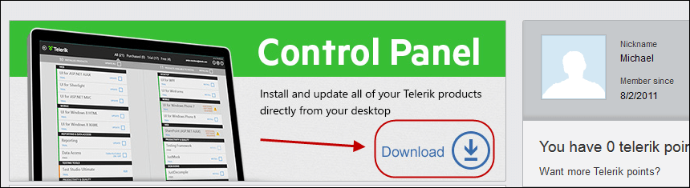
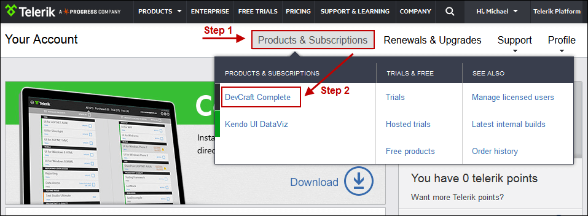
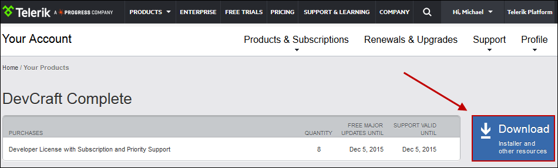
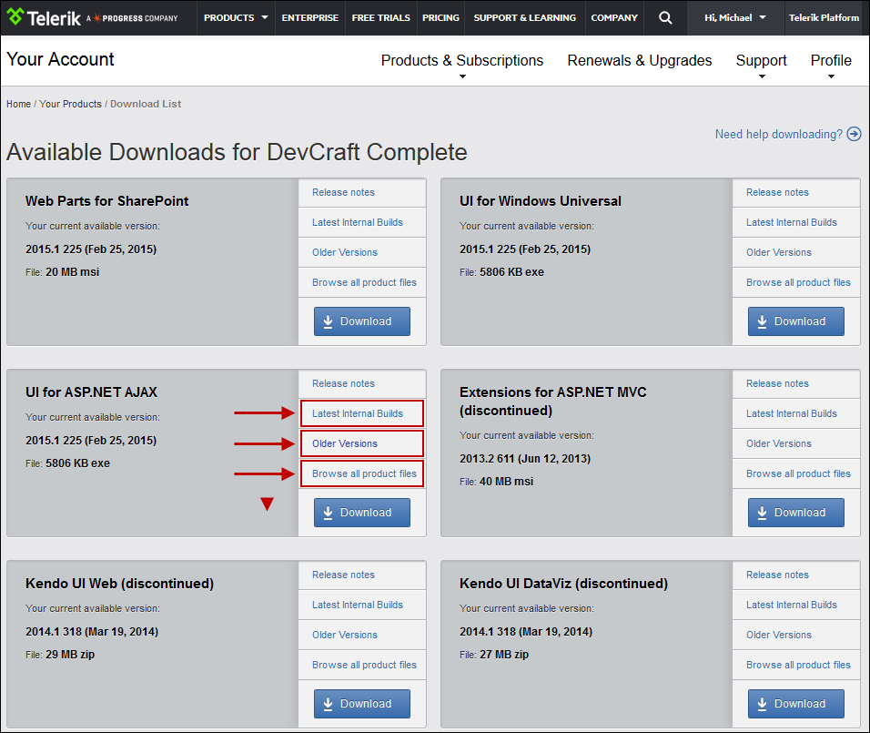

# Installation

The Report Server web application is installed by a Windows installer which automatically creates a separate web site with its own application pool on the IIS. The application pool runs under the *LocalSystem* identity.

The installer registers the new web site under port 83 by default. The installation process includes registering and starting of a Scheduler windows service.

## Downloading and installing the licensed product version

You can download the licensed product version from the **Telerik Control Panel** which you can get from [Your Account](http://www.telerik.com/account). The Control Panel is a small Windows utility which will notify you when a new version of the Telerik product(s) you have purchased is available. Once you download the product, run the installer to install it on your machine.

## Installing new versions of the product

The best way is to download the Control Panel from [Your Account](http://www.telerik.com/account/):

It automatically detects the latest version and lets you install it for the products you have access to.

## Downloading any other product files or latest internal builds

From [Your Account page](http://www.telerik.com/account/), go to “Products & Subscriptions”, select the product and hit “Download”:

From there select the product file you want to download:

