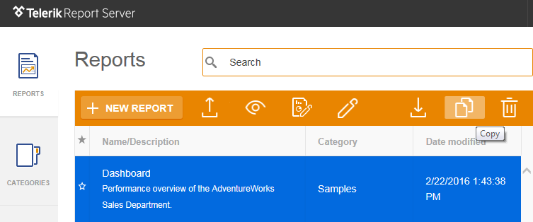

# Copy Report

Create a copy of the original report under a different Name / Category as a starting point for a new report design.

## Telerik Report Server Learning Resources

* [Telerik Report Server Homepage](https://www.telerik.com/report-server)
* [Telerik Report Server Installation]()
* [Telerik Report Server User Management]()
* [Connecting to Data with Telerik Report Server]()
* [Telerik Report Server License Agreement](https://www.telerik.com/purchase/license-agreement/report-server)
