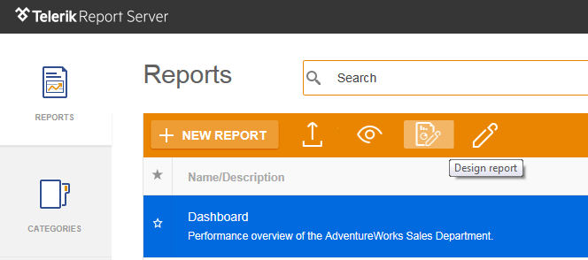

# Design Report

Invoke the desktop [Report Designer]() to modify the report definition.

>The Report Designer will be started using the [ClickOnce deployment technology](https://msdn.microsoft.com/en-us/library/t71a733d.aspx "ClickOnce Security and Deployment") which is supported out of the box in the Internet Explorer browser. If you are using another browser you can use a browser extension which adds support for the ClickOnce deployment technology. In case ClickOnce is not supported in your browser, clicking the New report button will bring up a notification containing the Report Designer download link. Use the link to download and start the designer manually.

Related articles:  

- [Working with Report Server Reports](https://docs.telerik.com/reporting/standalone-report-designer-working-with-server-reports "Working with Report Server Reports") 
