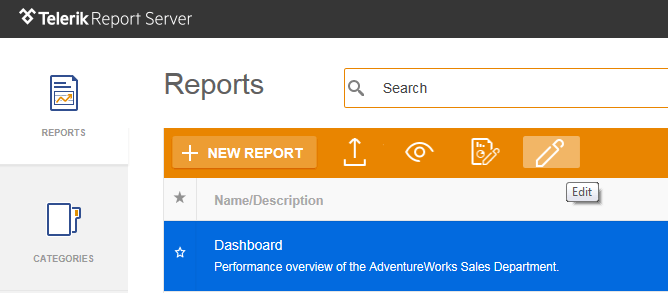

# Edit

Change the __title__, __description__ and the __category__ of the uploaded report.

The title, description, and category can be used to [search]() for a report. The category and title can also be used to create an interactive link to another report using a [Drillthrough Report Action](https://docs.telerik.com/reporting/designing-reports-interactivity-drill-through-report-links "Drillthrough Report Action"). Another report from the server can be referenced using _[CategoryName]/[ReportName]_ path for the URI, for example: _Samples/Product Sales_.