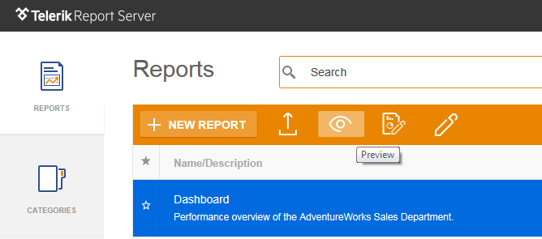

# Preview Report

The preview window uses the [HTML5 Report Viewer](https://docs.telerik.com/reporting/html5-report-viewer "HTML5 Report Viewer") to display the report.

The viewer Send Mail Message toolbar button is only visible if the Report Server has a valid SMTP setting.

The Preview Report view opens in a new web page and supports report export to various formats.

The document format can be any [single document format provided by the Telerik Reporting engine](https://docs.telerik.com/reporting/configuring-rendering-extensions "Rendering Extensions"):

* `PDF` - Renders a report in the Adobe Acrobat Reader. The format is shown as an Acrobat (PDF) File in the Export drop-down of the report toolbar.
* `XLS` - Renders a report in Microsoft Excel. The report opens in Microsoft Excel 97 or later.
* `CSV` - Renders a report in comma-delimited format. The report opens in a viewing tool associated with CSV file formats.
* `RTF` - Renders a report in Rich Text Format. The report opens in Microsoft Word 97 or later.
* `XPS` - Renders a report in XML Paper Specification (XPS) format - electronic representation of digital documents based on XML. The report opens in Microsoft XPS Viewer.
* `DOCX` - Renders a report in Microsoft Word 2007 format (also known as OpenXML) - it is a zipped, XML-based file format developed by Microsoft for representing word processing documents.
* `XLSX` - Renders a report in Microsoft Excel 2007 format (also known as OpenXML) - it is a zipped, XML-based file format developed by Microsoft for representing spreadsheets.
* `PPTX` - Renders a report in Microsoft PowerPoint 2007 format (also known as OpenXML) - it is a zipped, XML-based file format developed by Microsoft for presentations.
* `MHTML` - Renders a report in MHTML. The report opens in Internet Explorer. The format is shown as Web Archive in the Export drop-down of the report toolbar.

## Query String Report Parameters

When previewing a report with parameters, their values can be supplied in the URI. Report Server will automatically try to convert the [QueryString](https://msdn.microsoft.com/en-us/library/system.web.httprequest.querystring(v=vs.110).aspx) part of the request to a key-value dictionary and assign it to the report source parameters collection. The following list specifies the query parameter features:

* __Case insensitive names__ – the engine will match the parameter names regardless of the casing.
* __Cannot have spaces in names__ – this restriction is imposed by the report designers so it should be impossible to name a report parameter using spaces in the first place.
* __URL-encoded values__ – all the special characters and spaces in the parameters must be encoded for use in a URL. For example, the spaces for a string value must be replaced with *%20*.

The feature is useful when sharing a report and needs to preview it with certain parameter values instead of using the default ones. When the report is previewed in the HTML5 report viewer, every parameter change will also change the current report URL. Once all the report parameters are set, the URL in the address bar can be copied/pasted where needed.

## Telerik Report Server Learning Resources

* [Telerik Report Server Homepage](https://www.telerik.com/report-server)
* [Telerik Report Server Installation]()
* [Telerik Report Server User Management]()
* [Connecting to Data with Telerik Report Server]()
* [Telerik Report Server License Agreement](https://www.telerik.com/purchase/license-agreement/report-server)
