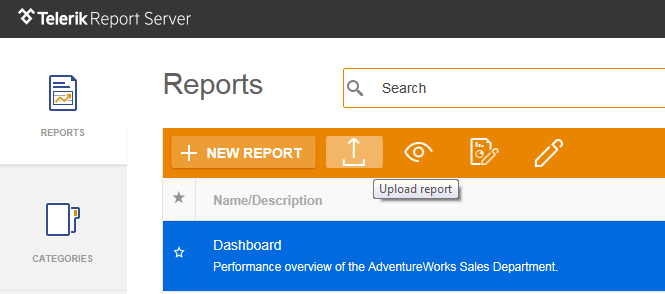

# Upload Report

Upload an existing report definition from the file system. When uploading a report you should select the report definition in the zip-based TRDP format or the legacy TRDX format, specify the report's __title__ and select the report's __category__. All the fields are mandatory except the __description__ field.

> To upload a report you need to create at least one category.

## Upload Revision

Upload a new revision to an existing report in TRDP or TRDX format. When uploading a report revision, it will appear as the latest available revision of the selected report. The validation rules for the revision upload are same as the rules for the report definition upload described above.

A new revision can also be uploaded via Standalone Report Designer, using __Save As...__ option from __File__ menu. the __Save__ dialog appears, type the report name that will be associated with the revision. A confirmation message will appear, notifying that a report with the same name already exists. After confirming, the opened report will be uploaded as a revision of the report whose name is typed in the __Save__ dialog. Note that the report name is case-insensitive.