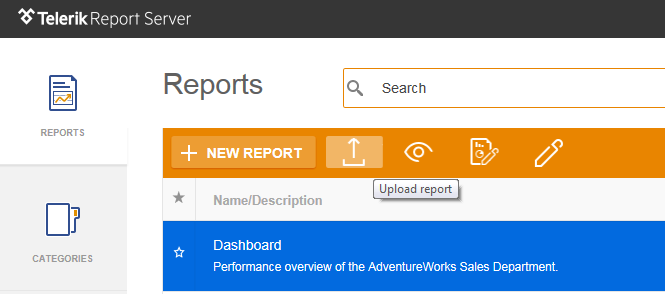
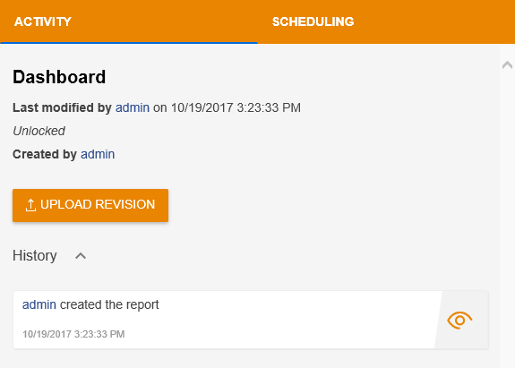

# Upload Report

Upload an existing report definition from the file system. When uploading a report you should select the report definition in the ZIP-based `TRDP`, XML-based `TRDX`, or JSON-based `TRDJ` format. For ReportBook definition select `TRBP` file. Next specify the report's __title__ and select the report's __category__. All the fields are mandatory except the __description__ field.

> The `TRDJ` format is available from [Telerik Report Server 2026 Q3 (12.2.26.812)](https://www.telerik.com/support/whats-new/report-server/release-history/progress-telerik-report-server-2026-q3-(12-2-26-812)) release.

> To upload a report you need to create at least one category.

## Upload Revision

Upload a new revision to an existing definition in TRDP, TRBP, TRDX, or TRDJ format. When uploading a report revision, it will appear as the latest available revision of the selected report. The validation rules for the revision upload are same as the rules for the report definition upload described above.

A new revision can also be uploaded via Standalone Report Designer, using __Save As...__ option from __File__ menu. When the __Save__ dialog appears, type the report name that will be associated with the revision. A confirmation message will appear, notifying that a report with the same name already exists. After confirming, the opened report will be uploaded as a revision of the report whose name is typed in the __Save__ dialog. Note that the report name is case-insensitive.

## Telerik Report Server Learning Resources

* [Telerik Report Server Homepage](https://www.telerik.com/report-server)
* [Telerik Report Server Installation]()
* [Telerik Report Server User Management]()
* [Connecting to Data with Telerik Report Server]()
* [Telerik Report Server License Agreement](https://www.telerik.com/purchase/license-agreement/report-server)
