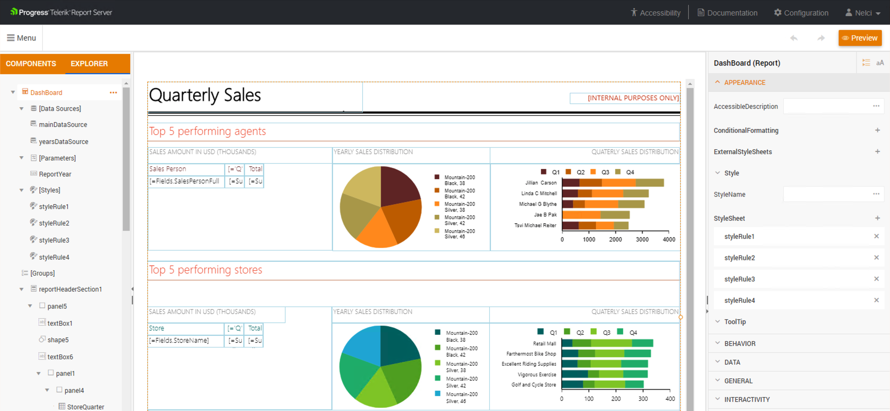
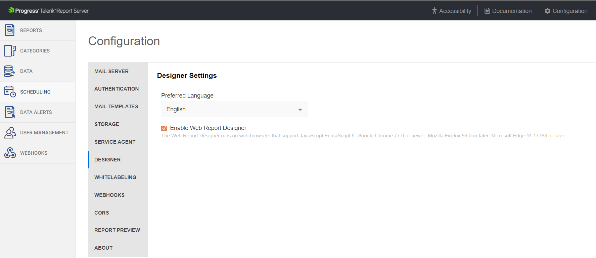
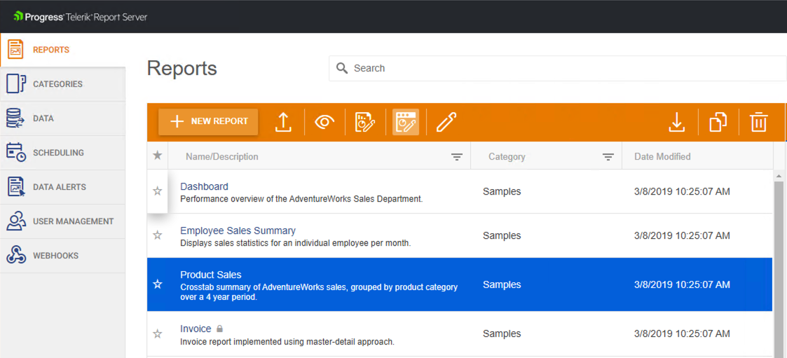

# Web Report Designer

Since R2 2019, we offer a web-based report designer which allows creating and designing reports in the Report Server. 
Further information about this controll can be found in [Telerik Web Report Designer](https://docs.telerik.com/reporting/designing-reports/report-designer-tools/web-report-designer/overview) article.

### Access

To enable it, run the server and navigate to **Configuration** -> **Designer** -> check **Enable Web Report Designer** ->  **Save Changes**:

Once you enable it, you will see the icon in the reports view:

### Data Connectivity

Report Server supports [WebService](https://docs.telerik.com/reporting/webservicedatasource-component), [JSON](https://docs.telerik.com/reporting/jsondatasource-component), [SQL](https://docs.telerik.com/reporting/sqldatasource), [Business Objects](https://docs.telerik.com/reporting/designing-reports/connecting-to-data/data-source-components/objectdatasource-component/overview) and inline [CSV](https://docs.telerik.com/reporting/csvdatasource-component) data sources.

### Shared Data Source

As of the `R1 2023` release, the Report Server's Web Report Designer also supports the [`SharedDataSource`](https://docs.telerik.com/reporting/designing-reports/connecting-to-data/data-source-components/shareddatasource-component) component which allows for reusing any of the available data source components across multiple report definitions. The `Shared Data Source` files(`.sdsx`) are considered assets and are thus not controlled by [User Permissions](). 

### Report Resources

The Web Report Designer allows uploading shared resources like images, styles, and data on the server.
It makes them easily accessible and allows to reuse them among different reports to achieve and maintain a common report vision.
It also makes it easy to renew the offline data in JSON or CSV format for multiple reports visualizing it.
The respective tool is called Assets Manager and more information on how it can be used is available in the 
[Report shared resources](https://docs.telerik.com/reporting/designing-reports/report-designer-tools/web-report-designer/tools/shared-resources) article.
Note that in the context of the Report Server the reports are organized into one-level directories representing the report categories on the Report Server.

### Browsers Support

The Web Report Designer can run on web browsers that support JavaScript EcmaScript 6: Google Chrome 77.0 or newer; Mozilla Firefox 69.0 or later, Microsoft Edge 44.17763 or later.

# See Also

- [Telerik Web Report Designer](https://docs.telerik.com/reporting/designing-reports/report-designer-tools/web-report-designer/overview "Web Report Designer Overview")
- [Table/Crosstab Wizard in Web Report Designer](https://docs.telerik.com/reporting/designing-reports/report-designer-tools/web-report-designer/tools/table-crosstab-wizard "Table/Crosstab Wizard in Web Report Designer")
